# Getting Started with Data Provisioning for RINF

A practical guide for infrastructure managers providing railway infrastructure data to the Register of Infrastructure (RINF) using the ERA Knowledge Graph.

---

## Table of Contents

- [Getting Started with Data Provisioning for RINF](#getting-started-with-data-provisioning-for-rinf)
  - [Table of Contents](#table-of-contents)
  - [Introduction](#introduction)
    - [Legal Framework](#legal-framework)
      - [European Commission Implementing Regulation (EU) 2019/773: the RINF Regulation](#european-commission-implementing-regulation-eu-2019773-the-rinf-regulation)
      - [Interoperability Directive (EU) 2016/797 and TSI Requirements](#interoperability-directive-eu-2016797-and-tsi-requirements)
      - [Open Data Directive (EU) 2019/1024](#open-data-directive-eu-20191024)
      - [ERA's Mandate for Data Management and Quality Assurance](#eras-mandate-for-data-management-and-quality-assurance)
      - [Deadline for RINF Data Provision: RDF v3.1](#deadline-for-rinf-data-provision-rdf-v31)
    - [Why RDF?](#why-rdf)
      - [RDF vs XML](#rdf-vs-xml)
      - [SPARQL vs JSON REST API](#sparql-vs-json-rest-api)
      - [Linked Data Event Streams (LDES)](#linked-data-event-streams-ldes)
      - [RDF as a Message Serialization Format](#rdf-as-a-message-serialization-format)
      - [The Practical Architecture](#the-practical-architecture)
    - [The Railway Data Problem](#the-railway-data-problem)
  - [Resources](#resources)
    - [Application Guide](#application-guide)
    - [GitLab: ERA Ontology Repository](#gitlab-era-ontology-repository)
      - [Tracking Ontology Changes](#tracking-ontology-changes)
    - [Dataset Manager](#dataset-manager)
      - [Getting access](#getting-access)
      - [Full Dataset Upload](#full-dataset-upload)
      - [Partial Dataset Upload](#partial-dataset-upload)
    - [SPARQL Endpoint](#sparql-endpoint)
    - [RINF Working Group (SharePoint)](#rinf-working-group-sharepoint)
  - [KG Generation Tools](#kg-generation-tools)
    - [Converting Legacy RINF XML to RDF](#converting-legacy-rinf-xml-to-rdf)
      - [Option 1 — Dataset Manager (server-side conversion)](#option-1--dataset-manager-server-side-conversion)
      - [Option 2 — RINF-XML2RDF (local converter)](#option-2--rinf-xml2rdf-local-converter)
    - [SPARQL-Anything](#sparql-anything)
    - [(R2)RML / YARRRML](#r2rml--yarrrml)
    - [OTTR](#ottr)
    - [A Do-It-Yourself Mapper](#a-do-it-yourself-mapper)
    - [Post-Processing](#post-processing)
      - [SPARQL UPDATE](#sparql-update)
      - [SHACL Rules](#shacl-rules)
    - [Conversion Between Serialization Formats](#conversion-between-serialization-formats)
  - [General Concepts](#general-concepts)
    - [URI Minting](#uri-minting)
      - [Use the ERA Namespace](#use-the-era-namespace)
      - [Use Your Own Namespace](#use-your-own-namespace)
    - [Using SKOS Concept Schemes](#using-skos-concept-schemes)
    - [Interpreting SHACL](#interpreting-shacl)
    - [External Controlled Vocabularies](#external-controlled-vocabularies)
      - [Countries](#countries)
    - [External Ontologies](#external-ontologies)
      - [FOAF (Friend of a Friend)](#foaf-friend-of-a-friend)
      - [ORG (W3C Organization Ontology)](#org-w3c-organization-ontology)
      - [GeoSPARQL](#geosparql)
      - [OWL-Time](#owl-time)
  - [RDF Design Patterns](#rdf-design-patterns)
    - [Organisation (Infrastructure Manager)](#organisation-infrastructure-manager)
    - [Topology](#topology)
      - [LinearElement](#linearelement)
      - [NetRelation](#netrelation)
    - [Positioning](#positioning)
      - [Topology Positioning (netReference)](#topology-positioning-netreference)
        - [NetPointReference (for point elements)](#netpointreference-for-point-elements)
        - [NetLinearReference (for linear elements)](#netlinearreference-for-linear-elements)
        - [NetAreaReference (for aggregate elements)](#netareareference-for-aggregate-elements)
      - [Spatial Positioning (GeoSPARQL)](#spatial-positioning-geosparql)
      - [Linear Referencing (Kilometric Posts)](#linear-referencing-kilometric-posts)
    - [Infrastructure Elements](#infrastructure-elements)
      - [Operational Point](#operational-point)
      - [Section of Line](#section-of-line)
      - [Track (RunningTrack / Siding)](#track-runningtrack--siding)
      - [Switch](#switch)
      - [Signal](#signal)
      - [Tunnel](#tunnel)
      - [Bridge](#bridge)
      - [Level Crossing](#level-crossing)
      - [Platform Edge](#platform-edge)
      - [Kilometer Post](#kilometer-post)
      - [Primary Location](#primary-location)
    - [Functional Resources (Classes Linked to Tracks)](#functional-resources-classes-linked-to-tracks)
      - [Train Detection System](#train-detection-system)
      - [Contact Line System](#contact-line-system)
      - [Speed](#speed)
      - [ETCS](#etcs)
      - [LinesideDistanceIndication](#linesidedistanceindication)
      - [TEN-T Corridor (TENTCorridor)](#ten-t-corridor-tentcorridor)
        - [What is TEN-T?](#what-is-ten-t)
        - [ERA ontology transition](#era-ontology-transition)
        - [Old model: `era:tenClassification`](#old-model-eratenclassification)
        - [New model: `era:partOfTENT` → `era:TENTCorridor`](#new-model-erapartoftent--eratentcorridor)
        - [SKOS concept values for the new properties](#skos-concept-values-for-the-new-properties)
        - [Mapping old values to new](#mapping-old-values-to-new)
        - [Open issues with the migration](#open-issues-with-the-migration)
      - [Common Characteristics (CommonCharacteristicsSubset)](#common-characteristics-commoncharacteristicssubset)
    - [Special Cases](#special-cases)
      - [Temporal Features](#temporal-features)
      - [Border Points](#border-points)
      - [Documents](#documents)
      - [Topology and `era:hasPart`](#topology-and-erahaspart)
      - [`era:connectedTo`](#eraconnectedto)
  - [Useful Techniques](#useful-techniques)
    - [Querying Your Graph](#querying-your-graph)
      - [SPARQL Notebooks](#sparql-notebooks)
      - [Jena Fuseki](#jena-fuseki)
      - [YasGUI](#yasgui)
    - [Executing SHACL Validation](#executing-shacl-validation)
      - [What to Load into the Validator](#what-to-load-into-the-validator)
      - [Using MapLib](#using-maplib)
      - [Using PySHACL](#using-pyshacl)
      - [Using VocBench](#using-vocbench)
    - [Creating ERA Topology from GIS Geometry](#creating-era-topology-from-gis-geometry)
      - [Pipeline overview](#pipeline-overview)
    - [SKILLs](#skills)
      - [era-resource-uri-minting](#era-resource-uri-minting)
      - [era-topology-relations](#era-topology-relations)
      - [era-dual-positioning](#era-dual-positioning)
      - [era-wkt-geometry-enrichment](#era-wkt-geometry-enrichment)
      - [era-functional-resources](#era-functional-resources)
    - [How This Repository Built the Knowledge Graph](#how-this-repository-built-the-knowledge-graph)
  - [Discussion](#discussion)
    - [Promoting Classes Linked to Tracks to Infrastructure Element Status](#promoting-classes-linked-to-tracks-to-infrastructure-element-status)
    - [`era:CommonCharacteristicsSubset`: An Anti-Pattern to Avoid](#eracommoncharacteristicssubset-an-anti-pattern-to-avoid)
    - [Putting the Data Transformation Workload on the Provider, ERA, or Consumer?](#putting-the-data-transformation-workload-on-the-provider-era-or-consumer)
    - [`era:connectedTo`](#eraconnectedto-1)
    - [LinesideDistanceIndication Property Naming](#linesidedistanceindication-property-naming)
    - [Open World vs Closed World](#open-world-vs-closed-world)
    - [RDF in Transactional Systems](#rdf-in-transactional-systems)
    - [Should `era:Feature` Be a Subclass of `time:TemporalEntity`?](#should-erafeature-be-a-subclass-of-timetemporalentity)
    - [Micro-Level Border Point Topology](#micro-level-border-point-topology)
  - [Frequently Encountered Issues](#frequently-encountered-issues)
    - [Loading Turtle to the ERA Dataset Manager](#loading-turtle-to-the-era-dataset-manager)
    - [SHACL Validation Returns Thousands of Warnings](#shacl-validation-returns-thousands-of-warnings)
    - [Topology Issues](#topology-issues)
    - [Positioning and Geometry Issues](#positioning-and-geometry-issues)
    - [SKOS Concept Issues](#skos-concept-issues)
    - [Modelling Mistakes](#modelling-mistakes)
    - [Document Upload Issues](#document-upload-issues)
  - [Getting into contact](#getting-into-contact)


---

## Introduction

### Legal Framework

#### European Commission Implementing Regulation (EU) 2019/773: the RINF Regulation

The Register of Infrastructure (RINF) is established by Implementing Regulation (EU) 2019/773 as the authoritative registry of technical characteristics of railway infrastructure within the European Union. Infrastructure managers are legally required to submit accurate, up-to-date infrastructure data to RINF through ERA.

#### Interoperability Directive (EU) 2016/797 and TSI Requirements

Directive 2016/797 on the interoperability of the rail system within the European Union mandates that infrastructure is described according to Technical Specifications for Interoperability (TSI). The ERA ontology encodes these TSI parameters as classes and properties with SKOS concept schemes and SHACL constraints, meaning compliance can be machine-verified.

#### Open Data Directive (EU) 2019/1024

Directive 2019/1024 on open data and the re-use of public sector information applies to RINF data. Railway infrastructure data held by public bodies (including infrastructure managers) falls under the scope of open data requirements, supporting transparency and enabling innovative re-use of transport data.

#### ERA's Mandate for Data Management and Quality Assurance

ERA is mandated to manage, validate, and publish RINF data. The agency maintains the ERA ontology, SHACL validation shapes, and controlled vocabularies (SKOS concept schemes) that define the canonical structure for infrastructure data. ERA provides tools for dataset submission, validation, and SPARQL-based querying.

#### Deadline for RINF Data Provision: RDF v3.1

Infrastructure managers must provide data according to the ERA ontology (RDF format, version 3.1). The transition from legacy XML-based RINF submissions to RDF-based Knowledge Graph submissions is mandated. All data providers must provide their RINF data by 31/03/2026.


### Why RDF?

The choice of RDF (Resource Description Framework) as the data format for RINF is a deliberate move toward Linked Data and Knowledge Graphs. The EU has decided to make this move in many domains and ERA has wisely decided to do the same for its registers.

Smart standardization: 
- How to identify data => IRI's
- How to structure data => RDF
- How to give meaning to data => Ontology
- How to define constraints => SHACL, RDFS

#### RDF vs XML

| Aspect | XML | RDF |
|--------|-----|-----|
| Data model | Hierarchical tree | Graph (subject–predicate–object triples) |
| Identity | Element nesting, no global identifiers | Every resource has a global URI |
| Schema validation | XSD | SHACL (Shapes Constraint Language) |
| Querying | XPath / XQuery | SPARQL |
| Linkability | Limited (XLink) | Native: URIs link across datasets |
| Mergeability | Difficult: trees don't merge well | Trivial: union of triple sets |

RDF's graph model naturally represents railway networks: stations connect to tracks, tracks carry signals, sections of line span operational points. Unlike XML's rigid hierarchy (where an element must have exactly one parent), RDF allows any resource to participate in any number of relationships.

#### SPARQL vs JSON REST API

A REST API returns data per request in isolated JSON payloads. RDF provides:

- **Global identifiers**: every resource has a dereferenceable URI, not just an opaque API ID
- **Federated querying**: SPARQL can query across datasets from different infrastructure managers
- **Self-describing data**: the ontology accompanies the data, making the schema available for any consumer
- **Incremental updates**: you can add triples without restructuring existing data
- **Response completeness**: you get exactly what you asked for
- **No setup costs**: no development needed to set up SPARQL endpoint on top of a graph

#### Linked Data Event Streams (LDES)

[LDES](https://semiceu.github.io/LinkedDataEventStreams) (Linked Data Event Streams) bridges the gap between RDF and event-driven architectures. An LDES publishes a stream of immutable, timestamped RDF members, where each member is a versioned snapshot of a resource.

LDES is built on the W3C [TREE specification](https://treecg.github.io/specification/) and is already used in Flanders (Belgium) for publishing governmental Linked Data, including heritage and address registries. Its applicability to transactional data but also to railway infrastructure data provisioning is a natural fit, since infrastructure rarely changes in bulk, and incremental, event-based updates are more efficient than full-dataset re-uploads.

#### RDF as a Message Serialization Format

In telematics and inter-system communication, messages have traditionally been serialized as XML (think SOAP, SIRI for public transport, TAF/TAP TSI messages in rail). RDF-based serializations offer an alternative with distinct advantages:

| Aspect | XML messages | RDF-based messages (Turtle, JSON-LD, N-Triples) |
|--------|-------------|--------------------------------------------------|
| Schema | XSD, rigid, version-coupled | OWL/SHACL, schema-aware but version-tolerant |
| Identity | Local element names | Global URIs: sender and receiver share identifiers |
| Extensibility | Adding fields breaks consumers on strict XSD | New triples are ignored by consumers that don't know them (open world) |
| Validation | XSD validation (all-or-nothing) | SHACL validation (graduated: required, optional, recommended) |
| Composability | Merging XML documents requires XSLT | Merging RDF is trivial (union of triples) |

A concrete scenario: an infrastructure manager sends a "temporary capacity restriction" message. In XML, the consumer must parse the message according to an exact XSD version. In RDF (e.g., serialized as JSON-LD), the message is a self-describing set of triples: the consumer processes what it understands and safely ignores what it doesn't. If the sender adds a new property (say, `era:maxAxleLoad`), existing consumers continue working without modification.

This makes RDF-based message exchange particularly resilient in environments where systems evolve at different speeds, which is exactly the reality of European railway infrastructure, where dozens of infrastructure managers operate on different IT upgrade cycles.

#### The Practical Architecture

Whether you use RDF as your primary transactional store, as a publication layer, or as a message format, a typical data flow could be:

```mermaid
flowchart TD
    IS["🗄️ Internal Systems<br/>DB / GIS / Asset Management / Telematics"] --> ETL

    ETL["⚙️ RDF Generation<br/>SPARQL-Anything · R2RML · Python · OTTR"] --> POST

    POST["🔧 Post-Processing<br/>SPARQL UPDATE · Python"] --> GRAPH

    GRAPH["📄 ERA-compliant RDF Graph<br/>.ttl / .nt"] --> VAL
    GRAPH --> DM
    GRAPH --> LDES

    VAL["✅ SHACL Validation<br/>Local · EU Test Bed"] -->|"Fix issues"| GRAPH

    DM["📤 ERA Dataset Manager<br/>Full or Partial Upload"] --> KG

    LDES["📡 LDES Publication<br/>Incremental / Event-Driven"] --> KG

    KG["🌐 ERA Knowledge Graph<br/>Public SPARQL Endpoint"]
```



You do not need to abandon your existing systems to provision RINF data. But you may find that RDF becomes more than just an export format. As your Knowledge Graph matures, it can serve as a shared integration layer across your organisation's railway data systems.

### The Railway Data Problem

We have such a beautifull system..


But we decided to throw it to the floor and break it into pieces..


And we call these "use cases"... But how to glue these back together?

Railway infrastructure data is inherently complex:

- **Historically grown use cases**: capacity management, asset management, runtime simulations, ... all home grown based on their own data models have introduced semantic incompatibility. They have broken the beautiful interconnected railway data world into their own controlled pieces.
- **Multiple coordinate systems**: kilometric posts, topological offsets, geographic coordinates (WGS84) all trying to describe the same location
- **Hierarchical and network structures coexist**: operational points contain tracks, but tracks also connect to form a navigable network
- **Temporal validity**: infrastructure changes over time; a track's electrification, speed limit, or gauge may change
- **Cross-border interoperability**: a section of line may span two countries, each managed by a different infrastructure manager
- **Controlled vocabularies**: signal types, electrification systems, operational point types must use standardised codes

The ERA ontology addresses these challenges with a formal, machine-readable data model built on open standards (RDF, OWL, SHACL, GeoSPARQL, SKOS).

---

## Resources

### Application Guide

ERA publishes an application guide for RINF data provisioning:

- [ERA RINF Application Guide](https://data-interop.era.europa.eu/era-vocabulary/rinf-appGuide/): official guidance on data requirements and ontology usage.

### GitLab: ERA Ontology Repository

The ERA ontology, SHACL shapes, and controlled vocabularies are maintained in a public GitLab repository:

- **Repository**: https://gitlab.com/era-europa-eu/public/interoperable-data-programme/era-ontology/era-ontology
- **Ontology (OWL)**: defining classes, properties, and their semantics
- **SHACL shapes**: `era-shacl/ERA-RINF-shapes.ttl`: validation constraints for RINF data
- **SKOS concept schemes**: controlled vocabularies for enumerations (signal types, electrification systems, etc.)

#### Tracking Ontology Changes

Keep track of what changed between ontology versions using these three complementary resources:

1. **CHANGELOG.md** — The ontology repository maintains a version-by-version changelog listing new classes and properties, deprecated terms, breaking changes, and bug fixes:
   [CHANGELOG.md on GitLab](https://gitlab.com/era-europa-eu/public/interoperable-data-programme/era-ontology/era-ontology/-/blob/main/CHANGELOG.md)

2. **Application Guide — Revision History** — Human-readable descriptions of what changed and why, including impact on data providers and migration guidance between versions:
   [rinf-appGuide/#revisionSection](https://data-interop.era.europa.eu/era-vocabulary/rinf-appGuide/#revisionSection)

3. **Git diff** — Compare any two ontology versions directly on GitLab (**Repository → Compare**), or locally:
   ```bash
   git diff v3.0..v3.1 -- *.ttl
   ```
   This shows the exact triple-level changes: which classes/properties were added, renamed, or removed.

> **Tip:** Subscribe to GitLab notifications on the ontology repository to receive an email whenever a new release is tagged — so you are notified as soon as a new version is published.

### Dataset Manager

The ERA Dataset Manager is the submission portal for infrastructure data.

#### Getting access

For requests that require action or support (such as account issues), please contact the [ERA Service Desk](servicedesk@era.europa.eu).

#### Full Dataset Upload

Upload a complete Turtle (`.ttl`) or N-Triples (`.nt`) file containing the entire infrastructure dataset for your country/network. This replaces any previously submitted data.

**Workflow:**
1. Generate your RDF graph according to the ERA ontology
2. Validate locally using SHACL (see [Executing SHACL validation](#executing-shacl-validation))
3. Upload the file through the Dataset Manager
4. ERA runs server-side SHACL validation
5. Review the validation report and fix any violations

#### Partial Dataset Upload

Upload a subset of infrastructure data (e.g., only updated operational points) that is merged into the existing dataset. Partial uploads are useful when only a portion of the network has changed.

> **Tip**: Whether doing full or partial uploads, ensure referential integrity. For example, if a Track references an `era:OperationalPoint`, that OperationalPoint must either already exist in the dataset or be included in the upload.

### SPARQL Endpoint

ERA provides a public SPARQL endpoint for querying the published RINF Knowledge Graph:

- **Endpoint**: https://data-interop.era.europa.eu/api/sparql (or the ERA-specific endpoint; check ERA documentation for the current URL)

Use this to:
- Explore the existing Knowledge Graph structure to understand expected patterns
- Query reference data (countries, concept schemes) for use in your own dataset
- Verify that your submitted data appears correctly after upload

> **Tip**: use a custom [Yasgui](https://yasgui.matdata.eu/) instead of the ERA provided interface to optimize your experience.

### RINF Working Group (SharePoint)

ERA runs a RINF implementation network for data providers. The SharePoint site is the primary collaboration space for national infrastructure managers participating in RINF data provisioning:

- **SharePoint**: https://eraeuropaeu.sharepoint.com/sites/RINFNet

The site contains:
- Meeting minutes and recordings from working group sessions
- Shared templates and example datasets
- Announcements about ontology updates and deadlines
- A discussion forum for implementation questions

Access requires an EU Login account with membership in the RINFNet group. Contact [servicedesk@era.europa.eu](mailto:servicedesk@era.europa.eu) to request access.

---

## KG Generation Tools

Your source data, whether from a database, CSV files, GIS exports, or any other format, needs to be transformed into RDF triples conforming to the ERA ontology. Several tools and approaches exist.

### Converting Legacy RINF XML to RDF

If your current RINF data is in the **legacy XML format**, ERA provides two ready-made conversion paths that do not require writing custom mapping code.

#### Option 1 — Dataset Manager (server-side conversion)

1. Log in to the **UAT Dataset Manager**: https://uat.ld4rail.fpfis.tech.ec.europa.eu/
2. Upload your legacy `.xml` file.
3. The server validates the file against the **XSD schema**.
4. On success, the server automatically **converts the XML to ERA ontology v3.1 RDF**.
5. Download and review the generated dataset.

This is the quickest way to see what ERA generates from your existing data — no local tooling required.

#### Option 2 — RINF-XML2RDF (local converter)

ERA provides a standalone Windows executable in the `era-kg-mappings` repository:

**Download**: [RINF-XML2RDF.exe on GitLab](https://gitlab.com/era-europa-eu/public/interoperable-data-programme/era-ontology/era-kg-mappings/-/blob/main/RINF-XML2RDF.exe)

```
RINF-XML2RDF.exe --in INFILE --out OUTFILE --graph GRAPH [--format FORMAT]
                 [--debug] [--log-level {INFO,WARNING,VIOLATION}] [--log-file LOG_FILE]
```

| Argument | Required | Description |
|---|---|---|
| `--in` | ✅ | Input RINF XML file path |
| `--out` | ✅ | Output RDF file path (Turtle by default) |
| `--graph` | ✅ | Named graph URI for the output dataset |
| `--format` | — | Output serialization format (e.g., `turtle`, `n-triples`) |
| `--log-level` | — | Log verbosity: `INFO`, `WARNING`, or `VIOLATION` |
| `--log-file` | — | Write log output to a file instead of stdout |
| `--debug` | — | Enable verbose debug output |

**Example:**
```bash
RINF-XML2RDF.exe \
  --in   rinf-data.xml \
  --out  rinf-data.ttl \
  --graph http://data.europa.eu/949/graph/rinf/0088
```

The local converter is useful for:
- Offline conversion (no network or portal access needed)
- Integrating into a CI/CD pipeline
- Processing large files without upload size limits
- Inspecting and validating the output before uploading

> ⚠️ **Limitation:** Both methods are limited to what the **legacy XML schema** contains. Parameters absent from the legacy format — including **micro topology** and other properties introduced in later ontology versions — will **not** be present in the generated RDF output. 

> **Note:** Both options use the same ERA mapping rules and produce equivalent ERA ontology v3.1 RDF. After conversion, validate the output locally with SHACL before the production submission (see [Executing SHACL Validation](#executing-shacl-validation)).

### SPARQL-Anything

[SPARQL-Anything](https://sparql-anything.cc/) can lift virtually any structured data format (XML, JSON, CSV, Excel, etc.) into an RDF graph using SPARQL CONSTRUCT queries. It treats the source data as a virtual RDF graph that you query and reshape.

**Advantages**: flexible, handles complex transformations, works with any source format. You only need to know SPARQL, something you should know anyway.
**Disadvantages**: SPARQL CONSTRUCT queries can become complex for deeply nested sources. Consider splitting up into multiple different queries.

> **Tip**: use the one-eyed-graph appraoch as demonstrated in [this repository](https://github.com/Matdata-eu/raillML-to-ERA) and explained in detail during [this W3C community group meeting](https://github.com/w3c-facade-x/meetings/tree/main/meetings/2026-01-12). This will allow you to use clean SPARQL (without SPARQL-Anything specifics) immediately.

### (R2)RML / YARRRML

[R2RML](https://www.w3.org/TR/r2rml/) is a W3C standard for mapping relational databases to RDF. [YARRRML](https://rml.io/yarrrml/) provides a human-friendly YAML syntax for writing RML mappings.

**Advantages**: declarative mappings, W3C standard, good tool support (RMLMapper, Morph-KGC).
**Disadvantages**: primarily designed for relational/tabular data; complex transformations may require custom functions. You'll need to learn the RML ontology and executing functions is complicated.

### OTTR

[OTTR (Reasonable Ontology Templates)](https://ottr.xyz/) uses parameterised templates to generate RDF. You define a template for each ERA class (e.g., `era:OperationalPoint`) with its required properties, then instantiate templates from your source data.

**Advantages**: reusable templates, clear separation of pattern and data, good for large-scale consistent mappings.
**Disadvantages**: newer tool with a smaller community than R2RML.

### A Do-It-Yourself Mapper

You can write a custom script (Python with `rdflib`, Java with Apache Jena, etc.) that reads your source data and programmatically constructs RDF triples.

```python
from rdflib import Graph, Namespace, Literal, URIRef
from rdflib.namespace import RDF, RDFS, XSD

ERA = Namespace("http://data.europa.eu/949/")
g = Graph()
g.bind("era", ERA)

op = URIRef("http://data.europa.eu/949/functionalInfrastructure/operationalPoints/MY-OP-001")
g.add((op, RDF.type, ERA.OperationalPoint))
g.add((op, ERA.opName, Literal("Hauptbahnhof", lang="de")))
g.add((op, ERA.uopid, Literal("DEHBF")))
# ... add more triples ...

g.serialize("my-data.ttl", format="turtle")
```

**Advantages**: full control, easy debugging, integrates with existing data pipelines.
**Disadvantages**: more code to maintain, must manually ensure ontology compliance.

> **Tip**: try to avoid this route.

### Post-Processing

After initial RDF generation, additional processing steps are typically needed.

#### SPARQL UPDATE

SPARQL UPDATE queries (`INSERT`, `DELETE`) modify an existing RDF graph. Common uses:

- **Inferring topology relations**: compute `era:hasPart` / `era:isPartOf` relationships based on network position overlap
- **Adding temporal features**: insert default `era:validFrom` dates on all infrastructure elements
- **Data type corrections**: fix literal datatypes (e.g., converting `xsd:double` to `xsd:integer` where SHACL demands it)
- **Propagating properties**: e.g., border point geometry inherited from its parent operational point

Example of adding temporal validity:

```sparql
PREFIX era: <http://data.europa.eu/949/>
PREFIX xsd: <http://www.w3.org/2001/XMLSchema#>
PREFIX time: <http://www.w3.org/2006/time#>

INSERT {
  ?element era:validity ?interval .
  ?interval a time:Interval ;
    time:hasBeginning ?begin .
  ?begin a time:Instant ;
    time:inXSDDate "2025-01-01"^^xsd:date .
}
WHERE {
  VALUES ?type { era:OperationalPoint era:Track era:SectionOfLine era:Signal era:Switch }
  ?element a ?type .
  FILTER NOT EXISTS { ?element era:validity ?existing . }
  BIND(IRI(CONCAT("https://data.example.eu/_validity_2025-01-01")) AS ?interval)
  BIND(IRI(CONCAT("https://data.example.eu/_validity_2025-01-01_begin")) AS ?begin)
}
```

#### SHACL Rules

SHACL rules (using `sh:rule`) can derive new triples based on existing data. While less commonly used than SPARQL UPDATE for post-processing, they are useful for declarative inference patterns that should be applied as part of validation.

> **Important**: the big advantage of SHACL rules is that they allow to add more metadata to your ETL pipeline. For example by using prov:Activity, it is possible to get a proper data lineage. 

### Conversion Between Serialization Formats

RDF can be serialized in multiple formats. Common ones for RINF:

| Format | Extension | Notes |
|--------|-----------|-------|
| Turtle | `.ttl` | Human-readable, good for development |
| N-Triples | `.nt` | One triple per line, easy to process with line-based tools |
| RDF/XML | `.rdf` | Legacy format, not recommended for new work |
| JSON-LD | `.jsonld` | JSON-based, useful for web APIs |

Convert between formats using `rdflib` (Python):

```python
from rdflib import Graph
g = Graph()
g.parse("my-data.ttl", format="turtle")
g.serialize("my-data.nt", format="nt")
```

Or using Apache Jena's `riot` command-line tool:

```bash
riot --output=ntriples my-data.ttl > my-data.nt
```

> **Tip**: The ERA Dataset Manager accepts Turtle and N-Triples. N-Triples is safer for large files because it avoids prefix resolution issues, but Turtle is much easier to read, debug and is smaller.

> Rule of thumb: A 2GB N-Triples file will compress into a 1GB ttl file or a 200MB zip file.

---

## General Concepts

### URI Minting

Every resource in your dataset needs a globally unique URI. You have two options.

#### Use the ERA Namespace

Mint URIs under `http://data.europa.eu/949/`, then you need to follow the ERA principles:

```
http://data.europa.eu/949/{ontology-module}/{className}/{dataId}
```

Official ontology module values: `topology`, `trackside`, `onboard`, `body`. Some implementations use alternative module names (e.g., `infrastructureElement` instead of `trackside`), which is acceptable as long as URIs are consistent within the dataset.

Examples:
```
http://data.europa.eu/949/topology/linearElement/NE-001-SVN
http://data.europa.eu/949/functionalInfrastructure/operationalPoints/ATAhH1K
http://data.europa.eu/949/functionalInfrastructure/signals/SIG-4201
```

**Character restrictions for `{dataId}`**: alphanumeric characters plus `-` and `_` only. No spaces, `/`, `.`, `(`, `)`, `#`, or percent-encoded characters.

#### Use Your Own Namespace

ERA allows data providers to mint URIs in their own namespace:

```
https://data.mycompany.eu/_operationalPoints_MY-OP-001
```

**Requirement**: own-namespace URIs **must** be dereferenceable: an HTTP GET on the URI must return a valid response. This is a core Linked Data requirement.

Dereferenceable URIs should support content negotiation:

| `Accept` header | Expected response |
|-----------------|-------------------|
| `text/html` | Human-readable HTML page |
| `text/turtle` | RDF description of the resource |

[Open source software](https://github.com/Matdata-eu/URI-Dereferencer) is available to help you set up a dereferencable infrastructure. 

> **Opinion**: Using your own namespace with a flat URI structure (e.g., `https://data.mycompany.eu/_tracks_TRK-001`) keeps PREFIX declarations minimal and makes URIs more manageable.

### Using SKOS Concept Schemes

Many ERA properties expect a reference to a SKOS concept from ERA's controlled vocabularies. For example:

- `era:opType` → `http://data.europa.eu/949/concepts/op-types/10` (station)
- `era:contactLineSystemType` → `http://data.europa.eu/949/concepts/contact-line-systems/10` (overhead contact line)
- `era:energySupplySystem` → `http://data.europa.eu/949/concepts/energy-supply-systems/AC10` (AC 25kV-50Hz)

These concept URIs are published in the ERA ontology repository and the SPARQL endpoint. Always verify the correct concept URI for your mapping. Using the `skos:inScheme` property, you can confirm a concept belongs to the expected vocabulary.

```turtle
era:operationalPoint_01 era:opType <http://data.europa.eu/949/concepts/op-types/10> .
```

### Interpreting SHACL

The ERA SHACL shapes define validation constraints. Key interpretations:

| SHACL property | Meaning |
|----------------|---------|
| `sh:minCount 1` | **REQUIRED**: property must appear at least once |
| `sh:maxCount 1` | Single-value: property must appear at most once |
| `sh:datatype xsd:string` | Literal value with declared datatype |
| `sh:nodeKind sh:IRI` | Must be a URI (typically a SKOS concept reference) |
| `sh:class era:SomeClass` | The referenced resource must be typed as that class |

Example query to find required properties for a class:

```sparql
PREFIX sh: <http://www.w3.org/ns/shacl#>
PREFIX era: <http://data.europa.eu/949/>

SELECT ?property ?datatype WHERE {
  ?shape sh:targetClass era:OperationalPoint ;
         sh:property ?ps .
  ?ps sh:path ?property ;
      sh:minCount 1 .
  OPTIONAL { ?ps sh:datatype ?datatype }
}
```

### External Controlled Vocabularies

#### Countries

Country references use the EU Publications Office authority table:

```turtle
@prefix country: <http://publications.europa.eu/resource/authority/country/> .

era:myOperationalPoint era:inCountry country:NOR .
```

> **Tip**: Declare the country resource as belonging to its SKOS scheme:

```turtle
country:NOR skos:inScheme <http://publications.europa.eu/resource/authority/country> .
```

This is a commonly missed triple; without it, SHACL validation will report a violation.

### External Ontologies

The ERA ontology builds on several external ontologies:

#### FOAF (Friend of a Friend)

Used for organisation descriptions. The ERA class `era:Body` (infrastructure manager, railway undertaking) may reference [FOAF](https://xmlns.com/foaf/spec/20140114.rdf) properties.

#### ORG (W3C Organization Ontology)

Organisational structure follows the [W3C ORG ontology](https://www.w3.org/ns/org.ttl) patterns. ERA uses `era:OrganisationRole` as an n-ary relationship pattern.

#### GeoSPARQL

Spatial data uses the [OGC GeoSPARQL](https://opengeospatial.github.io/ogc-geosparql/geosparql11/geo.ttl) vocabulary:

```turtle
@prefix gsp: <http://www.opengis.net/ont/geosparql#> .

era:mySignal gsp:hasGeometry [
  a gsp:Geometry ;
  gsp:asWKT "POINT(10.7522 59.9139)"^^gsp:wktLiteral
] .
```

> **Coordinate order**: GeoSPARQL WKT uses **longitude latitude** order (not latitude longitude) when no explicit CRS IRI is appended to the WKT literal. The [GeoSPARQL 1.1 standard (OGC)](https://www.ogc.org/standard/geosparql/) specifies CRS84 as the default CRS — an axis-swapped variant of WGS84 where **longitude comes first**. All WKT geometries in RINF must use WGS84 (CRS84) and follow this axis order. 

#### OWL-Time

Temporal validity uses [OWL-Time](https://raw.githubusercontent.com/w3c/sdw/gh-pages/time/rdf/time.ttl) patterns. The ERA model links a `era:Feature` to a separate `time:Interval` resource via `era:validity`. The interval carries a `time:hasBeginning` pointing to a `time:Instant` with `time:inXSDDate`:

```turtle
@prefix time: <http://www.w3.org/2006/time#> .
@prefix xsd:  <http://www.w3.org/2001/XMLSchema#> .

era:myTrack era:validity [
    a time:Interval ;
    time:hasBeginning [ a time:Instant ; time:inXSDDate "2025-01-01"^^xsd:date ]
] .
```

> **Common mistake**: typing the element itself as `era:TemporalFeature` is a class-disjointness violation — `era:Feature` and `era:TemporalFeature` are declared `owl:disjointWith`. Also, `era:validFrom` does not exist in the ERA ontology; use `era:validity` → `time:Interval` → `time:hasBeginning` → `time:Instant` → `time:inXSDDate` instead.

> **Authors oppinion**: Why don't we make era:Feature a subclass of time:TemporalEntity?

---

## RDF Design Patterns

This section covers the concrete RDF patterns expected by the RINF Knowledge Graph for each type of resource.

### Organisation (Infrastructure Manager)

Organisations are modelled using `era:Body` with a role defined via `era:OrganisationRole`:

```turtle
@prefix era: <http://data.europa.eu/949/> .
@prefix rdfs: <http://www.w3.org/2000/01/rdf-schema#> .

# The organisation entity
<http://data.europa.eu/949/organisations/0076> a era:Body ;
    era:organisationCode "0076" ;
    era:role <http://data.europa.eu/949/organisations/0076_IM> ;
    rdfs:label "Bane NOR"@no .

# The n-ary role relationship
<http://data.europa.eu/949/organisations/0076_IM> a era:OrganisationRole ;
    era:hasOrganisationRole <http://data.europa.eu/949/concepts/organisation-roles/IM> ;
    era:roleOf <http://data.europa.eu/949/organisations/0076> .
```

The n-ary role pattern requires three resources — body, role instance, and role concept:


> **Note**: The class `era:InfrastructureManager` and property `era:imCode` are **deprecated**. Use `era:Body` + `era:OrganisationRole` instead.

### Topology

The ERA topology model represents the railway network as a graph of linear elements connected by relations.

#### LinearElement

A `LinearElement` is the atomic building block of the micro-level topology, typically a track segment between two switches, or between a switch and a buffer stop.

```turtle
@prefix era: <http://data.europa.eu/949/> .
@prefix gsp: <http://www.opengis.net/ont/geosparql#> .

<https://data.example.eu/_netElements_NE001> a era:LinearElement ;
    rdfs:label "NE001" ;
    era:lengthOfNetLinearElement 523.5 ;
    gsp:hasGeometry [
        a gsp:Geometry ;
        gsp:asWKT "LINESTRING(10.7500 59.9100, 10.7550 59.9150)"^^gsp:wktLiteral
    ] .
```

Each LinearElement has:
- `era:lengthOfNetLinearElement`: length in metres
- A `gsp:hasGeometry` with a LINESTRING representing its geographic shape

#### NetRelation

A `NetRelation` connects two `LinearElement` instances, defining how they join and in which direction they can be traversed:

```turtle
<https://data.example.eu/_netRelations_NR001> a era:NetRelation ;
    era:elementA <https://data.example.eu/_netElements_NE001> ;
    era:elementB <https://data.example.eu/_netElements_NE002> ;
    era:isOnOriginOfElementA false ;
    era:isOnOriginOfElementB true ;
    era:navigability <http://data.europa.eu/949/concepts/navigabilities/Both> .
```

- `era:isOnOriginOfElementA` / `era:isOnOriginOfElementB`: `true` if the connection is at the origin (start) of the element, `false` if at the end
- `era:navigability`: SKOS concept indicating directionality (Both, AB, BA, None)

The diagram below shows three LinearElements connected via NetRelations, and how infrastructure elements (signals, tracks) position themselves on this topology using `era:netReference`:


### Positioning

ERA uses a dual positioning model: **topological coordinates** for network-relative position and (far less important...) **linear referencing coordinates** for kilometric position.

#### Topology Positioning (netReference)

Every `era:InfrastructureElement` has an `era:netReference` that places it on the topology network. Three reference types exist:

##### NetPointReference (for point elements)

Used by: Signals, Switches, Level Crossings, Kilometer Posts, stopping-point Operational Points.

```turtle
<https://data.example.eu/_signals_SIG001> a era:Signal ;
    era:netReference <https://data.example.eu/_netPointRef_SIG001> .

<https://data.example.eu/_netPointRef_SIG001> a era:NetPointReference ;
    era:hasTopoCoordinate [
        a era:TopologicalCoordinate ;
        era:onLinearElement <https://data.example.eu/_netElements_NE001> ;
        era:offsetFromOrigin 250.0    # metres from origin of NE001
    ] .
```



```mermaid
graph LR
    sig["🚦 era:Signal<br/>SIG001"]
    npr["era:NetPointReference"]
    tc["era:TopologicalCoordinate<br/>offsetFromOrigin: 250.0 m"]
    ne["🛤️ era:LinearElement<br/>NE001 · 500 m total"]
    sig -->|"era:netReference"| npr
    npr -->|"era:hasTopoCoordinate"| tc
    tc -->|"era:onLinearElement"| ne
```

##### NetLinearReference (for linear elements)

Used by: Tracks (RunningTrack, Siding), Platform Edges, (one-track) Bridges, (one-track) Tunnels.

A `NetLinearReference` spans one or more `LinearElement` instances via an ordered `rdf:List` (`era:hasSequence`), with start and end positions:

```turtle
<https://data.example.eu/_tracks_TRK001> a era:RunningTrack ;
    era:netReference <https://data.example.eu/_netLinRef_TRK001> .

<https://data.example.eu/_netLinRef_TRK001> a era:NetLinearReference ;
    era:hasSequence ( <https://data.example.eu/_netElements_NE001>
                      <https://data.example.eu/_netElements_NE002>
                      <https://data.example.eu/_netElements_NE003> ) ;
    era:startsAt [
        a era:NetPointReference ;
        era:hasTopoCoordinate [
            a era:TopologicalCoordinate ;
            era:onLinearElement <https://data.example.eu/_netElements_NE001> ;
            era:offsetFromOrigin 50.0
        ]
    ] ;
    era:endsAt [
        a era:NetPointReference ;
        era:hasTopoCoordinate [
            a era:TopologicalCoordinate ;
            era:onLinearElement <https://data.example.eu/_netElements_NE003> ;
            era:offsetFromOrigin 400.0
        ]
    ] .
```



```mermaid
graph LR
    trk["🛤️ era:RunningTrack<br/>TRK001"]
    nlr["era:NetLinearReference"]
    ne1["🛤️ LinearElement NE001<br/>500 m"]
    ne2["🛤️ LinearElement NE002<br/>300 m"]
    ne3["🛤️ LinearElement NE003<br/>700 m"]
    spt["era:NetPointReference<br/>(startsAt)"]
    ept["era:NetPointReference<br/>(endsAt)"]
    tcs["era:TopologicalCoordinate<br/>offsetFromOrigin: 50.0 m"]
    tce["era:TopologicalCoordinate<br/>offsetFromOrigin: 400.0 m"]
    trk -->|"era:netReference"| nlr
    nlr -->|"era:hasSequence ①"| ne1
    nlr -->|"era:hasSequence ②"| ne2
    nlr -->|"era:hasSequence ③"| ne3
    nlr -->|"era:startsAt"| spt
    nlr -->|"era:endsAt"| ept
    spt -->|"era:hasTopoCoordinate"| tcs
    ept -->|"era:hasTopoCoordinate"| tce
    tcs -.->|"era:onLinearElement"| ne1
    tce -.->|"era:onLinearElement"| ne3
```

##### NetAreaReference (for aggregate elements)

Used by: Operational Points (station areas), Sections of Line, multi-track Tunnels, multi-track Bridges.

A `NetAreaReference` aggregates multiple `NetLinearReference` instances via `era:includes`:

```turtle
<https://data.example.eu/_operationalPoints_OP001> a era:OperationalPoint ;
    era:netReference <https://data.example.eu/_netAreaRef_OP001> .

<https://data.example.eu/_netAreaRef_OP001> a era:NetAreaReference ;
    era:includes ( <https://data.example.eu/_netLinRef_TRK001>
                   <https://data.example.eu/_netLinRef_TRK002> ) .
```



```mermaid
graph LR
    op["🚉 era:OperationalPoint<br/>OP001"]
    nar["era:NetAreaReference"]
    nlr1["era:NetLinearReference<br/>(TRK001)"]
    nlr2["era:NetLinearReference<br/>(TRK002)"]
    op -->|"era:netReference"| nar
    nar -->|"era:includes ①"| nlr1
    nar -->|"era:includes ②"| nlr2
```

#### Spatial Positioning (GeoSPARQL)

In addition to topological coordinates, elements can carry geographic WKT geometries:

```turtle
<https://data.example.eu/_signals_SIG001> gsp:hasGeometry [
    a gsp:Geometry ;
    gsp:asWKT "POINT(10.7522 59.9139)"^^gsp:wktLiteral
] .
```

Topology locations can also carry geographic WKT geometries:

```turtle
<https://data.example.eu/_netPointRef_SIG001> gsp:hasGeometry [
    a gsp:Geometry ;
    gsp:asWKT "POINT(10.7522 59.9139)"^^gsp:wktLiteral
] .
```

> **Coordinate order is longitude latitude**: `POINT(lon lat)`, not `POINT(lat lon)`. Per the [GeoSPARQL 1.1 standard (OGC)](https://www.ogc.org/standard/geosparql/), when no explicit CRS IRI is provided in the WKT literal, the default CRS is CRS84 — an axis-swapped WGS84 where longitude comes first. All WKT geometries in RINF must use WGS84 (CRS84) and follow longitude-latitude axis order. Getting this wrong is one of the most common errors.

The expected WKT geometry type varies by network reference type:

| Network reference type | WKT geometry type |
|---|---|
| `NetPointReference` | `POINT` |
| `NetLinearReference` | `LINESTRING` |
| `NetAreaReference` | `MULTILINESTRING` (not polygon — topology has no polygons) |

Note that `gsp:asWKT` attached directly to an `era:InfrastructureElement` represents its **real-world position** (e.g., the physical location of a signal mast beside the track), while geometry derived from a `NetBasicReference` represents the **projection onto the track axis**. The geometry of a `TopologicalCoordinate` is always a `POINT` regardless of whether the element's network reference is linear or area.

Geometries can be computed automatically from topological coordinates using linear referencing (interpolating along LinearElement LINESTRING geometries). See [WKT Geometry Enrichment](#skills) for the algorithm.

#### Linear Referencing (Kilometric Posts)

The LRS (Linear Referencing System) coordinate positions an topological position relative to a `KilometricPost` on a `LinearPositioningSystem`:

```turtle
<https://data.example.eu/_netPointRef_SIG001> 
    era:hasLrsCoordinate [
        a era:LinearPositioningSystemCoordinate ;
        era:kmPost <https://data.example.eu/_kmPost_LPS01_km125> ;
        era:offsetFromKilometricPost 37.5
    ] .

<https://data.example.eu/_kmPost_LPS01_km125> a era:KilometricPost ;
    era:hasLRS <https://data.example.eu/_lps_01> ;
    era:kilometer 125.0 .
```

This means: "the signal is at kilometre 125 plus 37.5 metres on positioning system LPS01."

### Infrastructure Elements

Infrastructure elements are subclasses of `era:InfrastructureElement` and carry `era:netReference` for positioning.

```mermaid
graph BT
    OP["era:OperationalPoint<br/>Station · Junction · Border"] --> IE
    SOL["era:SectionOfLine<br/>Between two OPs"] --> IE
    TRK["era:RunningTrack / era:Siding<br/>Individual track segment"] --> IE
    SIG["era:Signal"] --> IE
    SW["era:Switch"] --> IE
    LC["era:LevelCrossing"] --> IE
    TUN["era:Tunnel"] --> IE
    BRG["era:Bridge"] --> IE
    PE["era:PlatformEdge"] --> IE
    KP["era:KilometricPost"] --> IE
    PL["era:PrimaryLocation<br/>(telematics link)"] --> IE
    IE["era:InfrastructureElement<br/>era:netReference · era:inCountry<br/>era:infrastructureManager · era:validity"]
```



#### Operational Point

An operational point (station, junction, stopping point, border point, ...) is one of the central elements:

```turtle
<https://data.example.eu/_operationalPoints_OP001> a era:OperationalPoint ;
    era:opName "Hauptbahnhof"@de, "Central station"@en ;
    rdfs:label "Hauptbahnhof"@de, "Central station"@en ;
    era:opType <http://data.europa.eu/949/concepts/op-types/10> ;   # Station
    era:uopid "DEHBF" ;
    era:inCountry <http://publications.europa.eu/resource/authority/country/DEU> ;
    era:infrastructureManager <http://data.europa.eu/949/organisations/0080_IM> ;
    era:netReference <https://data.example.eu/_netAreaRef_OP001> .
```

**Required properties** (minCount=1): `era:opType`, `era:uopid`, `era:inCountry`, `era:infrastructureManager`, `era:netReference`.

| id | label | definition |
| --- | --- | --- |
| 10 | station | large or major railway node with several functions, important for international traffic, basic for national railway system |
| 20 | small station | Multifunctional Operational Point not so big and not so important like station |
| 30 | passenger terminal | station with dominating function of service for passenger traffic, serving as a central hub for passengers, often integrating rail operations with intermodal transport networks and large-scale passenger facilities, including ticketing, waiting areas, and other passenger services |
| 40 | freight terminal | station dominantly serving for loading and unloading of freight trains |
| 50 | depot or workshop | group of tracks used by depot or workshop for rolling stock maintenance |
| 60 | train technical services | group of tracks for servicing trains (parking, washing, etc.) |
| 70 | passenger stop | or halts - small operational point consisting of at least one platform, normally serving mostly for local passenger services, without routing, dispatching, or train management facilities |
| 80 | junction | consists of at least one turnout, normally used mostly for changing direction of trains, with reduced or not existing other functions |
| 90 | border point | located exactly in the point where a border between Member States meets a railway line. |
| 100 | shunting yard | group of tracks used for shunting trains, mostly related to freight traffic |
| 110 | technical change | To describe a change on CCS or a type of contact line or gauge changeover facility – fixed installation allowing a train to travel across a break of gauge where two railway networks with different track gauges meet. |
| 120 | switch | consists of only one switch and the area around it delimited and protected by entry signals, normally used for changing direction of trains, with reduced or not existing other function |
| 130 | private siding | Operational Point allowing to provide more information on the private siding and on the way its is linked to the main network. Its use is left to the discretion of each Member State. |
| 140 | domestic border point | designated location on the main lines where the infrastructure responsibilities transition between IMs |
| 150 | over crossing | An over crossing describes a crossing, where something crosses over the railway line. From constructional point of view an over crossing can be a bridge or a tunnel. |

#### Section of Line

A section of line connects two operational points and contains tracks:

```turtle
<https://data.example.eu/_sectionsOfLine_SOL001> a era:SectionOfLine ;
    rdfs:label "Hauptbahnhof-Westbahnhof" ;
    era:opStart <https://data.example.eu/_operationalPoints_OP001> ;
    era:opEnd <https://data.example.eu/_operationalPoints_OP002> ;
    era:solNature <http://data.europa.eu/949/concepts/sol-natures/10> ;  # Regular SOL
    era:nationalLine <https://data.example.eu/_lps_LineA> ;
    era:inCountry <http://publications.europa.eu/resource/authority/country/DEU> ;
    era:infrastructureManager <http://data.europa.eu/949/organisations/0080_IM> ;
    era:netReference <https://data.example.eu/_netAreaRef_SOL001> .
```

#### Track (RunningTrack / Siding)

Tracks are ... (nope.. not going to tumble in that rabbit hole...). The ERA ontology distinguishes between `RunningTrack` (main line tracks) and `Siding` (auxiliary tracks):

```turtle
<https://data.example.eu/_tracks_TRK001> a era:RunningTrack ;
    rdfs:label "Track 1" ;
    era:trackId "TRK001" ;
    era:inCountry <http://publications.europa.eu/resource/authority/country/DEU> ;
    era:infrastructureManager <http://data.europa.eu/949/organisations/0080_IM> ;
    era:netReference <https://data.example.eu/_netLinRef_TRK001> .
```


Tracks also link to functional resources (see [Functional Resources](#functional-resources-classes-linked-to-tracks)).

> **SoL tracks vs OP running tracks**: some RINF parameters only apply to tracks within a Section of Line (SoL), not to running tracks within an Operational Point (OP). For example, `era:cantDeficiency` (RINF 1.2.1.1.4.8) is defined only for SoL tracks. SHACL validation does not always enforce this distinction; providing SoL-specific parameters on OP running tracks will not cause a validation error but may result in confusion for data consumers.

#### Switch

```turtle
<https://data.example.eu/_switches_SW001> a era:Switch ;
    rdfs:label "Switch 42" ;
    era:inCountry <http://publications.europa.eu/resource/authority/country/DEU> ;
    era:infrastructureManager <http://data.europa.eu/949/organisations/0080_IM> ;
    era:netReference <https://data.example.eu/_netPointRef_SW001> .
```

#### Signal

```turtle
<https://data.example.eu/_signals_SIG001> a era:Signal ;
    rdfs:label "Signal A1" ;
    era:signalType <http://data.europa.eu/949/concepts/signal-types/10> ;
    era:signalDirection <http://data.europa.eu/949/concepts/signal-directions/Both> ;
    era:inCountry <http://publications.europa.eu/resource/authority/country/DEU> ;
    era:infrastructureManager <http://data.europa.eu/949/organisations/0080_IM> ;
    era:netReference <https://data.example.eu/_netPointRef_SIG001> .
```

> **Note**: Signs (panels) are not Signals according to the ERA ontology. 

| id | label | definition |
| --- | --- | --- |
| 01 | Home Signal | A main signal, intended for trains entering a station. |
| 02 | Intermediate Signal | A main signal that is intended for protecting routes inside of an OP |
| 04 | Exit Signal | A main signal that is intended for trains leaving a station |
| 05 | Group Exit Signal | A main signal that is intended for trains leaving a station, which is combined with an auxiliary signal (often at shunting yard tracks), note that the signals are placed typically inside of the OP and give access to routes towards other tracks in the OP or the SoL. |
| 06 | Block Signal | A main signal, intended for trains on a SoL |
| 07 | Automatic Block Signal | An automatic block of main signal, intended for trains on a SoL |
| 10 | Fixed Speed Home Signal | A main signal, intended for trains entering a station with fixed speed. |
| 11 | Permissive Signal | A signal aspect or a signal identification, which enables a main  signal to be passed at danger under special conditions, without specific permission from the signalman |
| 12 | Shunting Signal | A signal provided for shunting movements only. A fixed signal intended for shunting movements. In some cases Shunting signals at danger are valid also for train movements. |

#### Tunnel

```turtle
<https://data.example.eu/_tunnels_TUN001> a era:Tunnel ;
    rdfs:label "Bergtunnel" ;
    era:tunnelIdentification "TUN001" ;          # REQUIRED (SHACL minCount=1)
    era:lineReferenceTunnelStart <https://data.example.eu/_netPointRef_TUN001_start> ;  # REQUIRED
    era:lineReferenceTunnelEnd   <https://data.example.eu/_netPointRef_TUN001_end> ;    # REQUIRED
    era:inCountry <http://publications.europa.eu/resource/authority/country/DEU> ;
    era:infrastructureManager <http://data.europa.eu/949/organisations/0080_IM> ;
    era:netReference <https://data.example.eu/_netLinRef_TUN001> ;
    # Optional properties
    era:lengthOfTunnel 1250.0 ;                  # metres (xsd:double)
    era:crossSectionArea 50 ;                    # m² (xsd:integer)
    era:maxTunnelSpeed 120 ;                     # km/h (xsd:integer)
    era:complianceInfTsi true ;
    era:dieselThermalAllowed true ;
    era:hasEmergencyPlan true ;
    era:hasEvacuationAndRescuePoints true ;
    era:hasWalkway true ;
    era:nationalRollingStockFireCategory "A" ;
    era:rollingStockFireCategory <http://data.europa.eu/949/concepts/rolling-stock-fire/10> ;
    era:tunnelDocRef <https://data.example.eu/_documents_tunnel_emergency_plan> .

<https://data.example.eu/_documents_tunnel_emergency_plan> a era:Document ;
    era:documentUrl "https://data.example.eu/docs/tunnel-emergency-plan.pdf"^^xsd:anyURI .
```

> **Note**: The `era:length` property does not exist in the ERA ontology. Use `era:lengthOfTunnel` instead.

> **Note**: The `era:lineReferenceTunnelStart and `era:lineReferenceTunnelEnd` will not be meaningfull when the tunnel spans multiple tracks.

#### Bridge

```turtle
<https://data.example.eu/_bridges_BRG001> a era:Bridge ;
    rdfs:label "Rheinbrücke" ;
    era:inCountry <http://publications.europa.eu/resource/authority/country/DEU> ;
    era:infrastructureManager <http://data.europa.eu/949/organisations/0080_IM> ;
    era:netReference <https://data.example.eu/_netLinRef_BRG001> ;
    # SHACL required properties that must always be provided explicitly
    era:existBridgeWindRestriction false ;       # boolean
    era:existOpeningHoursLimitation false .      # boolean
```

> **Note**: `era:existBridgeWindRestriction` and `era:existOpeningHoursLimitation` are SHACL-required on every `era:Bridge`. Even when neither restriction exists, you must provide these properties with value `false`.

#### Level Crossing

```turtle
<https://data.example.eu/_levelCrossings_LC001> a era:LevelCrossing ;
    rdfs:label "Bahnübergang Feldweg" ;
    era:inCountry <http://publications.europa.eu/resource/authority/country/DEU> ;
    era:infrastructureManager <http://data.europa.eu/949/organisations/0080_IM> ;
    era:netReference <https://data.example.eu/_netPointRef_LC001> .
```

> **Note**: The ERA SHACL shapes currently impose no additional required properties on `era:LevelCrossing` beyond the inherited `era:InfrastructureElement` constraints (`era:inCountry`, `era:infrastructureManager`, `era:netReference`).

#### Platform Edge

```turtle
<https://data.example.eu/_platformEdges_PE001> a era:PlatformEdge ;
    rdfs:label "Platform 1" ;
    era:inCountry <http://publications.europa.eu/resource/authority/country/DEU> ;
    era:infrastructureManager <http://data.europa.eu/949/organisations/0080_IM> ;
    era:netReference <https://data.example.eu/_netLinRef_PE001> ;
    # Optional properties
    era:platformId "Platform 1/2" ;               # name of the parent platform
    era:platformHeight <http://data.europa.eu/949/concepts/platform-heights/30> .  # 550 mm
```

Common `era:platformHeight` concept values:

| Concept URI suffix | Height |
|---|---|
| `/30` | 550 mm |
| `/40` | 760 mm |
| `/140` | 920 mm |

#### Kilometer Post

Kilometer posts mark positions on the linear referencing system:

```turtle
<https://data.example.eu/_kmPost_LPS01_km125> a era:KilometricPost ;
    era:hasLRS <https://data.example.eu/_lps_01> ;
    era:kilometer 125.0 ;                                        # km value (xsd:double)
    era:kmPostName "1 bis" ;                                    # human-readable name (optional, maxCount=1)
    era:measuredDistance 125000.0 ;                              # cumulative measured distance in metres (optional)
    era:netReference <https://data.example.eu/_netPointRef_KM125> .
```

#### Primary Location

`era:PrimaryLocation` makes the link with the Telematics domain (TAF/TAP TSI). It represents a location identifier used in freight and operational exchange messages. Any `era:InfrastructureElement` (typically, but not exlusively, an `era:OperationalPoint`) may carry an `era:primaryLocation` reference.

`era:PrimaryLocation` is a subclass of `era:InfrastructureElement`: it can carry a `era:netReference` and can have a geometry of its own.

```turtle
# Operational Point references its PrimaryLocation
<https://data.example.eu/_operationalPoints_OP001> a era:OperationalPoint ;
    era:primaryLocation <https://data.example.eu/_primaryLocations_AT12345> .

# The PrimaryLocation resource itself
<https://data.example.eu/_primaryLocations_AT12345> a era:PrimaryLocation ;
    era:primaryLocationCode "AT12345" ;           # REQUIRED (minCount=1) — pattern [A-Z]{2}[0-9]{5}
    era:primaryLocationName "Wien Westbahnhof"@en, "Wien Westbahnhof"@de ;  # optional, English required if present
    # Optional boolean flags
    era:freightFlag true ;                        # is this a freight location?
    era:containerHandlingFlag false ;             # container handling available?
    era:handoverPointFlag false .                 # train handover between IMs?
```

> **Note**: it is very likely that the ontology and SHACL around the `era:PrimaryLocation` will evolve in the context of the TSI Telematics.

**Properties of `era:PrimaryLocation`** (from SHACL `PrimaryLocationShape`):

| Property | RINF index | Constraint | Type | Notes |
|---|---|---|---|---|
| `era:primaryLocationCode` | 1.2.0.0.0.3 | **REQUIRED** (minCount=1, maxCount=1) | `xsd:string` | Pattern `[A-Z]{2}[0-9]{5}` — 2 uppercase letters + 5 digits |
| `era:primaryLocationName` | — | Optional, max 1 per language tag | `rdf:langString` | If supplied, English (`@en`) is required |
| `era:freightFlag` | — | Optional (maxCount=1) | `xsd:boolean` | Whether the location handles freight |
| `era:containerHandlingFlag` | — | Optional | `xsd:boolean` | Whether container handling is available |
| `era:handoverPointFlag` | — | Optional (maxCount=1) | `xsd:boolean` | Whether trains hand over between IMs here |

> **Linking pattern**: `era:primaryLocation` is defined on `era:InfrastructureElement`, so any infrastructure element can reference a `PrimaryLocation`. In practice it is mostly used on `era:OperationalPoint`.

### Functional Resources (Classes Linked to Tracks)

Some ERA classes represent **functional characteristics** of the railway rather than physical infrastructure placed at a specific position. These are **not** subclasses of `era:InfrastructureElement` and therefore:

- They do **not** carry `era:netReference`
- They have **no** geometry of their own
- They are referenced **from** tracks via dedicated properties

> **Key rule**: If one track spans multiple functional resources of the same class (e.g., two ContactLineSystems with different voltages), you must either (1) split the track so each sub-track has exactly one functional resource, or (2) aggregate the resources into a single instance with the most constraining combined properties.

> **Note from the author**: we should uplift these Functional Resources as a subclass of `era:InfrastructureElement` so they can have their own `era:netReference` and geometry.

Functional resources have no position of their own — they are always referenced **from** tracks via dedicated properties:

```mermaid
graph LR
    trk["🛤️ era:RunningTrack<br/>✓ era:InfrastructureElement<br/>✓ has era:netReference"]
    cls["era:ContactLineSystem<br/>✗ not InfrastructureElement<br/>✗ no netReference"]
    tds["era:TrainDetectionSystem<br/>✗ not InfrastructureElement<br/>✗ no netReference"]
    etcs["era:ETCS<br/>✗ not InfrastructureElement<br/>✗ no netReference"]
    ldi["era:LinesideDistanceIndication<br/>✗ not InfrastructureElement<br/>✗ no netReference"]
    spd["maximumPermittedSpeed<br/>(direct literal property)"]
    trk -->|"era:contactLineSystem"| cls
    trk -->|"era:trainDetectionSystem"| tds
    trk -->|"era:etcs"| etcs
    trk -->|"era:linesideDistanceIndication"| ldi
    trk -->|"era:maximumPermittedSpeed"| spd
```



#### Train Detection System

```turtle
<https://data.example.eu/_trainDetection_TDS001> a era:TrainDetectionSystem ;
    era:trainDetectionSystemType <http://data.europa.eu/949/concepts/train-detection/10> ;  # Track circuit (maxCount=1)
    era:inCountry <http://publications.europa.eu/resource/authority/country/DEU> ;
    era:infrastructureManager <http://data.europa.eu/949/organisations/0080_IM> ;
    # Optional properties
    era:trainDetectionSystemSpecificCheck <http://data.europa.eu/949/concepts/train-detection-specific-checks/10> ;  # SKOS concept, maxCount=1
    era:trainDetectionSystemSpecificCheckDocument <https://data.example.eu/_docs_TDS001_specificcheck> ;  # era:Document, maxCount=1
    era:frequencyBandsForDetection <http://data.europa.eu/949/concepts/train-detection/FrequencyBandsForDetection/20> ;  # maxCount=1
    era:maximumInterferenceCurrentEvaluation "See annex B of technical specification"^^xsd:string ;  # maxCount=1
    era:maximumInterferenceCurrent 4.0 ;              # A/m (xsd:double), maxCount=1
    # For axle-counter systems only:
    era:tdsMaximumMagneticField <https://data.example.eu/_magField_TDS001> .  # era:MaximumMagneticField, maxCount=1

<https://data.example.eu/_docs_TDS001_specificcheck> a era:Document ;
    era:documentUrl "https://data.example.eu/docs/tds-specific-check.pdf"^^xsd:anyURI .

# MaximumMagneticField (axle counters only, 3-directional)
<https://data.example.eu/_magField_TDS001> a era:MaximumMagneticField ;
    era:maximumMagneticFieldDirectionX 110 ;          # dB µA/m (xsd:integer, minCount=1)
    era:maximumMagneticFieldDirectionY 110 ;          # dB µA/m (xsd:integer, minCount=1)
    era:maximumMagneticFieldDirectionZ 110 .          # dB µA/m (xsd:integer, minCount=1)

# Linked FROM the track:
<https://data.example.eu/_tracks_TRK001> era:trainDetectionSystem
    <https://data.example.eu/_trainDetection_TDS001> .
```

**Optional properties of `era:TrainDetectionSystem`** (RINF indices and SHACL constraints):

| Property | RINF index | Type | Notes |
|---|---|---|---|
| `era:trainDetectionSystemType` | 1.1.1.3.7.1.1 | IRI (SKOS) | maxCount=1; concept scheme `train-detection/TrainDetectionSystems` |
| `era:trainDetectionSystemSpecificCheck` | 1.1.1.3.7.1.2 | IRI (SKOS) | maxCount=1; applicable when type is set |
| `era:trainDetectionSystemSpecificCheckDocument` | 1.1.1.3.7.1.3 | `era:Document` | maxCount=1; electronic spec document |
| `era:frequencyBandsForDetection` | 1.1.1.3.4.2 | IRI (SKOS) | maxCount=1; concept scheme `FrequencyBandsForDetection` |
| `era:maximumInterferenceCurrentEvaluation` | 1.1.1.3.4.2.1 | `xsd:string` | maxCount=1; text description of evaluation parameters |
| `era:maximumInterferenceCurrent` | 1.1.1.3.4.2.1 | `xsd:double` | maxCount=1; in A/m |
| `era:tdsMaximumMagneticField` | 1.1.1.3.4.2.3 | `era:MaximumMagneticField` | maxCount=1; **axle counters only** — composite resource with X/Y/Z directions |

#### Contact Line System

```turtle
<https://data.example.eu/_contactLine_CLS001> a era:ContactLineSystem ;
    era:contactLineSystemType <http://data.europa.eu/949/concepts/contact-line-systems/10> ;  # OCL — REQUIRED (minCount=1)
    era:inCountry <http://publications.europa.eu/resource/authority/country/DEU> ;
    era:infrastructureManager <http://data.europa.eu/949/organisations/0080_IM> ;
    # Optional properties (all maxCount=1)
    era:energySupplySystem <http://data.europa.eu/949/concepts/energy-supply-systems/AC10> ;   # AC 25kV-50Hz
    era:energySupplySystemTSICompliant true ;          # xsd:boolean
    era:maxTrainCurrent 300 ;                          # A (xsd:integer)
    # OCL-only properties (only applicable when contactLineSystemType = /10):
    era:maxCurrentStandstillPantograph 200 ;           # A (xsd:integer)
    era:maximumContactWireHeight 6.2 ;                 # metres (xsd:double, pattern N.NN)
    era:minimumContactWireHeight 5.0 ;                 # metres (xsd:double, pattern N.NN)
    era:conditionsAppliedRegenerativeBraking <https://data.example.eu/_docs_CLS001_regen> ;  # era:Document
    era:permissionChargingElectricEnergyTractionStandstill false ;  # xsd:boolean
    era:conditionsChargingElectricEnergyStorage "https://data.example.eu/docs/charging.pdf"^^xsd:anyURI ;
    # French-network only:
    era:umax2 29000 .                                  # V (xsd:integer, TSI section 7.4.2)

<https://data.example.eu/_docs_CLS001_regen> a era:Document ;
    era:documentUrl "https://data.example.eu/docs/regen-braking-conditions.pdf"^^xsd:anyURI .

# Track properties applicable when contactLineSystemType = OCL (/10)
# These are defined on the Track (not the ContactLineSystem)
<https://data.example.eu/_tracks_TRK001> a era:RunningTrack ;
    era:contactLineSystem <https://data.example.eu/_contactLine_CLS001> ;
    era:conditionalRegenerativeBrake <http://data.europa.eu/949/concepts/regenerative-braking/10> ;  # Allowed
    era:tsiPantographHead <http://data.europa.eu/949/concepts/compliant-pantograph-heads/10> ;       # 1950 mm
    era:trackRaisedPantographsDistanceAndSpeed <https://data.example.eu/_raisedPanto_TRK001> .      # RINF 1.1.1.2.3.3

# RaisedPantographsDistanceAndSpeed (minCount=1 on each sub-property)
<https://data.example.eu/_raisedPanto_TRK001> a era:RaisedPantographsDistanceAndSpeed ;
    era:raisedPantographsNumber 2 ;                    # xsd:integer (minCount=1, maxCount=1)
    era:raisedPantographsDistance 200 ;                # metres (xsd:integer, minCount=1, maxCount=1)
    era:raisedPantographsSpeed 160 .                   # km/h (xsd:integer, maxCount=1)
```

> **Not-electrified tracks**: even if a track is not electrified, you must still provide a `ContactLineSystem` instance with `era:contactLineSystemType` = `<http://data.europa.eu/949/concepts/contact-line-systems/40>` (Not electrified). Omitting the `ContactLineSystem` entirely means "electrification status unknown", which is a different statement. See [Open World vs Closed World](#open-world-vs-closed-world).

> **OCL applicability**: properties `era:maxCurrentStandstillPantograph`, `era:maximumContactWireHeight`, `era:minimumContactWireHeight`, and `era:conditionsAppliedRegenerativeBraking` are only applicable when `era:contactLineSystemType` = `/10` (Overhead Contact Line). SHACL produces a Warning if these are absent for OCL systems, and a Violation if they are present on non-electrified (`/40`) or third/fourth rail systems.

> **Track-level pantograph properties**: `era:tsiPantographHead`, `era:conditionalRegenerativeBrake`, `era:trackRaisedPantographsDistanceAndSpeed`, and `era:contactStripMaterial` are defined on `era:RunningTrack` (RINF 1.1.1.2.3.x), not on `era:ContactLineSystem`. They are only applicable when the track's contact line system is OCL of type `/10`.

#### Speed

`era:maximumPermittedSpeed` is a **direct property on `era:RunningTrack`**. RINF 1.1.1.1.2.5 requires at most one integer value per track.

```turtle
<https://data.example.eu/_tracks_TRK001> a era:RunningTrack ;
    era:maximumPermittedSpeed 160 .               # km/h (xsd:integer, range 0–500, RINF 1.1.1.1.2.5)
```

> When a track overlaps multiple speed sections with different limits, either take the **minimum** (most restrictive) speed or split the track, since SHACL enforces `maxCount=1`. 

#### ETCS

```turtle
<https://data.example.eu/_etcs_ETCS001> a era:ETCS ;
    era:etcsLevelType <http://data.europa.eu/949/concepts/etcs-levels/20> ;   # Level 2 (maxCount=1)
    era:inCountry <http://publications.europa.eu/resource/authority/country/DEU> ;
    era:infrastructureManager <http://data.europa.eu/949/organisations/0080_IM> ;
    # Optional properties (Warning in SHACL if absent when a level type is set)
    era:etcsBaseline <http://data.europa.eu/949/concepts/etcs-baselines/30> ;           # Baseline 3 (maxCount=1)
    era:etcsMVersion <http://data.europa.eu/949/concepts/etcs-m-versions/ETCSMVersions/33> ;  # M_VERSION IRI (maxCount=1)
    era:etcsTransmitsTrackConditions true ;        # xsd:boolean (maxCount=1)
    era:etcsTransmittedTrackConditions <http://data.europa.eu/949/concepts/etcs-transmitted-tcs/TransmittedTrackConditions/10> ;  # maxCount=1
    era:etcsSystemCompatibility <http://data.europa.eu/949/concepts/etcs-system-compatibilities/ETCSSystemCompatibilities/10> ;  # repeatable
    # Level-1-only:
    era:etcsInfill <http://data.europa.eu/949/concepts/etcs-infills/10> .               # Loop (maxCount=1)

# Linked FROM the track:
<https://data.example.eu/_tracks_TRK001> era:etcs
    <https://data.example.eu/_etcs_ETCS001> .
```

**Optional properties of `era:ETCS`** (RINF indices and SHACL constraints):

| Property | RINF index | Type | Notes |
|---|---|---|---|
| `era:etcsLevelType` | 1.1.1.3.2.1 | IRI (SKOS `etcs-levels/`) | maxCount=1; concept scheme `ETCSLevels` |
| `era:etcsBaseline` | 1.1.1.3.2.2 | IRI (SKOS `etcs-baselines/`) | maxCount=1; Warning if absent when level is set |
| `era:etcsMVersion` | 1.1.1.3.2.10 | IRI (SKOS `etcs-m-versions/ETCSMVersions`) | maxCount=1; Warning if absent when level is set |
| `era:etcsTransmitsTrackConditions` | 1.1.1.3.2.12 | `xsd:boolean` | maxCount=1; Warning if absent when level is set |
| `era:etcsTransmittedTrackConditions` | 1.1.1.3.2.12.1 | IRI (SKOS `etcs-transmitted-tcs/TransmittedTrackConditions`) | maxCount=1; Warning if absent when level is set |
| `era:etcsSystemCompatibility` | 1.1.1.3.2.9 | IRI (SKOS `etcs-system-compatibilities/ETCSSystemCompatibilities`) | repeatable; Warning if absent when level is set |
| `era:etcsInfill` | 1.1.1.3.2.4 | IRI (SKOS `etcs-infills/`) | maxCount=1; applicable for Level 1 only |

> **Note**: some older datasets and the construct SPARQL in this repository use `era:etcsLevel` (an earlier property name). The SHACL shape validates `era:etcsLevelType` (RINF 1.1.1.3.2.1). Use `era:etcsLevelType` in new data.

#### LinesideDistanceIndication

`era:LinesideDistanceIndication` gives a general indication for the distance markers used along a running track. It does not replace the `KilometricPost` or `LinearPositioningSystem` used for defining `LinearPositioningSystemCoordinate`.

```turtle
<https://data.example.eu/_ldi_LDI001> a era:LinesideDistanceIndication ;
    era:linesideDistanceIndicationAppearance <http://data.europa.eu/949/concepts/lineside-distance-indication-appearance/10> ;  # REQUIRED (minCount=1, repeatable)
    era:linesideDistanceIndicationFrequency 1000 ;   # metres between posts (xsd:integer, REQUIRED minCount=1 maxCount=1)
    era:linesideDistanceIndicationPositioning <http://data.europa.eu/949/concepts/lineside-distance-indication-positioning/10> ;  # optional (maxCount=1)
    era:inCountry <http://publications.europa.eu/resource/authority/country/DEU> .

# Linked FROM the track:
<https://data.example.eu/_tracks_TRK001> era:linesideDistanceIndication
    <https://data.example.eu/_ldi_LDI001> .
```

**Properties of `era:LinesideDistanceIndication`** (SHACL constraints):

| Property | Type | Constraint | Notes |
|---|---|---|---|
| `era:linesideDistanceIndicationAppearance` | IRI (SKOS `lineside-distance-indication-appearance/LinesideDistanceIndicationAppearance`) | **minCount=1** | REQUIRED; repeatable (multiple appearance types allowed) |
| `era:linesideDistanceIndicationFrequency` | `xsd:integer` | **minCount=1, maxCount=1** | REQUIRED; posting interval in metres |
| `era:linesideDistanceIndicationPositioning` | IRI (SKOS `lineside-distance-indication-positioning/LinesideDistanceIndicationPositioning`) | maxCount=1 | Optional; left or right of track |

> **Note**: there is currently some discussion in the [Gitlab issues](https://gitlab.com/era-europa-eu/public/interoperable-data-programme/era-ontology/era-ontology/-/issues/252) arround the proper naming of these properties.

#### TEN-T Corridor (TENTCorridor)

##### What is TEN-T?

The **Trans-European Transport Network (TEN-T)** is the EU's policy framework for building a connected, multimodal transport infrastructure across all member states. The current legal basis is **Regulation (EU) 2024/1679** (entered into force 17 July 2024), which replaced Regulation (EU) No 1315/2013.

The network is organised in three layers with staggered completion deadlines:

| Layer | Deadline | Scope |
|-------|----------|-------|
| **Core network** | 2030 | Most strategically important nodes and links |
| **Extended core network** | 2040 | Additional high-importance connections |
| **Comprehensive network** | 2050 | Full EU-wide coverage for accessibility of all regions |

Key **rail requirements** imposed by the regulation include:

- Line speed ≥ **160 km/h** for passenger lines, ≥ **100 km/h** for freight lines
- Full deployment of **ERTMS** (European Rail Traffic Management System)
- Freight trains of at least **740 m** length and **22.5 t** axle load
- Standard track gauge of **1435 mm** on new lines

The regulation defines **nine European Transport Corridors** (Atlantic, Baltic Sea–Adriatic Sea, Baltic Sea–Black Sea–Aegean Sea, Mediterranean, North Sea–Baltic, North Sea–Rhine–Mediterranean, Rhine–Danube, Scandinavian–Mediterranean, Western Balkans–Eastern Mediterranean) plus two horizontal priorities (European Rail Traffic Management System, European Maritime Space).

> 📄 **Official corridor map (PDF)**: [TEN-T Schematic Map (2024)](https://transport.ec.europa.eu/document/download/3f55bcf7-d2cf-4244-bbf1-fc4f132115ad_en?filename=TEN_T_Schematic_map.pdf) — published by DG MOVE, European Commission.
>
> 🗺️ **Interactive map**: [TENtec Public Viewer](https://ec.europa.eu/transport/infrastructure/tentec/tentec-portal/map/maps.html) — explore the TEN-T network by corridor, country, and mode.

##### ERA ontology transition

The TEN-T classification of tracks is undergoing a modelling change in the ERA ontology. Understanding both the old and new models is important during the transition period.

##### Old model: `era:tenClassification`

Previously, the TEN-T classification was expressed as a single property directly on the track or platformEdge, using SKOS concepts from the `TENClassifications` scheme:

```turtle
<https://data.example.eu/_tracks_TRK001> a era:RunningTrack ;
    era:tenClassification <http://data.europa.eu/949/concepts/ten-classifications/30> .  # Part of the TEN-T Core Passenger Network
```

The available values were:

| URI suffix | Label |
|------------|-------|
| `/10` | Part of the TEN-T Comprehensive Network |
| `/20` | Part of the TEN-T Core Freight Network |
| `/30` | Part of the TEN-T Core Passenger Network |
| `/40` | Off TEN |
| `/50` | Part of the TEN-T Extended Core Freight Network |
| `/60` | Part of the TEN-T Extended Core Passenger Network |

This property is now **pre-deprecated**. SHACL validation produces a Warning when `era:tenClassification` is used, recommending migration to the new model. The warning is non-blocking — data using `era:tenClassification` is still accepted.

##### New model: `era:partOfTENT` → `era:TENTCorridor`

The new model decomposes the single `tenClassification` into a separate resource of class `era:TENTCorridor` with three independent properties:

| Property | Range | SKOS Concept Scheme |
|----------|-------|---------------------|
| `era:tentNetworkLevel` | `skos:Concept` | `ten-t-network-levels/TENTNetworkLevels` |
| `era:typeOfTraffic` | `skos:Concept` | `traffic-types/TrafficTypes` |
| `era:europeanTransportCorridor` | `skos:Concept` | `european-transport-corridors/EuropeanTransportCorridors` |

The track links to the TENTCorridor instance via `era:partOfTENT`:

```turtle
# A track on the Core Passenger Network, in the Atlantic corridor
<https://data.example.eu/_tracks_TRK001> a era:RunningTrack ;
    era:partOfTENT <https://data.example.eu/_tent_TRK001_core_pax> .

<https://data.example.eu/_tent_TRK001_core_pax> a era:TENTCorridor ;
    era:tentNetworkLevel <http://data.europa.eu/949/concepts/ten-t-network-levels/01> ;   # Core network
    era:typeOfTraffic <http://data.europa.eu/949/concepts/traffic-types/01> ;              # Passenger
    era:europeanTransportCorridor <http://data.europa.eu/949/concepts/european-transport-corridors/05> .  # Atlantic
```

A track may link to **multiple** `TENTCorridor` instances (e.g., one for passenger and one for freight on the same corridor, or memberships of different corridors).

##### SKOS concept values for the new properties

**`tentNetworkLevel`** (`ten-t-network-levels/TENTNetworkLevels`):

| URI suffix | Label |
|------------|-------|
| `/01` | Core network |
| `/02` | Extended core network |
| `/03` | Comprehensive network |

**`typeOfTraffic`** (`traffic-types/TrafficTypes`):

| URI suffix | Label |
|------------|-------|
| `/01` | Passenger |
| `/02` | Freight |

**`europeanTransportCorridor`** (`european-transport-corridors/EuropeanTransportCorridors`):

| URI suffix | Label |
|------------|-------|
| `/01` | Scandinavian - Mediterranean |
| `/02` | North Sea - Baltic |
| `/03` | Mediterranean |
| `/04` | Baltic Sea - Adriatic Sea |
| `/05` | Atlantic |
| `/06` | Rhine - Danube |
| `/07` | Baltic Sea - Black Sea - Aegean Sea |
| `/08` | Western Balkans - Eastern Mediterranean |
| `/09` | North Sea - Rhine - Mediterranean |

##### Mapping old values to new

Four of the six old `tenClassification` values map cleanly to the new decomposed model:

| Old `tenClassification` | → `tentNetworkLevel` | → `typeOfTraffic` |
|---|---|---|
| `/30` Core Passenger Network | `/01` Core network | `/01` Passenger |
| `/20` Core Freight Network | `/01` Core network | `/02` Freight |
| `/60` Extended Core Passenger | `/02` Extended core network | `/01` Passenger |
| `/50` Extended Core Freight | `/02` Extended core network | `/02` Freight |

##### Open issues with the migration

Two old values do not have a clean mapping to the new model:

1. **"Part of the TEN-T Comprehensive Network" (`/10`)**: maps to `tentNetworkLevel` = `/03` (Comprehensive network), but the old value did not distinguish passenger from freight. It is unclear whether `typeOfTraffic` should be omitted, or both traffic types should be stated via two separate `TENTCorridor` instances.

2. **"Off TEN" (`/40`)**: the new `TENTNetworkLevels` concept scheme has no equivalent. The intended approach appears to be that tracks outside the TEN-T network simply **do not have** an `era:partOfTENT` triple (absence = Off TEN). However, this is a semantic shift from the old model where "Off TEN" was explicitly stated.

Additionally, there is an **inconsistency between the OWL ontology and the SHACL shapes**: the OWL ontology defines `era:tentNetworkLevel`, `era:typeOfTraffic`, and `era:europeanTransportCorridor` with `rdfs:domain era:TENTCorridor` (i.e., properties of the corridor instance), but the SHACL shapes validate these properties **directly on `RunningTrackShape`**. This means the SHACL validator currently expects these properties on the track itself, not on an intermediate `TENTCorridor` resource. This discrepancy needs clarification from ERA.

#### Common Characteristics (CommonCharacteristicsSubset)

`era:CommonCharacteristicsSubset` (label: "Subset with common characteristics") is a class that groups shared TSI properties across a set of infrastructure elements. Rather than duplicating identical parameters on every track, a single subset resource is created and each member track declares `era:belongsTo` pointing to it.

The class is defined as: *"A set of different infrastructure objects sharing the same common technical characteristics. The parameters may not be restricted to only one railway subsystem, but it can include common characteristics from each one of them (infrastructure, energy, track-side CCS)."*

Like other functional resources, `era:CommonCharacteristicsSubset` is **not** a subclass of `era:InfrastructureElement`: it carries no `era:netReference` and has no geometry.

```turtle
# Define the subset once
<https://data.example.eu/_subsets_SS001> a era:CommonCharacteristicsSubset ;
    era:subsetName "Main line 160 km/h AC 25kV"@en ;
    era:maximumPermittedSpeed 160 ;
    era:wheelSetGauge <http://data.europa.eu/949/concepts/nominal-track-gauges/1435> ;
    era:contactLineSystem <https://data.example.eu/_contactLine_CLS001> ;
    era:trainDetectionSystem <https://data.example.eu/_trainDetection_TDS001> .

# Multiple tracks declare membership
<https://data.example.eu/_tracks_TRK001> era:belongsTo <https://data.example.eu/_subsets_SS001> .
<https://data.example.eu/_tracks_TRK002> era:belongsTo <https://data.example.eu/_subsets_SS001> .
```

Subsets may be nested hierarchically using `era:subsetOf`:

```turtle
<https://data.example.eu/_subsets_SS002> a era:CommonCharacteristicsSubset ;
    era:subsetOf <https://data.example.eu/_subsets_SS001> .
```

**Properties available on `CommonCharacteristicsSubset`** (representative selection derived from SHACL shapes `CommonCharacteristicsSubsetShape`):

| Domain | Properties |
|--------|------------|
| Subset metadata | `era:subsetName`, `era:subsetOf` |
| Infrastructure | `era:wheelSetGauge`, `era:railInclination`, `era:minimumHorizontalRadius`, `era:minimumVerticalRadius`, `era:maximumAltitude`, `era:gradient`, `era:maximumPermittedSpeed`, `era:maximumBrakingDistance`, `era:trackLoadCapability`, `era:platformHeight`, `era:minimumWheelDiameter`, `era:temperatureRange` |
| Energy | `era:contactLineSystem`, `era:trackRaisedPantographsDistanceAndSpeed`, `era:trackSystemSeparationInfo`, `era:trackPhaseInfo`, `era:maxCurrentStandstillPantograph`, `era:permittedContactForce` |
| CCS | `era:trainDetectionSystem`, `era:etcs`, `era:radioNetworkId`, `era:voiceRadioCompatible`, `era:usesGroup555`, `era:otherTrainProtection`, `era:trainIntegrityOnBoardRequired`, `era:safeConsistLengthInformationNecessary` |
| Safety / braking | `era:magneticBraking`, `era:tsiMagneticFields`, `era:rollingStockFireCategory`, `era:localRulesOrRestrictions` |
| TEN-T | `era:tenClassification`, `era:tentNetworkLevel`, `era:typeOfTraffic`, `era:lineCategory` |
| Verification | `era:verificationINF`, `era:verificationENE`, `era:verificationCCS`, `era:verificationSRT` |

The property space deliberately mirrors that of a track: the class is a bundling vehicle for the full TSI parameter set.

> **Author's note — avoid using this class.** The author strongly discourages the use of `era:CommonCharacteristicsSubset`. The pattern introduces more problems than it solves:
>
> - **Query complexity.** Every property lookup now requires an extra join: `?track era:belongsTo ?subset . ?subset era:maximumPermittedSpeed ?v`. This complicates SPARQL queries and may surprise consumers that expect properties directly on tracks.
> - **Silent bulk mutations.** Changing one property on a subset silently changes the representation of *every* track that belongs to it. A routine speed limit correction becomes an unintended network-wide update.
> - **False homogeneity.** Tracks that share most properties nearly always differ in at least one. Discovering and splitting subsets when tracks diverge is tedious and error-prone.
> - **No real-world referent.** Unlike a `ContactLineSystem` or `TrainDetectionSystem`, a `CommonCharacteristicsSubset` has no counterpart in the physical railway. Its boundaries are defined by the data author's convenience, not by any operational reality.
> - **Mixed-subsystem coupling.** Bundling INF, ENE, and CCS parameters in one node means a CCS change on part of the network forces a split of a subset that was defined around infrastructure geometry.
> - **Temporal fragility.** Tracks have individual validity periods. A subset shared across tracks with different `era:validFrom` / `era:validTo` values has an undefined temporal scope.
>
> The recommended approach is to express parameters directly on the track and use dedicated functional resources (`ContactLineSystem`, `TrainDetectionSystem`, `ETCS`) where a genuinely shareable object exists. That is the pattern used throughout this guide and throughout this repository.
>
> It is very easy to create a post processing step that descend the properties of a `era:CommonCharacteristicsSubset` onto the track level and avoid problems for data providers and data consumers.

### Special Cases

#### Temporal Features

All infrastructure elements must declare temporal validity via `era:validity`. The property has domain `era:Feature` (which `era:InfrastructureElement` satisfies) and range `era:TemporalFeature`. The correct range value is a `time:Interval` (a subclass of `time:TemporalEntity`, which is a subclass of `era:TemporalFeature`):

```turtle
@prefix time: <http://www.w3.org/2006/time#> .
@prefix xsd:  <http://www.w3.org/2001/XMLSchema#> .

<https://data.example.eu/_tracks_TRK001> a era:RunningTrack ;
    era:validity <https://data.example.eu/_tracks_TRK001_validity> .

<https://data.example.eu/_tracks_TRK001/validity> a time:Interval ;
    time:hasBeginning <https://data.example.eu/_tracks_TRK001_validity_begin> .

<https://data.example.eu/_tracks_TRK001_validity_begin> a time:Instant ;
    time:inXSDDate "2025-01-01"^^xsd:date .
```

The validity chain always involves three separate resources — interval, instant, and date literal:

```mermaid
graph LR
    elem["🛤️ era:RunningTrack<br/>(any era:InfrastructureElement)"]
    interval["time:Interval"]
    instant["time:Instant"]
    date["'2025-01-01'^^xsd:date"]
    elem -->|"era:validity"| interval
    interval -->|"time:hasBeginning"| instant
    instant -->|"time:inXSDDate"| date
```



> **Do not** type the infrastructure element itself as `era:TemporalFeature`. `era:Feature` and `era:TemporalFeature` are `owl:disjointWith` — adding both types produces an OWL inconsistency. The interval is always a **separate** resource linked via `era:validity`.

> **Authors oppinion**: Why don't we make era:Feature a subclass of time:TemporalEntity?

#### Border Points

Operational points of type "border point" (SKOS concept `op-types/90`) have special handling:

1. **UOPID prefix**: border point UOPIDs start with `EU` (not a country code). For example: `EUABC` instead of `DEABC`.

2. **ReferenceBorderPoint**: `era:referenceBorderPoint` must point to an **ERA-managed URI** — do **not** define this resource locally in your dataset. The URI is constructed from the UOPID:

   ```
   http://data.europa.eu/949/referenceBorderPoints/{UOPID}
   ```

   Example:

   ```turtle
   <https://data.example.eu/_operationalPoints_BP001> a era:OperationalPoint ;
       era:opType <http://data.europa.eu/949/concepts/op-types/90> ;
       era:uopid "EUBP1" ;
       era:referenceBorderPoint
         <http://data.europa.eu/949/referenceBorderPoints/EUBP1> .
   # ↑ ERA-managed URI — do NOT define this resource in your own dataset
   ```

   > **Important:** The `era:ReferenceBorderPoint` resource at `http://data.europa.eu/949/referenceBorderPoints/EUBP1` is defined and maintained by ERA. Your dataset only needs to reference it; do not replicate or redefine it.

   **Alternative — federated SPARQL lookup by geometry:**  
   If the UOPID is not reliably known, a SPARQL CONSTRUCT query can resolve the correct `era:ReferenceBorderPoint` URI via a `SERVICE` call to the ERA SPARQL endpoint (`https://data-interop.era.europa.eu/api/sparql`), matching by GeoSPARQL geometry with a tolerance margin:

   ```sparql
   PREFIX gsp: <http://www.opengis.net/ont/geosparql#>
   PREFIX era: <http://data.europa.eu/949/>

   SELECT *
   WHERE {
     ?rbp a era:ReferenceBorderPoint ;
          gsp:hasGeometry/gsp:asWKT ?wkt .
   }
   ```

   Then match the returned geometries against your operational point geometry using a tolerance margin to identify the correct ERA URI to link to.

3. **Geometry inheritance**: border points inherit geometry from their parent operational point via post-processing.

The list of border points can currently be found on the [ERA RINF website](https://www.era.europa.eu/domains/registers/rinf_en) as a [CSV file](https://www.era.europa.eu/sites/default/files/2025-03/rinf_border_points.csv).

> **Author's note**: OK, we have a solution to link borders between national networks on the meso/macro level. But shouldn't we also be able to do something similar on the micro topology?

#### Documents

Several ERA properties reference `era:Document` instances (e.g., `era:conditionsForRegenBraking`, `era:localRulesOrRestrictionsDoc`, schematic overviews of operational points).

**Uploading a document via the Dataset Manager:**

1. In the Dataset Manager, go to *Reference Documents Management* and upload your file.
2. After upload, query the Reference Documents API (the Dataset Manager calls it internally or you can query it directly at `{base}/api/data-assets/documents`). Each document returns an `id` — a 40-character hex string assigned by the system — and the `fileName` (with extension).
3. Construct the download URL: `{base}/api/data-assets/documents/{id}/download`
   - Production base URL: `https://ld4rail.fpfis.tech.ec.europa.eu` (confirm with ERA if this changes)
   - UAT base URL: `https://uat.ld4rail.fpfis.tech.ec.europa.eu`
4. Use the ERA namespace URI `http://data.europa.eu/949/documents/{id}` as the URI for the `era:Document` resource in your RDF.


A Document resource looks like:

```turtle
<http://data.europa.eu/949/documents/a22e9fbd9a969ca6e2cbb4b7093d3b4583c57344> a era:Document ;
    foaf:name "test-document.txt"^^xsd:string ;
    era:documentUrl "https://ld4rail.fpfis.tech.ec.europa.eu/api/data-assets/documents/a22e9fbd9a969ca6e2cbb4b7093d3b4583c57344/download"^^xsd:anyURI .
```

To link the document to an infrastructure element:

```turtle
<https://data.example.eu/_sectionsOfLine_SOL001>
    era:localRulesOrRestrictionsDoc <http://data.europa.eu/949/documents/a22e9fbd9a969ca6e2cbb4b7093d3b4583c57344> .
```

**Language requirement:**

Documents referenced in RINF should be provided in two official EU languages. If your document is only available in your national language, also provide an English version. Currently, three options are possible to handle the multi language requirement in the knowledge graph: 
- 1 `era:Document` with 1 `era:documentURL` for 1 file that contains the 2 languages
- 1 `era:Document` with 2 `era:documentURL` for 2 files
- 2 `era:Document` with each 1 `era:documentURL` for each 1

Recommendation: the second option, 1 `era:Document` with 2 `era:documentURL` for 2 files

> **Note:** Multiple infrastructure managers have reported difficulty with the document upload and linking workflow. If you encounter issues, contact servicedesk@era.europa.eu.

#### Topology and `era:hasPart`

The `era:hasPart` / `era:isPartOf` relationships express containment between infrastructure elements. For example:

- An OperationalPoint `era:hasPart` its Tracks
- A SectionOfLine `era:hasPart` its Tracks
- A Track `era:isPartOf` its OperationalPoint

These relationships can be **inferred** from topology overlap: if a track's network extent falls within an operational point's network area, the track is a part of that operational point. This is done using SPARQL UPDATE post-processing queries rather than being stated explicitly.

The inference uses two patterns:
1. **Point-in-extent**: a point element (e.g., KilometerPost) is within a linear element (e.g., Track) if its topological offset falls within the track's effective window on a shared LinearElement
2. **Extent-overlap**: a linear element (e.g., Track) overlaps with an aggregate element (e.g., OperationalPoint) if their effective windows on a shared LinearElement intersect

The method to apply this is described in [era-topology-relations](#era-topology-relations).

#### `era:connectedTo`

`era:connectedTo` is an `owl:ObjectProperty` with domain and range `era:Track` (which is the common superclass of `era:RunningTrack` and `era:Siding`). It is declared both `owl:SymmetricProperty` and `owl:IrreflexiveProperty`, and corresponds to RINF parameter **1.2.4.1 Internal connection**.

> _"Represents a bidirectional connection between two Track instances."_

The property is used to indicate that two tracks within (or at the boundary of) an operational point are **somehow** physically connected **and** a train can move from one to the other through switches without changing direction. Because it is symmetric, stating `A era:connectedTo B` implies `B era:connectedTo A`.

The property only captures connectivity in the *normal running direction* of the track. This means that connections that exist only in the *opposite* direction are invisible. Consider the following operational point with two tracks:


```turtle
_trackLine1 era:connectedTo _trackA
_trackLine1 era:connectedTo _trackB
_trackLine1 era:connectedTo _trackC

_trackA era:connectedTo _trackLine2
_trackB era:connectedTo _trackLine2
```

> **Note**: _trackA, _trackB and _trackC are **not** connected to each other. Also note that the connection between _switch1 and _switch3 is unnamed. In the absence of microtopology and without explicitly declaring this as a era:Track, this connection would not exist in RINF.

**How to populate `era:connectedTo`**

The most reliable source is the topology layer: two tracks are connected when they have a topological connection with `NetRelation`-connected `LinearElement`s. A post-processing SPARQL UPDATE query can infer and assert `era:connectedTo` from these topological proximity relations rather than requiring manual enumeration.

---

## Useful Techniques

### Querying Your Graph

Before submitting data, you should be able to inspect and query your generated RDF.

#### SPARQL Notebooks

VS Code extensions like [SPARQL Notebook](https://marketplace.visualstudio.com/items?itemName=Zazuko.vscode-sparql-notebook) allow you to write and execute SPARQL queries directly in your editor, with results displayed inline. This is excellent for iterative development and debugging.

#### Jena Fuseki

[Apache Jena Fuseki](https://jena.apache.org/documentation/fuseki2/) is a SPARQL server that you can run locally. Load your generated Turtle file and query it via a web interface or HTTP API.

```bash
# Start Fuseki with a persistent dataset
fuseki-server --update --mem /mydata

# Upload data via Graph Store Protocol
curl -X POST http://localhost:3030/mydata/data \
  -H "Content-Type: text/turtle" \
  --data-binary @my-data.ttl
```

Fuseki provides a web UI at `http://localhost:3030/` where you can run queries interactively.

#### YasGUI

[YasGUI](https://yasgui.matdata.eu/) is a web-based SPARQL query editor with syntax highlighting, autocompletion, and result visualisation. Point it at your (local) Fuseki endpoint or the ERA public SPARQL endpoint to explore data.

### Executing SHACL Validation

Validating your data against ERA SHACL shapes before submission is advisable. It saves you time because you will get faster feedback. Several tools support SHACL validation.

#### What to Load into the Validator

A correct and complete ERA SHACL validation requires more than just your data graph and `ERA-RINF-shapes.ttl`. You need to load the following into your validator:

**1. Your data graph**

The enriched ERA graph (e.g., `era-graph-enriched.ttl`).

**2. ERA-RINF-shapes.ttl**

The main ERA RINF SHACL shapes file. SKOS concept validation constraints are included directly in this file (they were previously distributed as a separate `SKOS-shapes.ttl`, which no longer exists). Download from the official ERA repository:
```
https://gitlab.com/era-europa-eu/public/interoperable-data-programme/era-ontology/era-ontology/-/raw/main/era-shacl/ERA-RINF-shapes.ttl
```

**3. Shape fixes (SPARQL UPDATE pre-processing)**

Before running validation, apply SPARQL UPDATE queries to patch known issues in the official shapes. Without these fixes you get spurious violations that obscure real problems. The [04-validate/shape-fixes/](04-validate/shape-fixes/) directory in this repository contains:

| Fix file | What it does |
|---|---|
| `exclude-ontology-uris-from-type-check.sparql` | Rewrites the `InstancesMustHaveTypeShape` target to exclude well-known vocabulary and concept namespaces (OWL, RDF, SKOS, ERA concept URIs, etc.) from the "every IRI must have an `rdf:type`" check. Without this fix, the validator raises thousands of spurious warnings on standard vocabulary terms. |
| `exclude-ontology-uris-from-deprecated-check.sparql` | Removes the deprecated-property domain/range checks (`NoDeprecatedRangeInDatatypePropertyShape`, etc.) that incorrectly fire on properties used from external vocabularies. |

Apply them with SPARQL UPDATE against the shapes graph **after loading the shapes but before running validation**.

**4. Filter GeoSPARQL constraints**

The ERA shapes include several `sh:sparql` constraints that call GeoSPARQL extension functions (e.g., `geof:distance`, `geof:within`). Most open-source validators do not implement these functions and will throw errors on any triple that triggers them. Filter out `sh:SPARQLConstraint` nodes whose `sh:select` body references a `geof:` function before validation.

All four inputs must be in place before running validation:

```mermaid
flowchart TD
    data["📄 Your data graph<br/>(era-graph-enriched.ttl)"]
    shapes["📋 ERA-RINF-shapes.ttl<br/>(download from ERA GitLab)"]
    fixes["🔧 Apply shape fixes<br/>(SPARQL UPDATE on shapes graph)"]
    filter["🔍 Filter GeoSPARQL<br/>sh:SPARQLConstraints"]
    validator["⚙️ SHACL Validator<br/>(pySHACL / MapLib)"]
    report["📊 Validation Report<br/>Violations · Warnings"]
    fix["🛠️ Fix your data"]
    shapes --> fixes --> filter --> validator
    data --> validator
    validator --> report
    report -->|"violations found"| fix
    fix --> data
```



#### Using MapLib

[MapLib](https://www.data-treehouse.com/) is a high-performance knowledge graph library that supports SHACL validation. 

```python
import maplib

m = maplib.Mapping()
m.read_triples("my-data.ttl")
# SKOS constraints are included in ERA-RINF-shapes.ttl — only one shapes file needed
m.read_shacl("ERA-RINF-shapes.ttl", named_graph="urn:shapes")
# Apply shape fixes via SPARQL UPDATE against the shapes graph here
report = m.validate()
```

> **Note**: MapLib's SHACL validation requires a paid license. The free version allows loading and querying but not validation.

> **Small benchmark**: validation a 7100 triple data graph using the RINF SHACL shapes takes 1.5s with Maplib while it takes 250s with pySHACL.

#### Using PySHACL

[PySHACL](https://github.com/RDFLib/pySHACL) is a free, open-source SHACL validator:

```python
from pyshacl import validate
from rdflib import Graph

data_graph = Graph().parse("my-data.ttl")

# SKOS constraints are included in ERA-RINF-shapes.ttl — only one shapes file needed
shapes_graph = Graph().parse("ERA-RINF-shapes.ttl")
# Apply shape fixes via SPARQL UPDATE against shapes_graph here

conforms, report_graph, report_text = validate(
    data_graph,
    shacl_graph=shapes_graph,
    inference="none"
)

if not conforms:
    print(report_text)
```

#### Using VocBench

[VocBench](https://vocbench.uniroma2.it/) is a web-based platform for managing ontologies and controlled vocabularies. It includes SHACL validation capabilities and a visual interface for exploring validation results.

### Creating ERA Topology from GIS Geometry

If you have track geometry in GIS format (e.g., a CSV of LineString segments) but no pre-existing topology, it is relatively easy to generate a ERA compliant micro-topology. 

A demonstration Python script is available in the [raillML-to-ERA repository](https://github.com/Matdata-eu/raillML-to-ERA) — see `scripts/generate_topology_from_gis.py`.

#### Pipeline overview

There are three phases to a script that would execute such a conversion:

**Phase 1 — Filter and clip to area of interest**

The full dataset is streamed and each segment is tested against a bounding box. Segments outside the box are dropped. Segments that straddle the boundary can be clipped. The result is uplifted immediately to RDF as bare `gsp:asWKT LINESTRING` triples.

**Phase 2 — Detect intersections and split segments**

Segments are projected to a metric EPSG for metric calculations. An iterative split loop runs until convergence (typically 1–2 passes) to detect places where linestrings intersect (typically at switches and crossings):

- **T-intersections**: an endpoint of segment B lies within `SNAP_TOL` (0.5 m) of the interior of segment A → A is split at the projected distance.
- **X-crossings**: two segments geometrically cross → both are split at the intersection point.

A split is only applied when the line extends at least `MIN_SPLIT_EXT` (3 m) beyond the split point in both directions, preventing the creation of tiny stubs that would cause infinite further splits. Split children inherit the parent ID with a `_s0`, `_s1`, … suffix.

> Note: don't forget about the Z-coordinate, crossing tracks on different levels (tunnels/bridges) should not be slit.

**Phase 3 — Build ERA topology**

Each surviving segment becomes an `era:LinearElement`:

```turtle
<https://data.matdata.eu/_netElements_seg_123> a era:LinearElement ;
    era:lengthOfNetLinearElement 247.512 ;         # metres (xsd:double, 3 dp)
    gsp:hasGeometry <https://data.matdata.eu/_geometry_netElement_seg_123> .

<https://data.matdata.eu/_geometry_netElement_seg_123> a gsp:Geometry ;
    gsp:asWKT "LINESTRING (4.48201 50.88241, ...)"^^gsp:wktLiteral .  # back-projected to WGS84
```

Endpoints are clustered with a Union-Find algorithm (tolerance 0.5 m). Each cluster of ≥ 2 coincident endpoints becomes a connection node, and every pair within the node becomes an `era:NetRelation`. **Navigability** is determined by the azimuth of each endpoint into its segment interior (measured over the first/last 5 m):

| Node degree | Relations created | Rule |
|---|---|---|
| 2 — simple connection | 1 | `Both` |
| 3 — switch/turnout | 3 (all pairs) | Pair with smallest azimuth difference → `None`; others → `Both` |
| 4 — diamond crossing | 4 (of 6 pairs) | 2 pairs with smallest azimuth differences excluded; remaining 4 → `Both` |

> **Note on diamond crossings**: the algorithm currently assumes every degree-4 node is a **double slip crossing**. A simple diamond crossing (no slips) would need the 2 straight-through netrelations with `Both` and the 2 not-switching netrelations with `None`. Knowing the actual switch type (turnout, single slip, double slip) requires data beyond the geometry.

### SKILLs

This repository includes a set of documented "skills", detailed recipes for specific tasks in ERA data provisioning. Each SKILL is a standalone document under `.github/skills/` that can be used with AI coding assistants to automate or guide implementation. But since it is a markdown file, it can also be used by humans to enhance their `SKILLs`.

#### era-resource-uri-minting

Provides the canonical URI patterns for all ERA resource types, character restrictions for data IDs, and guidance on choosing between the ERA namespace and your own namespace.

#### era-topology-relations

Describes how to determine spatial relationships between infrastructure elements by analysing network reference overlap on the micro-level topology. Includes SPARQL patterns for point-in-extent and extent-overlap matching.

#### era-dual-positioning

Documents the dual positioning model, `TopologicalCoordinate` (network-relative offset on a LinearElement) plus `LinearPositioningSystemCoordinate` (kilometric post + offset), with complete SPARQL CONSTRUCT templates for both point and linear elements.

#### era-wkt-geometry-enrichment

Algorithm for computing GeoSPARQL WKT geometries from topological coordinates using Shapely linear referencing. Covers four passes: NetPointReference → POINT, NetLinearReference → LINESTRING, NetAreaReference → MULTILINESTRING, and subject geometry combination.

#### era-functional-resources

Explains the functional resource pattern: classes like `ContactLineSystem`, `ETCS`, `TrainDetectionSystem` that are not infrastructure elements and therefore have no `era:netReference`. Includes discovery queries for finding the correct linking properties.

### How This Repository Built the Knowledge Graph

This repository demonstrates a complete pipeline for building an ERA-compliant Knowledge Graph:

1. **Preparation**: source data is lifted to raw RDF using SPARQL-Anything
2. **CONSTRUCT queries**: SPARQL CONSTRUCT queries transform the raw RDF into ERA ontology structure, organised by domain:
   - Common: infrastructure managers, linear positioning systems
   - Topology: LinearElements, NetRelations
   - Functional Infrastructure: tracks, operational points, signals, switches, tunnels, bridges, etc.
3. **Post-processing**: SPARQL UPDATE queries enrich the graph:
   - Add temporal features (`era:validFrom`)
   - Add missing `rdf:type` declarations
   - Infer `era:hasPart` / `era:isPartOf` relationships from topology overlap
   - Fix datatypes (e.g., `xsd:double` → `xsd:integer` where needed)
   - Propagate border point geometries
4. **Geometry enrichment**: Python/Shapely computes WKT geometries from topological coordinates (because GeoSPARQL has no support for linear referencing)
5. **SHACL validation**: the enriched graph is validated against official ERA SHACL shapes
6. **Upload**: the final Turtle file is uploaded to the dataset manager

```mermaid
flowchart TD
    src["🗄️ Source Data<br/>XML · GIS · Database"]
    lift["Lift to raw RDF<br/>SPARQL-Anything"]
    cons["SPARQL CONSTRUCT<br/>Topology · Infrastructure · Organisation"]
    post["SPARQL UPDATE<br/>Post-processing<br/>(validity · hasPart · datatypes)"]
    geo["Geometry Enrichment<br/>Python + Shapely<br/>(WKT from topology coords)"]
    shacl["SHACL Validation"]
    upload["Upload<br/>ERA Dataset Manager"]
    kg["🌐 ERA Knowledge Graph"]
    src --> lift --> cons --> post --> geo --> shacl
    shacl -->|"violations found — fix & re-run"| post
    shacl --> upload --> kg
```



---

## Discussion

### Promoting Classes Linked to Tracks to Infrastructure Element Status

Currently, functional resources like `ContactLineSystem`, `ETCS`, and `TrainDetectionSystem` are not subclasses of `era:InfrastructureElement`. This means they cannot carry `era:netReference` and have no independent positioning. Their spatial extent is only implied through the tracks that reference them.

Promoting these classes to full `InfrastructureElement` status would:
- Avoid the issue of requiring a 1 to 1 relation between the functional resource and the track
- Allow them to carry their own network references and geometries
- Enable direct spatial querying (e.g., "find all ETCS Level 2 segments longer than 10 km")
- Simplify the data model for providers who naturally associate functional characteristics with network positions rather than with abstract track entities

### `era:CommonCharacteristicsSubset`: An Anti-Pattern to Avoid

The ERA ontology provides `era:CommonCharacteristicsSubset` as a mechanism to factor shared TSI parameters out of individual tracks. The intended economy is clear: if fifty tracks share the same speed limit, gauge, and electrification system, one subset resource captures them all, and each track simply declares `era:belongsTo`.

In practice this design creates more problems than it solves.

The most important motivators:
- It complexifies the data providing model
- It complexifies data consuming (querying and application creation)
- It complexifies the ontology and SHACL maintenance
- The use of it is completely up to the data provider, with no clear rules how or when to use it.

There is no advantage either either with RDF. With XML you could make the case but for RDF when two tracks share the same properties for the contact line system, they can refer the same era:ContactLineSystem.

A better solution to this problem is to promote the functional resources to the status of `era:InfrastructureElement`.

### Putting the Data Transformation Workload on the Provider, ERA, or Consumer?

The current approach places the data transformation burden largely on the **infrastructure manager (provider)**. Each national infrastructure manager must transform their internal data model to the ERA ontology and provide data that could be infered from other data. 

**Provider-side transformation**: ensures data quality at the source; providers understand their own data best.
**ERA-side transformation**: ERA could perform some transformation centrally; reduces burden on providers and consumers and adding homogenity.
**Consumer-side transformation**: pushing transformation burden to consumers increases the risk of wrong usage. But not every use case can be supported in every facet.

Examples of transformations that could be performed centrally in order to facilitate data consumption:
- Calculation of a geometry for different themes (cfr speed map)
- Switch branch (left/right and continuous/deviating) calculation
- Schematic representation of the network
- ...

### `era:connectedTo`

The `era:connectedTo` property could express direct connectivity between infrastructure elements (e.g., between two operational points, or between a track and a switch). Currently, connectivity should be primarily modelled through the topology layer (`NetRelation` connecting `LinearElement` instances). 

Best practice: infer `era:connectedTo` from your topology.

### LinesideDistanceIndication Property Naming

There is an open discussion in the [ERA ontology GitLab issues](https://gitlab.com/era-europa-eu/public/interoperable-data-programme/era-ontology/era-ontology/-/issues/252) about the naming of `era:linesideDistanceIndicationAppearance`, `era:linesideDistanceIndicationFrequency`, and `era:linesideDistanceIndicationPositioning`. The current names are verbose and asymmetric with other ERA property naming conventions. Until the discussion is resolved, use the current SHACL-validated property names.

### Open World vs Closed World

RDF follows the **Open World Assumption**: the absence of a triple does not mean the fact is false; it means it is unknown. This has practical implications:

**Example**: If a `ContactLineSystem` has no `era:contactLineSystemType` triple, does that mean:
- (a) the section is not electrified? (closed world interpretation)
- (b) we don't know whether it's electrified? (open world interpretation)

ERA's SHACL shapes enforce the closed world for **required** properties (`sh:minCount 1`): if a required property is missing, it's a violation. For optional properties, the open world assumption applies.

This means you should **explicitly state** facts like "not electrified" (`era:contactLineSystemType` → concept `40`/Not electrified) rather than omitting the property. Omission means "unknown", not "no".

Common examples of "not applicable" values that must be stated explicitly:

| Situation | What to provide |
|-----------|----------------|
| Track is **not electrified** | A `ContactLineSystem` with `era:contactLineSystemType` = `concepts/contact-line-systems/40` (Not electrified) |
| Track has **no local rules or restrictions** | Omit `era:localRulesOrRestrictions` — absence means "none known" in an Open World context |
| Parameter is **not relevant** for this element type | Look up the applicable SKOS scheme for a "Not applicable" or "Not provided" concept and state it explicitly |

ERA ontology should always supply the N/NA concept code when a condition definitively does not apply. But does it?

### RDF in Transactional Systems

A common misconception is that RDF is only suitable for static knowledge bases. In reality, modern triple stores like Ontotext GraphDB, Stardog, and Amazon Neptune support full ACID transactions, SPARQL UPDATE operations, and can handle millions of triples with sub-second query times. RDF *can* serve as the backbone of transactional systems.

**What RDF brings to operational systems:**
- Representing a complex, interconnected domain model (railway infrastructure is a textbook graph problem)
- Merging data from heterogeneous sources: triples from different infrastructure managers simply form a union
- Querying across datasets without pre-agreed join keys: URIs *are* the join keys
- Evolving the schema without breaking existing data: new properties and classes can be added without migrating legacy triples
- ACID-compliant writes in modern triple stores: SPARQL UPDATE with transactional guarantees is production-ready

**Where RDF is less mature than relational databases:**
- Raw throughput for high-frequency, single-record CRUD operations: relational databases are still faster for workloads like "update one cell in one row 10,000 times per second", though this gap is narrowing
- Tooling ecosystem: ORMs, migration frameworks, and admin tooling are more mature in the relational world
- Fine-grained access control: most triple stores operate at the named graph level rather than at the individual triple level, though some (e.g., Stardog) offer more granular security

But is this really required? How many triples per second are we going to process in Telematics?

### Should `era:Feature` Be a Subclass of `time:TemporalEntity`?

Currently, `era:Feature` and `era:TemporalFeature` are declared `owl:disjointWith`, which forces temporal validity to be expressed through an external `era:validity` → `time:Interval` chain rather than through direct subclassing. An alternative design would be to make `era:Feature` a subclass of `time:TemporalEntity`, allowing the temporal aspect to be intrinsic to every infrastructure element.

This would:
- Simplify the data model (no separate `time:Interval` resource per infrastructure element required)
- Allow direct attachment of temporal properties to features
- Bring ERA more in line with other ontologies that embed temporality in the domain object

### Micro-Level Border Point Topology

Border points are modelled at the meso/macro level via `era:ReferenceBorderPoint`, allowing national networks to reference a shared location. However, the micro-level topology has no equivalent mechanism: two infrastructure managers' `LinearElement` graphs end at the border without an explicit topological link between them.

Open questions:
- Should `era:NetRelation` instances span infrastructure manager boundaries at border points?
- If so, who is responsible for minting them — the infrastructure manager on each side, or ERA centrally?
- How should micro-topologies be reconciled when the two networks have different granularity or alignment at the border?


---

## Frequently Encountered Issues

See also the [RINF FAQ](https://www.era.europa.eu/can-we-help-you/faq/rinf).

### Loading Turtle to the ERA Dataset Manager

Common problems when uploading `.ttl` / `.nt` files:

1. **Encoding issues**: ensure files are UTF-8 encoded without BOM. Some tools add a BOM that could cause the Turtle parser to fail.

2. **Prefix resolution errors**: if using Turtle, ensure all prefixes are declared. Consider using N-Triples for uploads to avoid prefix issues entirely (N-Triples uses full URIs).

3. **Missing SKOS `inScheme` triples**: country URIs (e.g., `country:NOR`) can include `skos:inScheme <http://publications.europa.eu/resource/authority/country>`. Without this, SHACL validation fails because the SHACL shapes verify that concept references belong to the expected scheme.

4. **Deprecated vocabulary**: using deprecated classes or properties (e.g., `era:InfrastructureManager` instead of `era:Body`) will cause validation failures. Always check the current ontology version.

5. **Datatype mismatches**: SHACL shapes specify exact datatypes. A common error is providing `"120.0"^^xsd:integer` (which should be `"120"^^xsd:integer`) or using `xsd:string` where `xsd:boolean` is expected.

6. **Missing temporal features**: all infrastructure elements must have an `era:validity` triple pointing to a `time:Interval` with a `time:hasBeginning` instant. Using the non-existent `era:validFrom` property or typing the element directly as `era:TemporalFeature` are both incorrect and will either cause SHACL violations or OWL inconsistencies. See [Temporal Features](#temporal-features).

7. **Coordinate order**: WKT geometries use **longitude latitude**, not latitude longitude. A European point at roughly 10°E, 50°N should be `POINT(10.0 50.0)`, not `POINT(50.0 10.0)`. Rule of thumb: in Europe, the long is mostly the shortest.

8. **Functional resources with `era:netReference`**: adding `era:netReference` to a `ContactLineSystem`, `TrainDetectionSystem`, or other functional resource will cause SHACL violations. These classes do not have that property.

9. **Invalid URI characters**: spaces, parentheses, dots, and `#` in URI local names cause parsing errors. Use only alphanumeric characters, `-`, and `_`.

10. **Large file upload issues**: for very large datasets, first try zipping your N-Triples file. When the data manager supports uploading Turtle syntax, consider zipping the ttl file. A rule of thumb: a 1GB ttl file would expand to a 2GB N-Triples file which would compress to 200MB.

11. **SHACL error: "value is not one of the allowed strings" but the value looks correct**: this can occur due to bugs in earlier SHACL shape releases where valid values (e.g., `era:phaseInfoDistanceType "MAX"`) were incorrectly rejected even though the string matches the allowed vocabulary. Always download the latest `ERA-RINF-shapes.ttl` from the ERA GitLab repository before validating.

### SHACL Validation Returns Thousands of Warnings

Running SHACL validation against a fresh ERA graph without applying the shape fixes will produce an overwhelming number of spurious violations that obscure real problems.

1. **sh:severity** is defined as sh:Warning but I still get an sh:Violation. This is because of the wrong use of sh:severity. The RINF shapes have defined these on the SPARQLConstraint while they should (according to the W3C standard) be defined on the Node- or PropertyShape.

2. **`InstancesMustHaveTypeShape` fires on vocabulary URIs**: SKOS concepts (e.g., `<http://data.europa.eu/949/concepts/contact-line-systems/10>`), OWL built-ins, and country authority URIs all lack an `rdf:type` declaration in your data graph. Without the `exclude-ontology-uris-from-type-check.sparql` fix, the shape reports a Warning for every such URI you reference. Apply the shape fix first.

3. **Deprecated-property shapes fire on external vocabulary properties**: ERA SHACL includes shapes checking that deprecated properties are not used. These can incorrectly fire on properties from external ontologies (GeoSPARQL, OWL-Time, etc.) whose domain/range coincidentally overlaps ERA deprecated property definitions. Apply the `exclude-ontology-uris-from-deprecated-check.sparql` fix before validation.

4. **GeoSPARQL `sh:sparql` constraints cause errors**: shapes that call `geof:distance` or `geof:within` will throw errors in validators (pySHACL, MapLib) that do not implement GeoSPARQL extension functions. Filter out `sh:SPARQLConstraint` nodes whose `sh:select` body contains `geof:` prefixed calls before loading the shapes graph.

5. **Hundreds of "node must be an IRI" violations on blank nodes**: if you used blank nodes for network references, geometry instances, or validity intervals instead of named URIs, several ERA shapes will flag these. Replace blank nodes with named URIs following the conventions in [URI Minting](#uri-minting).

### Topology Issues

1. **NetRelation with wrong `isOnOriginOf` values**: `era:isOnOriginOfElementA false` means the connection is at the *end* of element A, not the origin. If both elements connect tail-to-tail or head-to-head (completely normal and valid topology, it's a network after all), this needs to be explicitly correct. Swapping the two booleans produces an invalid topology where traversal leads in the wrong direction.

2. **Disconnected topology**: if a LinearElement has no NetRelation at one or both ends, it is topologically isolated. Tracks positioned on that element cannot be connected to the wider network. Validate that every LinearElement has at least one NetRelation by running:
   ```sparql
   SELECT ?ne WHERE {
     ?ne a era:LinearElement .
     FILTER NOT EXISTS { ?nr era:elementA ?ne }
     FILTER NOT EXISTS { ?nr era:elementB ?ne }
   }
   ```

3. **NetLinearReference `hasSequence` list with gaps**: the ordered list in `era:hasSequence` must form a connected chain — each consecutive pair of LinearElements must be joined by a NetRelation. A gap (missing NetRelation between two consecutive elements in the list) means the positioning system is not traversable and geometry enrichment will produce incorrect LINESTRINGs.

4. **`era:offsetFromOrigin` outside element length**: a `TopologicalCoordinate` with `era:offsetFromOrigin` greater than the `era:lengthOfNetLinearElement` of the target element is geometrically invalid. Geometry enrichment will silently clamp or error at this point. Always check that offsets are within `[0, length]`.

5. **Multiple NetRelations between the same pair of LinearElements with inconsistent navigability**: if two NetRelation instances connect the same elementA/elementB pair (e.g., due to a split that was not cleaned up), the navigability may conflict. Remove duplicate relations and keep only the one with the correct navigability.

### Positioning and Geometry Issues

1. **`gsp:asWKT` on the infrastructure element instead of on a `gsp:Geometry` resource**: the correct pattern is `?element gsp:hasGeometry [ a gsp:Geometry ; gsp:asWKT "..."^^gsp:wktLiteral ]`. Attaching `gsp:asWKT` directly to the infrastructure element omits the intermediate `gsp:Geometry` resource and will fail SHACL validation, because the shape checks for a `gsp:Geometry`-typed node.

2. **WKT literal missing datatype**: `"POINT(10.0 50.0)"` (plain string) is not the same as `"POINT(10.0 50.0)"^^gsp:wktLiteral`. Always use the typed literal. Without the datatype, geometry-aware tools will not recognise the value as a geometry.

3. **MULTIPOINT or POLYGON geometry used where LINESTRING is required**: `NetLinearReference` geometries must be `LINESTRING`, not `MULTIPOINT`. `NetAreaReference` geometries must be `MULTILINESTRING`, not `POLYGON` (topology has no polygons — railways don't enclose areas, they link points through a network).

4. **Kilometric post offset does not match topological offset**: when both `era:hasTopoCoordinate` and `era:hasLrsCoordinate` are present on the same `NetPointReference`, the two positions should agree. A large discrepancy indicates either an incorrect LRS definition or an error in the topology layout.

5. **Geometry enrichment produces `LINESTRING` with only one point**: this typically results from two consecutive elements in a `hasSequence` list connecting at the same endpoint (zero-length connection), or from a `startsAt`/`endsAt` pair that resolve to the same position. Check the topology for self-touching elements.

### SKOS Concept Issues

1. **Wrong concept scheme**: using a concept URI from one scheme in a property that expects a different scheme (e.g., using a `signal-types` concept for `era:opType`) produces a SHACL `sh:class` or `skos:inScheme` violation. Always verify the concept belongs to the expected scheme using the ERA SPARQL endpoint:
   ```sparql
   ASK { <http://data.europa.eu/949/concepts/op-types/10> skos:inScheme <http://data.europa.eu/949/concepts/op-types/OpTypes> }
   ```

2. **Concept URI suffix capitalisation**: ERA SKOS concept URIs are case-sensitive. `/10` and `/10` are the same, but scheme-specific identifiers like `ETCSLevels` or `TrainDetectionSystems` in the path segment must match exact capitalisation. Check the ERA SPARQL endpoint or ontology repository for the canonical form.

3. **`skos:inScheme` triple missing from the upload**: as noted for countries, if your upload includes a concept reference that ERA treats as "external" (country, unit of measure), you must provide the `skos:inScheme` triple in your data. For ERA's own concepts, the inScheme declarations live in the ERA triplestore and don't need to be included.

4. **Deprecated concept used**: ERA periodically retires old concept values. Using a concept tagged `owl:deprecated true` will generate a SHACL Warning. Query for deprecated concepts before mapping:
   ```sparql
   SELECT ?c WHERE { ?c owl:deprecated true ; skos:inScheme <...your-scheme...> }
   ```

### Modelling Mistakes

1. **Providing `era:netReference` on a functional resource**: `ContactLineSystem`, `TrainDetectionSystem`, `ETCS`, `LinesideDistanceIndication`, etc. are not `InfrastructureElement` subclasses and therefore must not carry `era:netReference`. The SHACL shape will raise a violation. See [Functional Resources](#functional-resources-classes-linked-to-tracks).

2. **Typing a resource as both `era:RunningTrack` and `era:Siding`**: these classes are disjoint in the ERA OWL ontology. A resource can only be one type of track.

3. **`era:OperationalPoint` missing `era:uopid`**: `era:uopid` is required (minCount=1). The UOPID is the primary operational identifier used across European systems. Border points must use the `EU`-prefixed UOPID format.

4. **`era:SectionOfLine` missing `era:opStart` or `era:opEnd`**: both endpoint references are required. They must point to existing `era:OperationalPoint` instances; pointing to a string label or a non-existent URI will not satisfy the constraint.

5. **`era:hasSequence` list containing resources that are not `era:LinearElement`**: the RDF list passed to `era:hasSequence` must contain only `era:LinearElement` instances. Passing `era:NetRelation` or bare URIs will cause incorrect geometry computation and potential SHACL violations.

6. **Providing a property value on `CommonCharacteristicsSubset` instead of the track**: consumers and validators look for properties directly on the track (or on its functional resources). If a track declares `era:belongsTo ?subset` and the speed limit is on `?subset`, a query for `?track era:maximumPermittedSpeed ?v` will return no results. Propagate properties from subsets to individual tracks in post-processing if you decide to use this pattern.

7. **Using `era:opName` with no language tag**: `era:opName` is typed as `rdf:langString`, which requires a language tag. Providing a plain `xsd:string` will fail both SHACL datatype validation and RDF parser checks in strict mode. Use `"Hauptbahnhof"@de` not `"Hauptbahnhof"`.

### Document Upload Issues

1. **Document ID not retrievable**: after uploading a file to the Dataset Manager, the assigned `id` is returned by the Reference Documents API. If the API response is not captured at upload time, query `GET {base}/api/data-assets/documents` to list all documents for your dataset and find the matching `id` by `fileName`.

2. **Broken document URL after environment migration**: document download URLs reference the base URL of the environment (production or UAT). If data is migrated from UAT to production, document URLs need to be updated. Use a SPARQL UPDATE to rewrite the base URL prefix:
   ```sparql
   DELETE { ?doc era:documentUrl ?old }
   INSERT { ?doc era:documentUrl ?new }
   WHERE {
     ?doc a era:Document ;
          era:documentUrl ?old .
     FILTER(STRSTARTS(STR(?old), "https://uat.ld4rail"))
     BIND(IRI(REPLACE(STR(?old), "https://uat.ld4rail", "https://ld4rail")) AS ?new)
   }
   ```

3. **Single-language document**: RINF requires documents in at least two EU official languages. If only a national-language document exists, ERA will not automatically reject it at upload, but it may fail compliance checks. Provide both language versions as separate `era:documentUrl` values on the same `era:Document` resource.

---

## Getting into contact

| **Contact Purpose** | **How to Reach** |
|---|---|
| Requests requiring action or support (e.g., account issues) | Service Desk: servicedesk@era.europa.eu |
| Issues with the ERA Ontology | Report via [GitLab](https://gitlab.com/era-europa-eu/public/interoperable-data-programme/era-ontology/era-ontology/-/issues) |
| General RINF questions (no follow-up action needed) | RinfProjectTeam@era.europa.eu |
| Working group collaboration, shared templates, meeting minutes | [RINF SharePoint (RINFNet)](https://eraeuropaeu.sharepoint.com/sites/RINFNet) |

---

*This guide was compiled from practical experience building an ERA-compliant Knowledge Graph. For the authoritative specification, always refer to the [ERA ontology repository](https://gitlab.com/era-europa-eu/public/interoperable-data-programme/era-ontology/era-ontology) and the official RINF application guide.*
