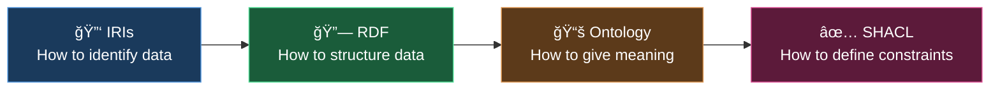
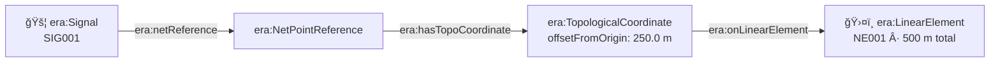
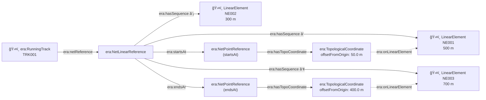
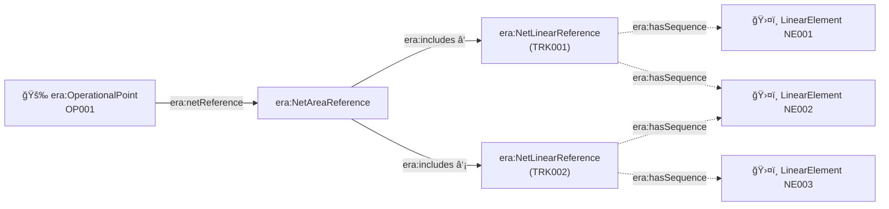

```mermaid
graph LR
    NE001["ğŸ›¤ï¸ LinearElement<br/>NE001 · 500 m"] -->|"NR001 · Both"| NE002["ğŸ›¤ï¸ LinearElement<br/>NE002 · 300 m"]
    NE002 -->|"NR002 · Both"| NE003["ğŸ›¤ï¸ LinearElement<br/>NE003 · 400 m"]
    NE001 -->|"NR003 · Both"| NE003
```

# RINF Data Provisioning Workshop

### Training for Infrastructure Managers & NREs

<div class="text-gray-400 mt-4">
📅 25 February 2026
</div>

<!--
Welcome everyone! Good morning and thank you for joining us today.

This is a full-day hands-on workshop. We'll go from legal context and background to your hands on a keyboard uploading data to the ERA Dataset Manager.

The goal: by end of day everyone can independently provision RINF data as RDF and validate it.
-->

---
layout: default
---

# Today's Agenda 📋

<div class="grid grid-cols-2 gap-6 mt-2 text-sm">
<div>

| # | Session |
|---|---------|
| 1 | 👋 Welcome & Introductions |
| 2 | 🌐 The ERA Data Ecosystem |
| 3 | 🔍 ERA Data Portal Tour |
| 4 | 🧩 RINF Ontology Deep-dive |
| 5 | 🗂️ Dataset Example Walk-through |
| 6 | 🛤️ Creating a RINF 3.1 Dataset from XML |

</div>
<div>

| # | Session |
|---|---------|
| 7 | ⚙️ Data Provisioning Workflow |
| 8 | ✅ SHACL Validation & Troubleshooting |
| 9 | 🔑 Access, Help & Reporting Issues |
| 10 | 💬 Q&A & Open Discussion |
| 11 | 🎯 Wrap-up & Next Steps |
| 12 | 🏁 End |

</div>
</div>

<!--
We have a packed day. Key principle: slides are the backdrop — we'll spend a lot of time in real code and repositories.

This deck is designed to be reference material too — every concept we cover is here so you can revisit it afterwards.
-->

---
layout: section
---

# 👋 Welcome & Introductions

<div class="absolute bottom-6 left-0 right-0 text-center text-xs text-gray-400">
  <span class="font-semibold text-white">① Welcome</span> · ② Ecosystem · ③ Portal · ④ Ontology · ⑤ Dataset · ⑥ Pipeline · ⑦ SHACL · ⑧ Access · ⑨ Q&A
</div>

<!--
30 minutes for welcome and round-table introductions.
-->

---
layout: default
---

# 👋 Hello, I am...

<div class="grid grid-cols-2 gap-8 mt-4">
<div>

**About me**

- 🧑 I am ...
- 🏢 I work for ...
- 🛤️ My role: ...

**My experience with RINF data**

- 📄 I currently produce RINF data as ...
- 🔧 Tools I use: ...

</div>
<div>

**Why I'm here today**

- 🎯 I want to learn how to ...
- ❓ My biggest open question is ...
- 💬 I'd love to discuss ...

</div>
</div>

<!--
Give participants 2–3 minutes to prepare, then go around the room.
Encourage them to be specific about their current pain points — it helps tailor the afternoon sessions.
-->

---
layout: default
---

# Workshop Objectives 🎯

By the end of today you will be able to:

<v-clicks>

- 🗺️ **Navigate** the ERA Data Interoperability Portal
- 📄 **Prepare** datasets according to RINF ontology v3.1
- ⚙️ **Use** the Dataset Manager pipeline for data provisioning
- ✅ **Perform** SHACL validation and interpret results
- 🔧 **Troubleshoot** common errors and validation issues
- 🆘 **Access** support resources and report issues effectively
- ✨ **Be amazed** by the possibilities of a railway topology

</v-clicks>

<!--
These are the 7 concrete objectives. At the end of the day we'll briefly revisit these to check off what we covered.

Key message: this is not a theoretical lecture. We will get our hands dirty.
-->

---
layout: two-cols-header
---

# 📎 Workshop Resources

::left::

Scan to open today's slide deck:

<div class="flex flex-col items-center mt-4 gap-2">
  
  <span class="text-xs text-gray-400">github.com/Matdata-eu/<br/>slides-era-rinf-data-provisioning</span>
</div>

::right::

Scan to open the railML-to-ERA dataset generator:

<div class="flex flex-col items-center mt-4 gap-2">
  
  <span class="text-xs text-gray-400">github.com/Matdata-eu/<br/>raillML-to-ERA</span>
</div>

<!--
Give everyone a minute to scan and bookmark both repositories.
The slide deck is the reference material — everything covered today is in there.
The railML-to-ERA repo is what we'll use hands-on during the afternoon sessions.
-->


---
layout: section
---

# 🌐 Understanding the ERA Data Ecosystem

<div class="absolute bottom-6 left-0 right-0 text-center text-xs text-gray-400">
  ① Welcome · <span class="font-semibold text-white">② Ecosystem</span> · ③ Portal · ④ Ontology · ⑤ Dataset · ⑥ Pipeline · ⑦ SHACL · ⑧ Access · ⑨ Q&A
</div>

<!--
30 minutes covering legal context, why RDF, and terminology.
Split: ~10 min legal, ~15 min why RDF, ~5 min terminology/quiz.
-->

---
layout: two-cols
---

# ⚖️ Legal Framework

**Three directives drive RINF data provision:**

<v-clicks>

- 📜 **EU 2019/773** — RINF Regulation  
  _Infrastructure managers **must** submit data_

- 🔗 **EU 2016/797** — Interoperability Directive  
  _Data must follow TSI requirements_
  _Compliance can be machine-verified via SHACL_

- 📂 **EU 2019/1024** — Open Data Directive  
  _Infrastructure data must be open and reusable_

</v-clicks>

::right::

<div class="mt-12">
<v-click>

**ERA's mandate:**

- Maintain the ontology, SHACL shapes, SKOS vocabularies
- Validate and publish submitted data
- Provide tooling for submission and querying

</v-click>

<v-click>

> 🗓️ **Deadline: 31 March 2026**  
> All data providers must submit RINF data
> in RDF format (ontology v3.1) for routebook parameters

</v-click>
</div>

<!--
The legal context is important — this is not optional. Infrastructure managers are legally required to provide this data.

The Open Data directive means the data, once submitted, becomes public. This is a feature, not a bug: it enables route compatibility tools, journey planners, and infrastructure research.

ERA's role: they don't just collect data — they maintain the entire technical standard (ontology + SHACL + vocabularies).
-->

---
layout: default
---

# 📅 RINF RDF Transition Timeline


<v-click>

> 🗓️ **Deadline: 31 March 2026**  
> All data providers must submit RINF data  
> in RDF format (ontology v3.1) for routebook parameters

</v-click>
<!--
Key takeaway from this timeline:
- The legal mandate has existed since 2019
- The technical specification (ontology) has been evolving
- We are NOW in the final stretch before the mandatory deadline
- Routebook and rulebook come next!

Where are we today? February 2026 — 5 weeks before the deadline.
-->

---
layout: default
---

# 🤔 Why RDF? Smart Standardisation



<ul class="mt-4 text-sm text-left space-y-2">
<li v-click><div class="bg-blue-50 dark:bg-blue-900 text-gray-800 dark:text-gray-100 rounded p-2"><strong>🔑 IRIs</strong> — Dereferencable globally unique identifiers. No more local IDs that clash across systems.</div></li>
<li v-click><div class="bg-green-50 dark:bg-green-900 text-gray-800 dark:text-gray-100 rounded p-2"><strong>🔗 RDF</strong> — Subject–predicate–object triples. Graph, not hierarchy.</div></li>
<li v-click><div class="bg-orange-50 dark:bg-orange-900 text-gray-800 dark:text-gray-100 rounded p-2"><strong>📚 OWL Ontology</strong> — Classes, properties, semantics. Machine-readable meaning.</div></li>
<li v-click><div class="bg-pink-50 dark:bg-pink-900 text-gray-800 dark:text-gray-100 rounded p-2"><strong>✅ SHACL</strong> — Validation constraints. Compliance is machine-verifiable. Also useful for building UIs and search engines.</div></li>
</ul>

<!--
This is the key insight: the EU (and ERA) chose RDF not just to be modern, but because each layer solves a real problem.

- IRIs: no more "our station ID is 42, theirs is 42 too but they're different stations"
- RDF: a graph model naturally fits railway networks — stations connect to tracks, tracks connect to signals
- OWL Ontology: the schema accompanies the data. New consumers can understand old data.
- SHACL: instead of writing custom validation code, you declare constraints and any validator can check them.

Real benefit: ERA can download a dataset from any IM and validate it with the same SHACL shapes. No custom parsing per IM.
-->

---
layout: default
---

# 📊 RDF vs XML

| Aspect | **XML** | **RDF** |
|--------|---------|---------|
| Data model | Hierarchical tree 🌲 | Graph — triples 🕸️ |
| Identity | Element nesting | Global URI for every resource |
| Validation | XSD | SHACL |
| Querying | XPath / XQuery | SPARQL |
| Linkability | Difficult (XLink) | Native: URIs link across datasets |
| Merging | Trees don't merge | Trivial: union of triple sets |


<!--
The biggest practical difference: XML IDs are local. When you want to reference data from another IM or another system, you need agreed mapping tables. With RDF, the URI IS the identifier — no mapping needed.

This is exactly what RINF needs: 30+ countries, ~600 infrastructure managers, one shared graph.
-->

---
layout: two-cols
class: gap-8
---

# 🔎 What is SPARQL?

**SPARQL** is a query language for RDF — like SQL, but for graphs.

<v-click>

A SPARQL query matches **triple patterns** against your data:

```sparql
PREFIX era: <http://data.europa.eu/949/>
PREFIX rdfs: <http://www.w3.org/2000/01/rdf-schema#>

SELECT ?tunnel ?name ?length
WHERE {
    ?tunnel a era:Tunnel ;
            rdfs:label ?name ;
            era:length ?length .
    FILTER(?length > 1000)
}
ORDER BY DESC(?length)
LIMIT 10
```

> Checkout this [fantastic wiki](https://kvistgaard.github.io/sparql/#/page/sparql%20wiki) about SPARQL!

</v-click>

::right::

<div class="mt-6 text-sm space-y-3">

<v-click>

**Key concepts:**

- **Triple pattern** `?tunnel a era:Tunnel`
- **Variable** `?tunnel`, `?name` 
- **PREFIX** — shorthand for long URIs
- **FILTER** — numeric, string, date comparisons
- **OPTIONAL** — left joins (like SQL `LEFT JOIN`)
- **UNION** — combine results from two patterns

</v-click>
<v-click>

**Four query forms:**

| Form | Purpose |
|---|---|
| `SELECT` | Return a table of bindings |
| 💡 `CONSTRUCT` | Return a new RDF graph |
| `ASK` | Return true/false |
| `DESCRIBE` | Return triples about a resource |

</v-click>

</div>

<!--
Most participants know SQL. The mental model is very similar — match patterns, filter, project.

The key difference: instead of matching rows in a table, you match triples in a graph. Variables are unbound and can bind to any matching node.

CONSTRUCT is the one to emphasise for this workshop — it's the transformation mechanism.
-->

---
layout: default
---

# 🔍 SPARQL vs REST JSON API

| Aspect | **REST JSON API** | **SPARQL over RDF** |
|--------|-------------------|---------------------|
| Querying | One endpoint per resource type | Any query over the full graph |
| Cross-dataset joins | Requires custom code | Native — federated queries across IMs |
| Identifiers | Opaque local IDs, mapping tables needed | Global URIs — universal, no mapping |
| Schema | Lives in documentation | Accompanies the data (ontology) |
| Extensibility | New fields require API versioning | Add triples without restructuring |
| Setup cost | Custom development per endpoint | No development — graph is the endpoint |

<!--
Key message: a REST API is a contract between two systems. SPARQL is a standard interface over any RDF graph — no bespoke development, no custom endpoint per question.

Real example: "give me all tunnels longer than 500m in the Benelux with their max speed" — one SPARQL query across datasets from BE, NL, LU. With REST APIs you'd need three different API calls, three different schemas, and custom code to merge them.
-->


---
layout: default
---

# 🚂 The Railway Data Problem

We have such a beautiful system…


---
layout: default
---

# 🚂 The Railway Data Problem

But we decided to break it into pieces we call "use cases"…


---
layout: default
---

# 🤔 How do we glue the pieces back together?

<div class="grid grid-cols-2 gap-6 mt-4">
<div>

**The challenge:**
<v-clicks>

- 🗂️ Siloed data models, historically home grown
- 🔤 Semantic interoperability
- 📍 Multiple coordinate systems
- 🔀 Hierarchical + network structure
- ⏰ Temporal validity
- 🌍 Cross-border IMs

</v-clicks>

</div>
<div v-click>

> _"If there is not enough autonomy, an organisation will be slow to adapt. But with too much autonomy and not enough cohesion, it will grow silos that pursue their own continuation at the expense of the whole._
>
> _Can you have freedom and keep everything working together at the same time?"_
>
> https://essentialbalances.com/

<div class="mt-4 p-3 bg-blue-50 dark:bg-blue-900 text-gray-800 dark:text-blue-100 rounded text-sm">

**Answers: Topology + Linked Data**

- 🔑 Use **IRIs** as globally unique identifiers
- 🔗 Use **RDF** to structure data
- 📚 Reuse **ontologies** for shared meaning
- And... don't give up!

</div>

</div>
</div>

<!--
This is the core motivation for RDF in RINF.

Societies create traffic rules to allow individual freedom while maintaining safe, efficient cohesion. Track design follows standards to form a coherent network. Data needs the same.

Linked Data as the "traffic rules" of data: every organisation can build their own systems, but IRIs, RDF and shared ontologies create the cohesion that makes cross-border integration possible.

This is exactly why ERA chose RDF — not because it's fashionable, but because it's the standardisation layer that makes 600+ infrastructure managers' data work together.
-->

---
layout: default
---

# 🏗️ Where RDF Fits in Your Architecture



<!--

```mermaid
flowchart LR
    IS["ğŸ—„ï¸ Internal Systems<br/>DB / GIS / Asset Management / Telematics"] --> ETL

    ETL["âš™ï¸ RDF Generation<br/>SPARQL-Anything · R2RML · Python · OTTR"] --> POST

    POST["🔧 Post-Processing<br/>SPARQL UPDATE · Python · SHACL Rules"] --> GRAPH

    GRAPH["📄 ERA-compliant RDF<br/>.ttl / .nt"] --> VAL
    GRAPH --> DM
    GRAPH --> LDES

    VAL["✅ SHACL Validation<br/>Local · EU Test Bed"] -->|"fix issues"| GRAPH

    DM["📤 Dataset Manager<br/>Full or Partial Upload"] --> KG

    LDES["📡 LDES Publication<br/>Event-Driven Streaming"] --> KG

    KG["🌠ERA Knowledge Graph<br/>Public SPARQL Endpoint"]

    style IS fill:#2d3748,color:#e2e8f0
    style KG fill:#1a365d,color:#e2e8f0
    style VAL fill:#276749,color:#e2e8f0
```

You don't need to abandon your existing systems. Your internal DB, GIS, and asset management systems stay as-is.

You add an RDF generation step — a transformation layer — that converts your data to ERA-compliant RDF.

The key insight: validate BEFORE you upload. Local SHACL validation gives you fast feedback. The Dataset Manager also validates, but it's slower to iterate.

The LDES option is for the future: rather than batch uploads, stream changes incrementally.
-->

---
layout: default
---

# 📖 Terminology Quick Reference

<div class="grid grid-cols-3 gap-3 text-sm">
<div>

**Organisations & Roles**
- **ERA** — EU Agency for Railways
- **IM** — Infrastructure Manager
- **NRE** — National Registration Entity
- **RCC** — Route Compatibility Check

**Registers**
- **RINF** — Register of Infrastructure
- **ERATV** — European Register of Authorised Types of Vehicles

</div>
<div>

**Data Standards**
- **RDF** — Resource Description Framework
- **TTL** — Turtle (RDF format)
- **SPARQL** — RDF query language
- **KG** — Knowledge Graph
- **URI** — Uniform Resource Identifier
- **IRI** — Internationalised Resource Identifier

**Validation**
- **SHACL** — Shapes Constraint Language
- **SKOS** — Simple Knowledge Org. System

</div>
<div>

**Infrastructure**
- **OP** — Operational Point (station, junction, ...)
- **SoL** — Section of Line
- **TSI** — Technical Specification for Interoperability
- **TEN-T** — Trans-European Transport Network
- **ETCS** — European Train Control System

**Topology**
- **NE** — LinearElement (NetElement)
- **NR** — NetRelation
- **LRS** — Linear Referencing System

</div>
</div>

<!--
This is a reference slide — don't read it out loud. Point people to it and let them take a photo.

You'll hear these abbreviations throughout the day. If something is unclear, ask!

Quick quiz idea: show the abbreviation, ask room to call out the full term.
-->

---
layout: section
---

# 🔍 ERA Data Portal Tour

**https://data-interop.era.europa.eu/**

<div class="absolute bottom-6 left-0 right-0 text-center text-xs text-gray-400">
  ① Welcome · ② Ecosystem · <span class="font-semibold text-white">③ Portal</span> · ④ Ontology · ⑤ Dataset · ⑥ Pipeline · ⑦ SHACL · ⑧ Access · ⑨ Q&A
</div>

<!--
30 minutes touring the ERA Data Interoperability Portal.
Switch to browser: open https://data-interop.era.europa.eu/
We will navigate through each application live.
-->

---
layout: two-cols
---

# 🖥️ Portal Applications

**Navigate to: https://data-interop.era.europa.eu/**

<v-clicks>

1. **🔎 Search Form**
   - Search OPs and sections of line
   - Advanced filters and export
   - 💡 *Get the SPARQL query behind results*

2. **🗺️ Map Explorer**
   - Interactive rail infrastructure map
   - Visualise track characteristics

3. **🚆 Route Compatibility Check**
   - Vehicle + route compatibility
   - Uses ERATV vehicle data
   - ⚠️ _Currently limited — workgroup active_

</v-clicks>

::right::

<v-clicks>

4. **📦 Dataset Explorer**
   - Browse published datasets
   - Metadata and provenance
  
</v-clicks>

<div class="mt-16 text-sm">

**💡 Hands-on tip:**

> In the Search Form, run a query and look for  
> the "Show SPARQL" option. This reveals the  
> exact SPARQL query behind the filter — great  
> for learning the data model.

</div>

<!--
Live demo in browser:
1. Show Search Form: search for "Hamburg" operational points, show SPARQL button
2. Show Map Explorer: zoom to a country, click a track to see its properties
3. Briefly show RCC — mention it's being reviewed by a working group
4. Show Dataset Explorer — show a recently uploaded dataset

Key message: these are the CONSUMER applications. As data providers, you feed this system.
-->

---
layout: two-cols
---

# 📚 Portal Resources

<v-clicks>

1. **📖 Data Stories**

2. **🧬 Vocabulary / Ontology**
   - ERA RINF ontology structure
   - Key classes, properties, version

3. **⚡ SPARQL Endpoint**
   - Direct query access
   - 💡 Use [Yasgui](https://yasgui.matdata.eu/) for better UX

4. **🗂️ GraphDB**
   - [graph.data.era.europa.eu](https://graph.data.era.europa.eu/) — Visual Graph, SPARQL, repository browser

</v-clicks>

::right::


<v-clicks>

1. **📤 Data Provisioning**
   - Introduction to Dataset Manager
   - Links to user manual
  
</v-clicks>


<div class="mt-4 text-sm">

**Useful links:**

| Resource | URL |
|---|---|
| Portal | [data-interop.era.europa.eu](https://data-interop.era.europa.eu/) |
| Application Guide | [rinf-appGuide](https://data-interop.era.europa.eu/era-vocabulary/rinf-appGuide/) |
| ERA GitLab | [era-ontology](https://gitlab.com/era-europa-eu/public/interoperable-data-programme/era-ontology/era-ontology) |
| UAT Environment | [uat.ld4rail...](https://uat.ld4rail.fpfis.tech.ec.europa.eu/) |
| User Manual | [RINF User Manual](https://data-interop.era.europa.eu/RINF-User%20Manual%20v2.0.pdf) |
| GraphDB | [graph.data.era.europa.eu](https://graph.data.era.europa.eu/) |

</div>

<!--
SPARQL tip: the ERA-provided SPARQL interface is functional but basic. The Yasgui instance at yasgui.matdata.eu offers autocomplete, result table downloads, and history — much better for day-to-day work.

GitLab is where all the source material lives: ontology OWL files, SHACL shapes, SKOS concept schemes, and the issue tracker for reporting problems.
-->

---
layout: section
---

# 🧩 RINF Ontology

<div class="absolute bottom-6 left-0 right-0 text-center text-xs text-gray-400">
  ① Welcome · ② Ecosystem · ③ Portal · <span class="font-semibold text-white">④ Ontology</span> · ⑤ Dataset · ⑥ Pipeline · ⑦ SHACL · ⑧ Access · ⑨ Q&A
</div>

<!--
75 minutes. Most technical section of the morning.
-->


---
layout: default
---

# 🗺️ What We'll Cover

<div class="grid grid-cols-3 gap-4 mt-4 text-sm">

<div class="bg-gray-100 dark:bg-gray-800 text-gray-900 dark:text-gray-100 rounded p-3">

**🏢 Organisation**
- `era:Body` + `era:OrganisationRole` (v3.1)

**🛤️ Topology**
- `LinearElement` + geometry
- `NetRelation` + navigability
- Worked example

**📏 Positioning**
- `NetPointReference`
- `NetLinearReference`
- `NetAreaReference`
- GeoSPARQL geometry
- Linear Referencing (KPs)

</div>

<div class="bg-gray-100 dark:bg-gray-800 text-gray-900 dark:text-gray-100 rounded p-3">

**🏗️ Infrastructure Elements**
- Overview & base pattern
- `OperationalPoint`
- `SectionOfLine`
- `Track` & functional resources
- `Signal` / `Switch`
- `Tunnel` / `Bridge`
- `LevelCrossing` / `PlatformEdge` / `KilometricPost` / `PrimaryLocation`

</div>

<div class="bg-gray-100 dark:bg-gray-800 text-gray-900 dark:text-gray-100 rounded p-3">

**📐 Patterns & Best Practices**
- Open World Assumption
- Temporal validity (`era:validity`)
- Functional Resources: TDS, CLS, ETCS

**🔀 Special Cases**
- Border Points
- Documents
- `era:hasPart` (inferred)
- `era:notYetAvailable` (not yet provided)
- `era:notApplicable` (not applicable)

</div>
</div>

<!--
Overview of the ontology chapter. Walk through this quickly — it sets expectations for the next 75 minutes.
-->


---
layout: default
---

# 🏢 Organisation (Infrastructure Manager)

<div class="text-sm mt-3">

The `era:infrastructureManager` property on all infrastructure elements (Tracks, OPs, Signals …) points to the **`era:OrganisationRole`** instance, not directly to the `era:Body`.

</div>


<div class="grid grid-cols-2 gap-3 text-sm">

<div>
```turtle
# ✅ v3.1 pattern
<era:organisations/0076> a era:Body ;
    era:organisationCode "0076" ;
    era:role <era:organisations/0076_IM> ;
    rdfs:label "Bane NOR"@no, "Bane NOR"@en .

<era:organisations/0076_IM> a era:OrganisationRole ;
    era:hasOrganisationRole
      <era:concepts/organisation-roles/IM> ;
    era:roleOf <era:organisations/0076> .
```

</div>

<div class="p-2 bg-red-50 dark:bg-red-900 text-red-900 dark:text-red-100 rounded text-sm mt-4">

❌ **Deprecated (v3.0):** `era:InfrastructureManager` + `era:imCode`  
✅ **Required (v3.1):** `era:Body` + `era:OrganisationRole`

</div>

</div>

<div class="mt-4">


</div>

<!--
The organisation pattern changed significantly in v3.1.

The key rule: infrastructureManager on tracks/OPs/etc points to the OrganisationRole, not the Body.
-->

---
layout: default
---

# 🔗 Topology: LinearElements

**LinearElements** are the atoms of the network topology — each represents a track segment between two connection points (switches, buffer stops, etc.). They have an origin and an end. They are directed.

```turtle
<_:NE001> a era:LinearElement ;
    era:length 500.0 .     # metres — optional but recommended
```

A geometry is attached with GeoSPARQL **`gsp:hasGeometry`**. Only 1 allowed in current SHACL...

```turtle
<_:NE001> a era:LinearElement ;
    era:length 500.0 ;
    gsp:hasGeometry [          # real-world WGS84 LINESTRING
        a gsp:Geometry ;
        rdfs:label "WGS84"@en ;
        gsp:asWKT "LINESTRING(7.4520 51.5100, 7.4620 51.5148)"
            ^^gsp:wktLiteral
    ] .
```

<!--
LinearElements are the atoms: each represents a track segment between two connection points (switches, buffer stops, etc).

gsp:hasGeometry can only appear ones and should be WGS84, longitude first.
-->

---
layout: default
---

# 🔗 Topology: LinearElements with multiple geometries

But what about schematic coordinates? A schematic visualisation? 

```turtle
<_:NE001> a era:LinearElement ;
    era:length 500.0 ;
    gsp:hasGeometry [          # real-world WGS84 LINESTRING
        a gsp:Geometry ;
        rdfs:label "WGS84"@en ;
        gsp:asWKT "LINESTRING(7.4520 51.5100, 7.4620 51.5148)"
            ^^gsp:wktLiteral
    ] ;
    gsp:hasGeometry [          # separate schematic-diagram geometry
        a gsp:Geometry ;
        rdfs:label "Schematic"@en, "Schematisch"@de ;
        gsp:asWKT "<https://data.example.eu/schematic/0/> LINESTRING(0 0, 500 0)"^^gsp:wktLiteral
    ] .
```

<!--
GeoSPARQL doesn't limit the number of gsp:hasGeometry on a gsp:Feature. 

gsp:hasGeometry can appear multiple times on the same element — e.g. one WGS84 LINESTRING for GIS tools and a separate schematic LINESTRING for diagram rendering.

Everything else — signals, tracks, operational points — positions itself ON the topology using netReference. And there could be an automatic calculation of their coordinates in the different coordinate systems.
-->

---
layout: default
---

# 🔗 Topology: NetRelations

**NetRelations** connect `LinearElements` at their endpoints, defining navigability.

```turtle
<_:NR001> a era:NetRelation ;
    era:elementA <_:NE001> ; era:isOnOriginOfElementA false ;   # end of NE001
    era:elementB <_:NE002> ; era:isOnOriginOfElementB true ;    # start of NE002
    era:navigability <era:concepts/navigabilities/Both> .
```

<div class="grid grid-cols-2 gap-4 mt-4 text-sm">
<div class="bg-gray-100 dark:bg-gray-800 text-gray-900 dark:text-gray-100 rounded p-3">

**`isOnOriginOfElement`**
- `true` = connects at the **start** of the element
- `false` = connects at the **end** of the element

</div>
<div class="bg-gray-100 dark:bg-gray-800 text-gray-900 dark:text-gray-100 rounded p-3">

**`navigability` values**
- `Both` — bidirectional
- `AB` — only A → B
- `BA` — only B → A
- `None` — physically connected, not traversable

</div>
</div>

<!--
NetRelations connect LinearElements at their endpoints. The isOnOriginOf flags determine which end connects where.

Navigability: Both = bidirectional, AB = only A→B, BA = only B→A, None = not navigable (physically connected but not traversable, e.g., bumper only).
-->

---
layout: two-cols
---

# 🗺️ Topology: LinearElements & NetRelations — Worked Example




::right::

```turtle
<_:NE001> a era:LinearElement ; era:length 500.0 .
<_:NE002> a era:LinearElement ; era:length 300.0 .
<_:NE003> a era:LinearElement ; era:length 400.0 .

# NE001 end ──── NE002 start
<_:NR001> a era:NetRelation ;
    era:elementA <_:NE001> ;
    era:isOnOriginOfElementA false ;  # end of NE001
    era:elementB <_:NE002> ;
    era:isOnOriginOfElementB true ;   # start of NE002
    era:navigability
        <era:concepts/navigabilities/Both> .

# NE002 end ──── NE003 start
<_:NR002> a era:NetRelation ;
    era:elementA <_:NE002> ;
    era:isOnOriginOfElementA true ;
    era:elementB <_:NE003> ;
    era:isOnOriginOfElementB true ;
    era:navigability
        <era:concepts/navigabilities/None> .

# NE001 end ──── NE003 start  (junction/branch)
<_:NR003> a era:NetRelation ;
    era:elementA <_:NE001> ;
    era:isOnOriginOfElementA false ;
    era:elementB <_:NE003> ;
    era:isOnOriginOfElementB true ;
    era:navigability
        <era:concepts/navigabilities/Both> .
```

<!--
This is the worked example for the previous two slides.
NE001 branches at its end (isOnOriginOfElementA=false) into both NE002 and NE003 — a classic junction/switch topology.

The SVG shows the same network: you can see the branching at the right end of NE001.
-->

---
layout: default
---

# 📏 Positioning: NetPointReference

Used by **point elements**: Signals, Switches, Level Crossings, Kilometric Posts, stopping-point Operational Points.




```turtle
<_:SIG001> a era:Signal ;
    era:netReference <_:NPR_SIG001> .

<_:NPR_SIG001> a era:NetPointReference ;
    era:hasTopoCoordinate <_:TC_SIG001> .

<_:TC_SIG001> a era:TopologicalCoordinate ;
    era:onLinearElement <_:NE001> ;
    era:offsetFromOrigin 250.0 .   # metres from origin

# Optional: LRS (kilometric) coordinate
<_:NPR_SIG001> era:hasLrsCoordinate [
    a era:LinearPositioningSystemCoordinate ;
    era:kmPost <_:KP_LPS01_km125> ;
    era:offsetFromKilometricPost 37.5   # metres
] .
```

<div class="text-xs mt-2 text-gray-400">


</div>

<!--
The topology coordinate is the most important. It places the element precisely on the network graph.

NetPointReference = one LinearElement, one offset. The simplest case.


**Topological coordinate — mandatory**

**LRS coordinate — optional**

`offsetFromOrigin` is in **metres** from the origin end of the LinearElement.  
The LRS coordinate is independent — both can coexist on the same NetPointReference.
-->

---
layout: default
---

# 📏 Positioning: NetLinearReference

Used by **linear elements**: RunningTrack, Siding, PlatformEdge, single-track Tunnel/Bridge.



```turtle
<_:TRK001> a era:RunningTrack ;
    era:netReference <_:NLR_TRK001> .

<_:NLR_TRK001> a era:NetLinearReference ;
    # ordered sequence of LinearElements spanned
    era:hasSequence ( <_:NE001> <_:NE002> <_:NE003> ) ;
    era:startsAt :NPR_START ;
    era:endsAt :NPR_END .
```

<!--
The sequence is an ordered rdf:List of LinearElements the track spans.
startsAt and endsAt carry full NetPointReference/TopologicalCoordinate chains to express the precise offset within the first and last LinearElement.
-->

---
layout: default
---

# 📏 Positioning: NetAreaReference

Used by **aggregate elements**: OperationalPoints, Sections of Line, multi-track Tunnels/Bridges.




```turtle
<_:OP001> a era:OperationalPoint ;
    era:netReference <_:NAR_OP001> .

<_:NAR_OP001> a era:NetAreaReference ;
    # ordered list, one entry per track inside the OP
    era:includes ( <_:NLR_TRK001> <_:NLR_TRK002> ) .
```

<!--
The NetAreaReference aggregates the NetLinearReference of every track in the area. Tracks within the same OP can share underlying LinearElement nodes.
-->

---
layout: two-cols
---

# 🗺️ GeoSPARQL Geometry

Geometries are placed on the element (and/or its netReference). Can be **computed** from topology + LinearElement LINESTRING, or provided directly.

```turtle
<_:SIG001>
  era:netReference [
    a era:NetPointReference ;
    era:hasTopoCoordinate [
      a era:TopologicalCoordinate ;
      era:onLinearElement <_:NE001> ;
      era:offsetFromOrigin 250.0 ] ] ;
  gsp:hasGeometry [
    a gsp:Geometry ;
    gsp:asWKT "POINT(10.752 59.914)"^^gsp:wktLiteral ] .
  #                  ^^^lon ^^^lat  ← longitude FIRST!
```

::right::
<v-click>
<div class="mt-4 text-sm">

**⚠️ #1 geometry mistake in RINF submissions:**

`POINT(`**lat lon**`)` instead of `POINT(`**lon lat**`)`

**WKT coordinate order in Europe:**

| Position | Dimension | Range |
|----------|-----------|-------|
| **1st ← FIRST** | **Longitude** | 4° – 25° E |
| 2nd | Latitude | 35° – 70° N |

**Memory aid:** In Europe, longitude is the *smaller* number. Even though it is LONG

> `POINT(`**10.75** `59.91)` ← 10.75° E, 59.91° N ✅ (Oslo)
> `POINT(`**59.91** `10.75)` ← latitude first ❌

**⚠️ Your GIS tool likely shows `(lat, lon)` — WKT is the reverse!**

</div>
</v-click>
<!--
The GeoSPARQL geometry is what goes on the map.

The coordinate order issue is one of the most frequent mistakes because:
1. Most people naturally think "latitude, longitude" (GPS, Google Maps)
2. Most GIS tools display coordinates as (lat, lon)
3. WKT standard is (lon, lat) — x-axis first, then y-axis

In Europe: if the first POINT value is > 30, it's almost certainly latitude (which belongs second). Run the SPARQL detection query from the appendix to bulk-check your dataset.

Geometry can be computed automatically from topological coordinates by interpolating along LinearElement LINESTRING geometries using Shapely or equivalent. See the era-wkt-geometry-enrichment skill for this workflow.
-->

---
layout: default
---

# 📌 Linear Referencing (Kilometric Posts)

LRS coordinates add a **kilometric position** to any topology position. They are **optional** but widely used.

```turtle
<_:netPointRef_SIG001>
    era:hasLrsCoordinate [
        a era:LinearPositioningSystemCoordinate ;
        era:kmPost <_:kmPost_LPS01_km125> ;
        era:offsetFromKilometricPost 37.5   # metres forward
    ] .

<_:kmPost_LPS01_km125> a era:KilometricPost ;
    era:hasLRS <_:lps_01> ;          # the Linear Positioning System
    era:kilometer 125.0 ;             # km value (xsd:double)
    era:kmPostName "1bis" ;         # human-readable name (optional)
    era:measuredDistance 125000.0 ;  # cumulative distance in metres (optional)
    era:netReference <_:NPR_KM125> . # own topology placement
```

<div class="grid grid-cols-2 gap-4 mt-4 text-sm">
<div class="bg-gray-100 dark:bg-gray-800 text-gray-900 dark:text-gray-100 rounded p-3">

📖 **Reading:** _"Signal SIG001 is at km 125 + 37.5 m on LPS01"_

</div>
<div class="bg-gray-100 dark:bg-gray-800 text-gray-900 dark:text-gray-100 rounded p-3">

**`KilometricPost`** is also an `era:InfrastructureElement` — it carries its own `era:netReference` (`NetPointReference`) for precise placement on the topology network.

</div>
</div>

<!--
LRS coordinates are optional but common. They provide a human-friendly reference alongside the topological coordinate.

The KilometricPost itself needs a netReference — it also lives on the topology network.
-->

---
layout: default
---

# 🏗️ Infrastructure Element Overview

All classes share the same base pattern: `era:inCountry`, `era:infrastructureManager`, `era:netReference`.

<div class="grid grid-cols-2 gap-3 mt-3 text-sm">

<div class="bg-gray-100 dark:bg-gray-800 text-gray-900 dark:text-gray-100 rounded p-3">

**📍 Point elements**

- `era:OperationalPoint` (stopping-point type), `era:Signal`, `era:Switch`,`era:LevelCrossing`, `era:KilometricPost`

**↔️ Linear elements** 

- `era:RunningTrack`, `era:Siding`, `era:PlatformEdge`, `era:Tunnel`, `era:Bridge`

**🗺️ Area elements** 

- `era:OperationalPoint`, `era:SectionOfLine`

</div>

<div>

```turtle
# Every infrastructure element follows this pattern:
<_:ELEM001> a era:InfrastructureElement ;

    # Where in the world
    era:inCountry country:DEU ;

    # Who manages it (→ era:OrganisationRole)
    era:infrastructureManager
        <era:organisations/0080_IM> ;

    # Where on the network topology
    era:netReference <_:REF_001> .
```
</div>
</div>

<!--
All these classes share the same base pattern:
- era:inCountry (required)
- era:infrastructureManager (required)
- era:netReference (required for positioning)

The functional resources distinction is crucial: ContactLineSystem, ETCS, TrainDetectionSystem do NOT have netReference — they are linked FROM tracks.

This is one of the most common modelling mistakes: trying to put netReference on a ContactLineSystem.
-->

---
layout: two-cols
---

# 📍 Operational Point Patterns

```turtle
<_:OP001> a era:OperationalPoint ;
    era:opName "Hauptbahnhof"@de, "Main Station"@en ;
    rdfs:label "Hauptbahnhof"@de, "Main Station"@en ;
    era:opType
      <era:concepts/op-types/10> ;   # station
    era:uopid "DEHBF" ;
    era:inCountry country:DEU ;
    era:infrastructureManager
      <era:organisations/0080_IM> ;
    era:netReference <_:NAR_OP001> .
```

**Required:** `opType`, `uopid`, `inCountry`, `infrastructureManager`, `netReference`

::right::

<div class="mt-4 text-sm">

**OP Types (selection):**

| Code | Type |
|------|------|
| 10 | Station |
| 20 | Small Station |
| 30 | Passenger Terminal |
| 70 | Passenger Stop (halt) |
| 80 | Junction |
| 90 | **Border Point** (UOPID starts `EU`) |
| 120 | Switch |
| 130 | Private Siding |

</div>

<!--
Border points are special: UOPID starts with EU, not a country code. E.g., EUBP1 not DEBP1.

The ERA organisation pattern changed significantly in v3.1. The old era:InfrastructureManager class is deprecated. The new pattern is era:Body (the organsation) + era:OrganisationRole (n-ary relationship for the IM role).

The infrastructureManager property now points to an era:OrganisationRole instance, not directly to a Body.
-->

---
layout: default
---

# ↔️ Section of Line

A `SectionOfLine` connects two `OperationalPoint` instances and acts as a **container for the tracks** between them.

```turtle
<_:SOL001> a era:SectionOfLine ;
    rdfs:label "Hauptbahnhof–Westbahnhof"@de,
              "Main Station–West Station"@en ;
    era:opStart <_:OP001> ;
    era:opEnd   <_:OP002> ;
    era:solNature <era:concepts/sol-natures/10> ;   # Regular SoL
    era:nationalLine <_:lps_LineA> ;
    era:inCountry country:DEU ;
    era:infrastructureManager <_:0080_IM> ;
    era:netReference <_:netAreaRef_SOL001> .        # ← NetAreaReference
```

**Required:** `opStart`, `opEnd`, `solNature`, `inCountry`, `infrastructureManager`, `netReference`

<!--
SoL is the second top-level container after OperationalPoint.
The nationalLine property links to the Linear Positioning System — the same LPS used for kilometric posts.
-->

---
layout: default
---

# 🛤️ Track & Functional Resources

Tracks are ... (nope.. not going to tumble in that rabbit hole...). The ERA ontology distinguishes between RunningTrack (main line tracks) and Siding (auxiliary tracks):

```turtle
<_:TRK001> a era:RunningTrack ;
    era:inCountry country:DEU ;
    era:infrastructureManager <_:0080_IM> ;
    era:netReference <_:NLR_TRK001> ;

    # Functional resources linked FROM the track:
    era:contactLineSystem <_:CLS001> ;
    era:trainDetectionSystem <_:TDS001> ;
    era:etcs <_:ETCS001> ;
    era:maximumPermittedSpeed 160 .
```

<!--
Functional resources are a different category from infrastructure elements.

Infrastructure elements (OP, Track, Signal, Tunnel ...) all inherit from era:InfrastructureElement and have netReference.

Functional resources (ContactLineSystem, TrainDetectionSystem, ETCS) do NOT inherit from era:InfrastructureElement and do NOT have netReference. They are attached to the track via properties like era:contactLineSystem.

This is one of the most common modelling mistakes: people try to add netReference to a ContactLineSystem. The SHACL shapes will catch this — but it's better to understand the architecture than to rely on error messages.
-->

---
layout: default
---
# Track category


---
layout: two-cols-header
---

# 🚦 Signal

> ⚠️ Signs (panels) are **not** era:Signals.

::left::

```turtle
<_:SIG001> a era:Signal ;
    rdfs:label "Signal A1"@de, "Signal A1"@en ;
    era:signalType <era:concepts/signal-types/01> ;
    era:inCountry country:DEU ;
    era:infrastructureManager <_:0080_IM> ;
    era:netReference <_:NPR_SIG001> .
```

::right::

| id | type |
|----|------|
| 01 | Home Signal |
| 02 | Intermediate Signal |
| 04 | Exit Signal |
| 06 | Block Signal |


<!--
Both Signal and Switch are point elements — they use NetPointReference.
-->

---
layout: two-cols-header
---

# 🚇 Tunnel

`era:Tunnel` → `NetLinearReference`
> `lineReferenceTunnelStart/End` are not meaningful when the tunnel spans multiple tracks.


::left::

**Required properties:**

<div class="text-sm">

| Property | Note |
|---|---|
| `era:tunnelIdentification` | string ID |
| `era:lineReferenceTunnelStart` | `NetPointReference` |
| `era:lineReferenceTunnelEnd` | `NetPointReference` |
| `era:inCountry` | |
| `era:infrastructureManager` | |
| `era:netReference` | `NetLinearReference` |


</div>

::right::

```turtle
<_:TUN001> a era:Tunnel ;
    rdfs:label "Bergtunnel"@de, "Mountain Tunnel"@en ;
    era:tunnelIdentification "TUN001" ;          # REQUIRED
    era:lineReferenceTunnelStart <_:NPR_start> ; # REQUIRED
    era:lineReferenceTunnelEnd   <_:NPR_end> ;   # REQUIRED
    era:inCountry country:DEU ;
    era:infrastructureManager <_:0080_IM> ;
    era:netReference <_:NLR_TUN001> ;
    # Optional properties:
    era:lengthOfTunnel 1250.0 ;       # metres — NOT era:length!
    era:crossSectionArea 50 ;         # m²
    era:maxTunnelSpeed 120 ;          # km/h
    era:complianceInfTsi true ;
    era:dieselThermalAllowed true ;
    era:hasEmergencyPlan true ;
    era:hasEvacuationAndRescuePoints true ;
    era:hasWalkway true ;
    era:nationalRollingStockFireCategory "A" ;
    era:rollingStockFireCategory
      <era:concepts/rolling-stock-fire/10> ;
    era:tunnelDocRef <_:doc_emergency_plan> .
```


<!--
Tunnels use NetLinearReference.
Three required properties specific to Tunnel beyond the base pattern.
lineReferenceTunnelStart/End point to NetPointReference resources marking the tunnel portals.
era:length does not exist — always use era:lengthOfTunnel.
When a tunnel spans multiple parallel tracks, start/end references are not meaningful — just use the NLR.
-->

---
layout: default
---

# 🌉 Bridge

`era:Bridge` → `NetLinearReference`

> Bridge has no extra required properties beyond the two booleans and the base pattern (`inCountry`, `infrastructureManager`, `netReference`).

<div class="grid grid-cols-2 gap-4 mt-2 text-sm">
<div>

**Required properties** (beyond base):

| Property | Type | Meaning |
|---|---|---|
| `era:existBridgeWindRestriction` | `boolean` | Wind speed limits? |
| `era:existOpeningHoursLimitation` | `boolean` | Opening hours? |

</div>
<div>

```turtle
<_:BRG001> a era:Bridge ;
    rdfs:label "Rheinbrücke"@de, "Rhine Bridge"@en ;
    era:inCountry country:DEU ;
    era:infrastructureManager <_:0080_IM> ;
    era:netReference <_:NLR_BRG001> ;
    # REQUIRED — even when false:
    era:existBridgeWindRestriction false ;
    era:existOpeningHoursLimitation false .
```

</div>
</div>

<!--
Bridge is one of the simpler elements — the main trap is missing the two boolean properties.
In RDF Open World semantics, omitting existBridgeWindRestriction does not say "no restriction" — it says "we don't know".
SHACL will flag an absent boolean as a Violation.
-->


---
layout: default
---

# ⚠️ Level Crossing

`era:LevelCrossing` → `NetPointReference`

<div class="grid grid-cols-2 gap-4 mt-4 text-sm">
<div>

Level crossings use a **point** network reference — the crossing position on the track.

**Required properties:** only the base pattern:

- `era:inCountry`
- `era:infrastructureManager`
- `era:netReference` → `NetPointReference`

No additional SHACL-required properties beyond the base for `era:LevelCrossing`.

</div>
<div>

```turtle
<_:LC001> a era:LevelCrossing ;
    rdfs:label "Bahnübergang Feldweg"@de, "Feldweg Level Crossing"@en ;
    era:inCountry country:DEU ;
    era:infrastructureManager <_:0080_IM> ;
    era:netReference <_:NPR_LC001> .
```

> Optional properties include road and railway identifiers, protection equipment (`era:protectionLegacySystem`), and traffic control (`era:hasBarriersOrGates`).

</div>
</div>

<!--
Level crossing is the simplest element — just the base triple pattern.
The optional properties cover things like road category, protection systems, barrier types.
-->

---
layout: default
---

# 🚉 Platform Edge

`era:PlatformEdge` → `NetLinearReference`

<div class="grid grid-cols-2 gap-4 mt-2 text-sm">
<div>

**Key property: `era:platformHeight`**

| Concept | Height |
|---|---|
| `platform-heights/30` | 550 mm |
| `platform-heights/40` | 760 mm |
| `platform-heights/140` | 920 mm |

Also: `era:platformId` — string identifier matching the OP's platform label.

</div>
<div>

```turtle
<_:PE001> a era:PlatformEdge ;
    rdfs:label "Bahnsteig 1"@de, "Platform 1"@en ;
    era:inCountry country:DEU ;
    era:infrastructureManager <_:0080_IM> ;
    era:netReference <_:NLR_PE001> ;
    era:platformId "Platform 1/2" ;
    era:platformHeight
      <era:concepts/platform-heights/30> .
      # 550 mm
```

> The `era:netReference` spans the full length of the platform edge as a `NetLinearReference`.

</div>
</div>

<!--
Platform edge uses NetLinearReference — the extent from the start to the end of the platform face.
Platform height is a SKOS concept, not a literal number.
The platformId should match the identifier used in the operational point description.
-->

---
layout: default
---

# 📌 Kilometric Post

`era:KilometricPost` → `NetPointReference`

<div class="grid grid-cols-2 gap-4 mt-4 text-sm">
<div>

Kilometer posts mark physical distance markers placed alongside the track. They carry both a **topological coordinate** (position on the topology) and a **LRS coordinate** (the kilometre value from a specific linear positioning system).

**Key properties:**

| Property | Role |
|---|---|
| `era:hasLRS` | Which LRS this post belongs to |
| `era:kilometer` | Kilometrage value (decimal) |
| `era:netReference` | Position on the topology |

</div>
<div>

```turtle
<_:KP125> a era:KilometricPost ;
    era:hasLRS <_:lps_01> ;
    era:kilometer 125.0 ;
    era:netReference <_:NPR_KP125> .

<_:NPR_KP125> a era:NetPointReference ;
    era:usesPoint <_:TP001> ;
    era:intrinsicCoordinate [
        era:coordinate 0.0
    ] .
```

> The topological position of the KP itself is described by the `NetPointReference`.

</div>
</div>

<!--
Kilometric posts are the physical manifestation of the LRS system on the ground.
They are infrastructure elements in their own right — not just annotation.
era:kilometer holds the decimal value; era:hasLRS points to the LinearPositioningSystem resource.
-->

---
layout: two-cols
---

# 🔗 Primary Location

`era:PrimaryLocation` — TAF/TAP TSI telematics link

A Primary Location (`era:PrimaryLocation`) is a subclass of `era:InfrastructureElement` and links any other `era:InfrastructureElement` to the TAF/TAP TSI location catalogue (used in freight/passenger telematics).

**Key properties:**

<div class="text-xs">

| Property | Required | Description |
|---|---|---|
| `era:primaryLocationCode` | ✅ | Pattern `[A-Z]{2}[0-9]{5}` |
| `era:primaryLocationName` | — | Human-readable name |
| `era:freightFlag` | — | Freight relevance |
| `era:containerHandlingFlag` | — | Container handling |
| `era:handoverPointFlag` | — | Network handover point |

</div>

> Likely to evolve with the TSI Telematics revision.

::right::

<div class="mt-8">

```turtle
<_:OP001> era:primaryLocation <_:PL001> .

<_:PL001> a era:PrimaryLocation ;
    era:primaryLocationCode "AT12345" ; # REQUIRED
    # Pattern: [A-Z]{2}[0-9]{5}
    era:primaryLocationName
      "Wien Westbahnhof"@en ;
    era:freightFlag true ;
    era:containerHandlingFlag false ;
    era:handoverPointFlag false ;
    era:inCountry country:AUT ;
    era:infrastructureManager <_:0081_IM> ;
    era:netReference <_:NPR_PL001> .
```

> The Primary Location is a **separate resource** linked from any era:InfrastructureElement (but mostly from era:OperationalPoint) via `era:primaryLocation`. It has its own `netReference`.

</div>

<!--
PrimaryLocation is a subclass of InfrastructureElement — it has inCountry, infrastructureManager, netReference.
It is linked FROM the OperationalPoint via era:primaryLocation.
The code pattern must match [A-Z]{2}[0-9]{5} — two uppercase letters followed by exactly 5 digits.
ERA is planning updates to this model as part of the TAF/TAP TSI revision.
-->

---
layout: default
---

# 🌐 Open World Assumption — Never Omit, Always State

**RDF / Open World thinking:**

> If the triple is absent, the answer is **"unknown"**.

```turtle
# Omitting contactLineSystem means:
# "we don't know the electrification status"

# To say "not electrified", you must DECLARE it:
_:TRK001 era:contactLineSystem [
  a era:ContactLineSystem ;
  era:contactLineSystemType era-cls:40
  # era-cls:40 = Not electrified (.../contact-line-systems/40)
] .
```

<v-click>
<div class="mt-4 p-3 bg-yellow-50 dark:bg-yellow-900 text-gray-800 dark:text-yellow-100 rounded text-sm">

⚠️ **This applies to ALL boolean-like properties in RINF.**  No emergency exit? State it explicitly. No gradient? State it explicitly.
Absence only means the data provider hasn't stated it yet.

</div>
</v-click>

<!--
This is arguably the most important conceptual slide of the day for people coming from XML backgrounds.

Practical consequences:
- Non-electrified tracks MUST have a ContactLineSystem with type /40
- Tracks with no gradient restrictions should have maximumGradient = 0, not omit the property
- Tunnels with no special emergency plan still need a document reference if the SHACL shape requires it

The SHACL shapes catch SOME of these (minCount constraints), but not all. The Open World assumption is a mindset change, not just a validation rule.
-->

---
layout: default
---

# ⏰ Temporal Validity Pattern

**Every infrastructure element needs `era:validity`**

<div class="grid grid-cols-2 gap-4">
<div>

```turtle
_:TRK001 a era:RunningTrack ;
    era:validity _:TRK001_validity .

_:TRK001_validity a time:Interval ;
    time:hasBeginning _:TRK001_begin .

_:TRK001_begin a time:Instant ;
    time:inXSDDate "2025-01-01"^^xsd:date .
```

</div>
<div>

**❌ Common mistakes:**

```turtle
# WRONG: era:validFrom does not exist!
_:TRK001 era:validFrom "2025-01-01" .

# WRONG: disjoint classes violation!
_:TRK001 a era:RunningTrack, era:TemporalFeature .

# WRONG: missing the Interval resource
_:TRK001 era:validity "2025-01-01"^^xsd:date .
```

</div>
</div>

<v-click>
<div class="p-3 bg-yellow-50 dark:bg-yellow-900 text-gray-800 dark:text-yellow-100 rounded text-sm mt-2">

⚠️ `era:Feature` and `era:TemporalFeature` are declared `owl:disjointWith`.  
Never type a track/OP as both. The validity is always on a **separate** `time:Interval` resource.

</div>
</v-click>

<!--
The temporal model is one of the trickier parts. ERA's model follows OWL-Time.

The chain is: Feature → era:validity → time:Interval → time:hasBeginning → time:Instant → time:inXSDDate.

Common mistakes:
1. Using era:validFrom — this property doesn't exist in the ERA ontology
2. Typing the element itself as era:TemporalFeature — causes OWL disjointness violation
3. Putting a date literal directly on era:validity — must be an Interval resource

Best practice: use a SPARQL UPDATE post-processing step to add validity to all elements that don't have one yet.
-->

---
layout: default
---

# 🔍 Train Detection System (TDS)

`era:TrainDetectionSystem` — linked FROM track via `era:trainDetectionSystem`

<div class="grid grid-cols-2 gap-4 mt-2 text-sm">
<div>

**Required:** `era:trainDetectionSystemType` (maxCount=1)

| Concept | Meaning |
|---|---|
| `train-detection/10` | Track circuit |
| `train-detection/20` | Axle counter |
| `train-detection/30` | Loop |

**Axle-counter-only properties:**
- `era:tdsMaximumMagneticField` → `era:MaximumMagneticField`  
  (directional X/Y/Z in dB µA/m)
- `era:maximumInterferenceCurrent` (A/m)

</div>
<div>

```turtle
<_:TDS001> a era:TrainDetectionSystem ;
    era:trainDetectionSystemType
      <era:concepts/train-detection/20> ;  # REQUIRED
    era:inCountry country:DEU ;
    era:infrastructureManager <_:0080_IM> ;
    era:trainDetectionSystemSpecificCheck
      <era:concepts/train-detection-specific-checks/10> ;
    era:frequencyBandsForDetection
      <era:concepts/FrequencyBandsForDetection/20> ;
    era:maximumInterferenceCurrent 4.0 ;
    era:tdsMaximumMagneticField [
        a era:MaximumMagneticField ;
        era:maximumMagneticFieldDirectionX 110 ;
        era:maximumMagneticFieldDirectionY 110 ;
        era:maximumMagneticFieldDirectionZ 110
    ] .

# Linked FROM the track:
<_:TRK001> era:trainDetectionSystem <_:TDS001> .
```

> Functional resource — **no** `era:netReference`.

</div>
</div>

<!--
TDS is a functional resource — no netReference, no geometry of its own.
Linked from the RunningTrack via era:trainDetectionSystem.
The maximumMagneticField sub-resource is only required for axle counter type (/20).
-->

---
layout: two-cols-header
---

# ⚡ Contact Line System (CLS)

::left::

**Required:** `era:contactLineSystemType` (maxCount=1)

<div class="text-xs">

| Concept | Meaning |
|---|---|
| `contact-line-systems/10` | Overhead contact line |
| `contact-line-systems/40` | **Not electrified** |


**Key rules:**
- Non-electrified tracks **must** still have a CLS with type `/40`
- OCL-only properties (`maxCurrentStandstillPantograph`, `maximumContactWireHeight`, `minimumContactWireHeight`) produce SHACL Warning if absent on OCL, Violation if present on non-OCL
- If track spans multiple CLS: **split the track** ? or aggregate using most restrictive values ?

</div>
::right::

<div class="mt-8">

```turtle
<_:CLS001> a era:ContactLineSystem ;
    era:contactLineSystemType
      <era:concepts/contact-line-systems/10> ; # REQUIRED
      # /10 = OCL, /40 = Not electrified
    era:inCountry country:DEU ;
    era:infrastructureManager <_:0080_IM> ;
    era:energySupplySystem
      <era:concepts/energy-supply-systems/AC10> ;
    era:maxTrainCurrent 300 ;
    # OCL-only properties:
    era:maxCurrentStandstillPantograph 200 ;
    era:maximumContactWireHeight 6.2 ;
    era:minimumContactWireHeight 5.0 .

# Linked FROM the track:
<_:TRK001> era:contactLineSystem <_:CLS001> ;
    # Track-level OCL properties:
    era:tsiPantographHead
      <era:concepts/compliant-pantograph-heads/10> ;
    era:trackRaisedPantographsDistanceAndSpeed
      <_:raisedPantoSpec> .
```

</div>

<!--
CLS is the most complex functional resource.
Non-electrified is a common trap — you must STILL declare a CLS with type /40.
OCL-only properties cause SHACL violations if present on type /40.
Track-level pantograph properties are on the RunningTrack, not the CLS itself.
Aggregation rule: if a track crosses from one electrification zone to another, either split at the boundary or aggregate conservatively.
-->

---
layout: two-cols-header
---

# 📡 ETCS

`era:ETCS` — linked FROM track via `era:etcs`

**Required:** `era:etcsLevelType` (maxCount=1) — _not_ the deprecated `era:etcsLevel`!

::left::

<div class="text-xs">

| Concept | Level |
|---|---|
| `etcs-levels/10` | Level 1 |
| `etcs-levels/20` | Level 2 |
| `etcs-levels/30` | Level 3 |
| `etcs-levels/99` | STM / national |

**SHACL Warning if absent:**
- `era:etcsBaseline`
- `era:etcsMVersion`
- `era:etcsTransmitsTrackConditions`

**Level-1 only:** `era:etcsInfill`

</div>

::right::

<div class="mt-8">

```turtle
<_:ETCS001> a era:ETCS ;
    era:etcsLevelType
      <era:concepts/etcs-levels/20> ;  # REQUIRED — NOT era:etcsLevel!
    era:inCountry country:DEU ;
    era:infrastructureManager <_:0080_IM> ;
    era:etcsBaseline
      <era:concepts/etcs-baselines/30> ;
    era:etcsMVersion
      <era:concepts/etcs-m-versions/ETCSMVersions/33> ;
    era:etcsTransmitsTrackConditions true ;
    era:etcsSystemCompatibility
      <era:concepts/etcs-system-compatibilities/10> ;
    # Level 1 only:
    era:etcsInfill
      <era:concepts/etcs-infills/10> .

# Linked FROM the track:
<_:TRK001> era:etcs <_:ETCS001> .
```

</div>

<!--
Common mistake: using era:etcsLevel (old property) instead of era:etcsLevelType.
Baseline and M_VERSION are not hard required but SHACL will warn.
etcsInfill only makes sense for Level 1 — applying it to Level 2/3 will cause a SHACL issue.
-->

---
layout: default
---

# 📏 Lineside Distance Indication (LDI)

`era:LinesideDistanceIndication` — linked FROM track via `era:linesideDistanceIndication`

> Currently only 1 `era:LinesideDistanceIndication` per Track is supported. But this is under discussion


<div class="grid grid-cols-2 gap-4 mt-2 text-sm">
<div>

**Required properties:**

| Property | Notes |
|---|---|
| `era:linesideDistanceIndicationAppearance` | REQUIRED, **repeatable** |
| `era:linesideDistanceIndicationFrequency` | metres between posts, REQUIRED |

**Optional:**

- `era:linesideDistanceIndicationPositioning` — approximate distance between markers

</div>
<div>

```turtle
<_:LDI001> a era:LinesideDistanceIndication ;
    era:linesideDistanceIndicationAppearance
      <era:concepts/lineside-distance-indication-appearance/10> ;
    # REQUIRED — repeatable if multiple types
    era:linesideDistanceIndicationAppearance
      <era:concepts/lineside-distance-indication-appearance/20> ;
    era:linesideDistanceIndicationFrequency 1000 ;
    # metres between posts — REQUIRED
    era:linesideDistanceIndicationPositioning
      <era:concepts/lineside-distance-indication-positioning/10> .
    # optional

# Linked FROM the track:
<_:TRK001> era:linesideDistanceIndication <_:LDI001> .
```

</div>
</div>

<!--
LDI is the least commonly known functional resource.

Frequency is the spacing in metres between individual distance markers.
-->

---
layout: default
---

# 🚩 Border Points

`era:OperationalPoint` with `era:opType` = `op-types/90`

<div class="grid grid-cols-2 gap-4 mt-2 text-sm">
<div>

**Special rules for border points:**

1. **UOPID prefix** starts with `EU` — not a country code  
   (e.g. `EUBP1`, not `DEBP1`)

2. `era:referenceBorderPoint` must point to an **ERA-managed** URI:  
   `http://data.europa.eu/949/referenceBorderPoints/{UOPID}`  
   Do **not** define this resource locally in your dataset.

3. Geometry is **inherited** from the parent OperationalPoint via post-processing

> The list of official border points is published by ERA as a CSV on the [RINF website](https://www.era.europa.eu/domains/registers/rinf_en).

</div>
<div>

```turtle
<_:BP001> a era:OperationalPoint ;
    era:opType
      <era:concepts/op-types/90> ;
    era:uopid "EUBP1" ;
    # "EU" prefix — NOT a country code!
    era:inCountry country:DEU ;
    era:infrastructureManager <_:0080_IM> ;
    era:netReference <_:NPR_BP001> ;
    era:referenceBorderPoint
      <http://data.europa.eu/949/referenceBorderPoints/EUBP1> .
# ↑ ERA-managed URI — do NOT define this resource yourself
```

> **Alternatively**: look up the matching `era:ReferenceBorderPoint` via a federated SPARQL query in your post-process  to the ERA endpoint, matching by geometry with a tolerance margin.

</div>
</div>

<!--
Border points are a special subtype of OperationalPoint.
The EU prefix on the UOPID signals that the point is administered at EU level, not nationally.
The ReferenceBorderPoint is an ERA-managed resource — do NOT define it locally. Its URI is constructed as:
  http://data.europa.eu/949/referenceBorderPoints/{UOPID}

Alternatively, if the UOPID is not known in advance, a SPARQL CONSTRUCT query can use a SERVICE block to query the ERA endpoint:
  https://data-interop.era.europa.eu/api/sparql
and match by geometry (GeoSPARQL, with a tolerance margin) to find the correct ReferenceBorderPoint URI.
The CSV on the ERA RINF website is the authoritative list of current border points.
-->

---
layout: default
---

# 📄 Documents

Linking documents to infrastructure elements (`era:Document`)

<div class="grid grid-cols-2 gap-4 mt-2 text-sm">
<div>

**Workflow:**

1. Upload file in Dataset Manager → _Reference Documents Management_
2. Query the Reference Documents API → get an `id` — a 40-char hex string
3. Construct the URI: `http://data.europa.eu/949/documents/{id}`
4. Use that URI in your Turtle:

**Language requirement:**

Documents must be provided in 2 official EU languages.  
**Recommended:** 2 `era:Document` with each 1 `era:documentUrl` values (one per language file) and a `dcterms:language` property.

</div>
<div>

```turtle
# The Document resource:
<era:documents/a22e9fbd9a969ca6e2cbb4b7093d3b4583c57344>
    a era:Document ;
    foaf:name "emergency_plan.pdf"^^xsd:string ;
    era:documentUrl
      "https://ld4rail.../documents/a22e.../download"
      ^^xsd:anyURI ;
    dcterms:language "en".

<era:documents/b344e533ecbb4322367dde627093d3b4583c57344>
    a era:Document ;
    foaf:name "emergency_plan.pdf"^^xsd:string ;
    era:documentUrl
      "https://ld4rail.../documents/b33f.../download"
      ^^xsd:anyURI ;
    dcterms:language "fr".

# Link from infrastructure element:
<_:TUN001>
    era:document
      <era:documents/a22e9fbd9a969...>, <era:documents/b344e533ecbb43...>  .
```

</div>
</div>

<!--
Documents are referenced from elements like Tunnels (emergency plan), SectionsOfLine (local rules), SwitchesAndCrossings (safety docs).
The 40-char hex id is assigned by the system at upload time — you cannot choose it.
Multiple infrastructure managers have had difficulties with this workflow — it's worth flagging to ERA early.
Provide docs in 2 EU languages; the English + national language combination is the most common approach.
-->

---
layout: default
---

# 🔗 `era:hasPart` & `era:isPartOf`

Prefer to **inferred** containment instead of stating manually

<div class="grid grid-cols-2 gap-4 mt-2 text-sm">
<div>

**What these properties express:**

- `era:OperationalPoint era:hasPart era:Track`  
- `era:SectionOfLine era:hasPart era:Track`  
- `era:Track era:isPartOf era:OperationalPoint`

These **don't need to be set in your Turtle source** — they can be derived from topology overlap using SPARQL UPDATE post-processing.


</div>
<div>

```sparql
# Conceptual post-processing — do NOT write manually:
# (handled by era-topology-relations skill)

CONSTRUCT {
    ?op era:hasPart ?track .
    ?track era:isPartOf ?op .
}
WHERE {
    # track's NLR window overlaps with
    # OP's NLR window on the same LinearElement
    ...
}
```

</div>

</div>

<div class="text-sm">

**Inference patterns:**
1. **Point-in-extent**: a point element (e.g. `KilometricPost`) is within a linear element if its topological offset lies within the linear element's effective window on a shared `LinearElement`
2. **Extent-overlap**: a linear element (e.g. `Track`) is part of an aggregate (e.g. `OperationalPoint`) if their effective windows on a shared `LinearElement` intersect

</div>

<!--
This is one of the most commonly misunderstood aspects.
Providers often try to explicitly state era:hasPart from OP to Track based on their knowledge of the physical layout.
This works in simple cases but breaks when topology is updated — the manual assertions become stale.
The topology-based inference ensures containment is always consistent with the actual network geometry.
-->

---
layout: default
---

# 🔌 `era:connectedTo` — Internal Track Connections

RINF parameter **1.2.4.1 Internal connection**

<div class="grid grid-cols-2 gap-4 mt-2 text-sm">
<div>

**Ontology definition:**

```turtle
era:connectedTo
    a owl:ObjectProperty,
      owl:SymmetricProperty,
      owl:IrreflexiveProperty ;
    rdfs:domain era:Track ;
    rdfs:range  era:Track .
```

Connects two `era:Track` instances (superclass of `RunningTrack` and `Siding`).  
Because it is **symmetric**, `A era:connectedTo B` implies `B era:connectedTo A`.  
Because it is **irreflexive**, a track cannot be connected to itself.

</div>
<div>


```turtle
_trackLine1 era:connectedTo _trackA .
_trackLine1 era:connectedTo _trackB .
_trackLine1 era:connectedTo _trackC .

_trackA era:connectedTo _trackLine2 .
_trackB era:connectedTo _trackLine2 .
```

> `_trackA`, `_trackB`, `_trackC` are **not** connected to each other.  
> The unnamed connection between switch 1 and switch 3 is invisible unless explicitly modelled as a `era:Track`.

</div>
</div>

<!--
era:connectedTo answers the question: "which tracks are reachable from this track without reversing direction?"

The limitation is real: if a train arrives on national line 1 in the opposite direction, it can only reach trackC, not trackA — but the property cannot express that asymmetry.

Best practice: infer connectedTo from topology (NetRelation boundaries) rather than stating it manually.
-->

---
layout: default
---

# ⏳ `era:notYetAvailable`

<div class="grid grid-cols-2 gap-4 mt-2 text-sm">
<div>

**When to use:**

The property **should** have a value, but the IM hasn't submitted it yet. Use `era:notYetAvailable` pointing to the **property IRI itself** — not a value of the property.

**Rules:**
- Object must be an `owl:ObjectProperty` or `owl:DatatypeProperty` IRI
- SHACL-validated inside `era:InfrastructureElementShape`
- **Mutually exclusive** with providing the actual triple — do not combine both

**Semantics:**
> `era:notYetAvailable` = _"this data exists but hasn't been provided"_ (pending/incomplete)

</div>
<div>

Data example: 

```turtle
# Electrification data pending — not yet submitted by the IM
<https://data.example.eu/tracks/TRK001>
    a era:RunningTrack ;
    era:notYetAvailable era:contactLineSystem .

# ✅ The object is the property IRI itself
# ❌ Do NOT also add:
#    era:contactLineSystem <_:CLS001>
```

Find data that is not yet available:

```sparql
# Query: find tracks missing contactLineSystem
SELECT ?track WHERE {
  ?track a era:RunningTrack ;
         era:notYetAvailable era:contactLineSystem .
}
```

</div>
</div>

<!--
era:notYetAvailable is the "I don't have it yet" marker.
It signals an obligation — the data provider acknowledges the property exists and is required, but hasn't been filled in.
The object is the property IRI (era:contactLineSystem), NOT a value of that property.
SHACL will validate that the IRI is actually an owl:ObjectProperty or owl:DatatypeProperty.
-->

---
layout: default
---

# 🚫 `era:notApplicable`

<div class="grid grid-cols-2 gap-4 mt-2 text-sm">
<div>

**When to use:**

The property is **conceptually irrelevant** for this element — not unknown, not pending. Use `era:notApplicable` pointing to the **property IRI itself**.

**Rules:**
- Object must be an `owl:ObjectProperty` or `owl:DatatypeProperty` IRI
- SHACL-validated inside `era:InfrastructureElementShape`
- **Mutually exclusive** with providing the actual triple — do not combine both

**Semantics:**
> `era:notApplicable` = _"this property does not apply here"_ (by design, not by omission)

</div>
<div>

```turtle
# Heritage / conventional line: no ETCS equipment fitted
<https://data.example.eu/tracks/TRK001>
    a era:RunningTrack ;
    era:notApplicable era:etcs .

# ✅ The object is the property IRI itself
# ❌ Do NOT also add:
#    era:etcs <_:ETCS001>
```

```sparql
# Query: find tracks where ETCS is explicitly not applicable
SELECT ?track WHERE {
  ?track a era:RunningTrack ;
         era:notApplicable era:etcs .
}
```

</div>
</div>

<!--
era:notApplicable is the "this doesn't apply here" marker.
Classic use case: a heritage or conventional line that is not equipped with ETCS at all.
The object is era:etcs (the property IRI), NOT an ETCS instance.
Contrast with notYetAvailable: notApplicable says "this will never apply", not "this is pending".
-->

---
layout: section
---

# 🗂️ Dataset Example

### Hands-on exploration

<div class="absolute bottom-6 left-0 right-0 text-center text-xs text-gray-400">
  ① Welcome · ② Ecosystem · ③ Portal · ④ Ontology · <span class="font-semibold text-white">⑤ Dataset</span> · ⑥ Pipeline · ⑦ SHACL · ⑧ Access · ⑨ Q&A
</div>

<div class="absolute right-8 top-20 flex flex-col items-center gap-1">
  
  <span class="text-xs text-gray-400">raillML-to-ERA</span>
</div>

<!--
Short hands-on section: explore the example railML-derived dataset.
-->

---
layout: default
---

# 🧪 Hands-on: Explore the Example Dataset

<div class="text-lg mt-4">

1. 📂 Open the [railML example dataset](https://github.com/Matdata-eu/raillML-to-ERA) in your editor
2. 🔍 Find an `era:OperationalPoint` — what required properties does it have?
3. 🛤️ Find its tracks — what functional resources are linked?
4. 🗺️ Trace the `era:netReference` chain to the `LinearElement`
5. ✅ Check for `era:validity` — is the temporal pattern correct?

</div>

<div class="mt-6 p-3 bg-gray-100 dark:bg-gray-800 text-gray-900 dark:text-gray-100 rounded text-sm">

**💡 Tools:**
- Your code editor (VS Code) for syntax highlighting
- [YasGUI](https://yasgui.matdata.eu/) https://yasgui.matdata.eu/ pointed at a local Fuseki instance
- Repository: https://github.com/Matdata-eu/raillML-to-ERA
- SPARQL endpoint: https://jena.matdata.eu/rinf

</div>


<!--
Give 15 minutes for this exercise. Walk around and help people.

The goal is just to get comfortable navigating real RDF data. Not to complete a full review.

Common findings during this exercise:
- "I can't find a CLS on this not-electrified track" → teachable moment about Open World
- "The netReference chain is confusing" → draw it on the whiteboard
-->

---
layout: section
---

# 🛤️ Creating a RINF 3.1 Dataset from XML

<div class="absolute bottom-6 left-0 right-0 text-center text-xs text-gray-400">
  ① Welcome · ② Ecosystem · ③ Portal · ④ Ontology · ⑤ Dataset · <span class="font-semibold text-white">⑥ railML</span> · ⑦ Pipeline · ⑧ SHACL · ⑨ Techniques · ⑩ Access · ⑪ Q&A
</div>

<!--
45 minutes — walks through the railML-to-ERA case study repository.
-->

---
layout: two-cols-header
---

# 🔄 Converting Legacy RINF XML to RDF

If your current RINF data is in the **legacy XML format**, you have two paths to generate ontology v3.1 RDF — without writing SPARQL or Python.

::left::

### Option 1 — Dataset Manager (server-side)

1. Log in to the [**UAT Dataset Manager**](https://uat.ld4rail.fpfis.tech.ec.europa.eu/)
2. Upload your legacy `.xml` file
3. The server validates it against the **XSD schema**
4. On success, it is automatically **converted to RDF** (ontology v3.1)
5. Download and review the generated dataset

<v-click>

> ✅ No local tooling required. Good first step to see what ERA generates from your data.

</v-click>

::right::

<div>


<v-click>

### Option 2 — Local converter (RINF-XML2RDF)

ERA provides a standalone Windows executable:

**[RINF-XML2RDF.exe on GitLab](https://gitlab.com/era-europa-eu/public/interoperable-data-programme/era-ontology/era-kg-mappings/-/blob/main/RINF-XML2RDF.exe)**

```
RINF-XML2RDF.exe \
  --in   path/to/rinf-data.xml \
  --out  path/to/output.ttl \
  --graph http://data.europa.eu/949/graph/rinf/0088
```

</v-click>

<v-click>

> 🖥️ Run locally — no upload needed.

</v-click>

<v-click>

<div class="mt-4 bg-orange-50 dark:bg-orange-900 text-gray-800 dark:text-orange-100 rounded p-3 text-xs border border-orange-300 dark:border-orange-700">
⚠️ <strong>Limitation:</strong> Both methods are limited to what the <strong>legacy XML schema</strong> contains. Parameters absent from the legacy format — including <strong>micro topology</strong> and other properties added in later ontology versions — will <em>not</em> be included in the output.
</div>

</v-click>

</div>

<!--
Both options produce the same ERA ontology v3.1 RDF — they use the same ERA mapping rules.

Option 1 (Dataset Manager) is the quickest to get started: just upload and inspect. Good for IMs who want to see what their existing data looks like as RDF before committing to a full pipeline build.

Option 2 (local exe) gives full control: run offline, integrate into CI, inspect the output before uploading. Requires Windows (or Wine on Linux/Mac).

In both cases, the output should then be validated with SHACL locally before the final production submission.
-->

---
layout: default
---

# 🛤️ railML Case Study: ERA Dataset from XML

Convert a **railML 3.2** infrastructure file into RINF-compatible RDF using a 4-step pipeline:

```
railML XML  →  [01-prep]        SPARQL Anything  →  one-eyed-graph.ttl
            →  [02-construct]   SPARQL CONSTRUCT  →  era-graph.ttl
            →  [03-post-process] Geometry enrichment → era-graph-enriched.ttl
            →  [04-validate]    SHACL validation  →  validation-report.ttl
```

<div class="grid grid-cols-4 gap-3 mt-4 text-sm">
<div class="bg-gray-100 dark:bg-gray-800 text-gray-900 dark:text-gray-100 rounded p-2">

**① Prep**  
SPARQL Anything ingests the XML — no custom parser needed. Output: raw RDF mirroring the railML structure.

</div>
<div class="bg-gray-100 dark:bg-gray-800 text-gray-900 dark:text-gray-100 rounded p-2">

**② Construct**  
SPARQL CONSTRUCT queries map railML concepts → ERA ontology classes and properties.

</div>
<div class="bg-gray-100 dark:bg-gray-800 text-gray-900 dark:text-gray-100 rounded p-2">

**③ Post-process**  
Shapely interpolates WKT geometries from topological coordinates. Topology relations inferred.

</div>
<div class="bg-gray-100 dark:bg-gray-800 text-gray-900 dark:text-gray-100 rounded p-2">

**④ Validate**  
ERA SHACL shapes checked locally before upload. Violations caught early.

</div>
</div>

<div class="mt-3 p-2 bg-gray-100 dark:bg-gray-800 text-gray-900 dark:text-gray-100 rounded text-xs">

📦 Repository: <a href="https://github.com/Matdata-eu/raillML-to-ERA">github.com/Matdata-eu/raillML-to-ERA</a> · Built around the <strong>railML® advanced example v14</strong>

</div>

<!--
This is a real working pipeline, not pseudocode.
SPARQL Anything removes the need for any custom XML parser — the railML is queried directly as RDF using the facade-x extension.
CONSTRUCT queries are the heart of the mapping — each infrastructure element type has its own .rq file.
Post-processing handles two things: WKT geometry from topology (Shapely), and hasPart/isPartOf inference.
Local SHACL validation before upload saves a lot of round trips with the ERA portal.
-->

---
layout: section
---

# ⚙️ Data Provisioning Workflow

<div class="absolute bottom-6 left-0 right-0 text-center text-xs text-gray-400">
  ① Welcome · ② Ecosystem · ③ Portal · ④ Ontology · ⑤ Dataset · ⑥ railML · <span class="font-semibold text-white">⑦ Pipeline</span> · ⑧ SHACL · ⑨ Techniques · ⑩ Access · ⑪ Q&A
</div>

<!--
30 minutes — pipeline walkthrough, reference docs, hands-on.
-->

---
layout: default
---

# 🔄 The Provisioning Pipeline

```mermaid
flowchart LR
    A["📤 Upload<br/>.ttl or .nt file"] --> C["✅ SHACL<br/>Validation"]
    C --> D["🧠 KG<br/>Generation"]
    D --> E["🌐 Publication<br/>Public endpoint"]

    C -->|"❌ Violations"| F["📋 Validation<br/>Report"]
    F -->|"Fix & re-upload"| A

    style A fill:#2d3748,color:#e2e8f0
    style C fill:#276749,color:#e2e8f0
    style E fill:#1a365d,color:#e2e8f0
    style F fill:#742a2a,color:#e2e8f0
```



<div class="grid grid-cols-3 gap-3 mt-4 text-sm">
<div class="bg-gray-100 dark:bg-gray-800 text-gray-900 dark:text-gray-100 rounded p-2">

**Upload**
- Turtle (`.ttl`) or N-Triples (`.nt`)
- Full or partial
- ZIP supported for large files

</div>
<div class="bg-gray-100 dark:bg-gray-800 text-gray-900 dark:text-gray-100 rounded p-2">

**Validation**
- ERA RINF SHACL shapes
- Severity: Violation / Warning
- Report downloadable

</div>
<div class="bg-gray-100 dark:bg-gray-800 text-gray-900 dark:text-gray-100 rounded p-2">

**Publication**
- SPARQL endpoint updated
- Public visibility
- Dataset versioned

</div>
</div>

<!--
The pipeline is the core workflow. Each stage has a status you can monitor in the Dataset Manager UI.

Important: server-side SHACL validation is slower than local validation. A large dataset can take minutes. This is why local pre-validation is strongly recommended.

The validation report shows each violation with: the resource URI, the property, the constraint that was violated, and the actual/expected values. This is enough information to fix the issue.
-->

---
layout: two-cols-header
---

# 📤 Full vs Partial Upload

::left::

### Full Upload 🔄

Replaces your entire dataset.

**When to use:**
- First submission
- Major restructuring
- Version upgrade (v3.0 → v3.1)

<v-click>
<div class="bg-yellow-50 dark:bg-yellow-900 text-gray-800 dark:text-yellow-100 rounded p-2 mt-4 text-sm col-span-2">

⚠️ **Referential integrity**: a partial upload referencing an `era:OperationalPoint` must either include that OP or have it already in the published dataset.

</div>
</v-click>

::right::

### Partial Upload ➕

Merged into existing dataset.

**When to use:**
- Regular updates
- New tracks or OPs added
- Property corrections

**Format:** a ZIP file containing:

<div class="text-xs">

| File | Purpose |
|---|---|
| `INSERT.nt` | Triples to **add** |
| `DELETE.nt` | Triples to **remove** |

</div>

<!--
The partial upload is powerful but requires care around referential integrity.

Example: if you add a new Track that is era:isPartOf an existing OperationalPoint, the OP must already be in the knowledge graph. If you're uploading it for the first time, include the OP in the same upload.

Practical tip: for regular incremental updates, maintain a version control system (Git) for your RDF files. Tag releases against ontology versions.
-->

---
layout: two-cols
---

# 📄 Reference Documents

Linking documents to infrastructure elements (`era:Document`)

<v-click>

```turtle
<_:TUN001>
    era:document
      <era:documents/a22e9fbd9a969...>, <era:documents/b344e533ecbb43...> .
      
<era:documents/a22e9fbd9a969ca6e2cbb4b7093d3b4583c57344>
    a era:Document ;
    foaf:name "emergency_plan.pdf"^^xsd:string ;
    era:documentUrl
      "https://ld4rail.../documents/a22e.../download"
      ^^xsd:anyURI ;
    dcterms:language "en".

<era:documents/b344e533ecbb4322367dde627093d3b4583c57344>
    a era:Document ;
    foaf:name "emergency_plan.pdf"^^xsd:string ;
    era:documentUrl
      "https://ld4rail.../documents/b33f.../download"
      ^^xsd:anyURI ;
    dcterms:language "fr".

```

</v-click>

::right::

<div class="mt-4 text-sm">
<v-click>

**Workflow to link a document:**

1. Upload file in Dataset Manager → _Reference Documents Management_
2. Query the Reference Documents API → get an `id` — a 40-char hex string
3. Construct the URI: `http://data.europa.eu/949/documents/{id}`
4. Use that URI in your Turtle

</v-click>

<v-click>
<div class="p-2 bg-blue-50 dark:bg-blue-900 text-gray-800 dark:text-blue-100 rounded mt-2 text-xs">

💡 **2 languages required!**  
Recommended: 2 `era:Document` with each 1 `era:documentUrl` (one per language file) and a `dcterms:language` property.

</div>
</v-click>

</div>

<!--
Documents are a common pain point. Multiple IMs have reported issues with the workflow.

If you have trouble: contact servicedesk@era.europa.eu with the specific error message.

The 40-character hex ID is assigned by the system when you upload. You need to capture it from the API response or query the documents API afterwards.

Language requirement: at least 2 EU official languages. This usually means English + your national language. Provide them as two documentUrl values on the same Document resource.
-->

---
layout: default
---


---
layout: default
---

# 🧪 Hands-on: Upload to UAT

<div class="text-lg mt-4">

1. 🌐 Open: **https://uat.ld4rail.fpfis.tech.ec.europa.eu/**
2. 🔐 Log in with your credentials
3. 📂 Navigate to your country's dataset
4. 📤 Upload the railML example dataset (`.ttl` or `.nt`)
5. ⏳ Monitor pipeline execution — watch each stage
6. 📋 Review the validation report
7. 🔧 Identify any violations and discuss²

</div>

<div class="mt-4 p-3 bg-gray-100 dark:bg-gray-800 text-gray-900 dark:text-gray-100 rounded text-sm">

**💡 Help:**  
Credentials not working? 👉 Contact servicedesk@era.europa.eu  
Pipeline stuck? Check status, wait 2 min, then refresh.

</div>

<!--
This is the central hands-on exercise of the afternoon section.

Walk around and help people with login issues. These are common — UAT credentials sometimes expire.

The example dataset is specifically designed to include some common patterns (and optionally some deliberate errors to fix).

Encourage people to use their own small real data samples if they have them prepared.
-->

---
layout: section
---

# ✅ Understanding & Performing SHACL Validation

<div class="absolute bottom-6 left-0 right-0 text-center text-xs text-gray-400">
  ① Welcome · ② Ecosystem · ③ Portal · ④ Ontology · ⑤ Dataset · ⑥ Pipeline · <span class="font-semibold text-white">⑦ SHACL</span> · ⑧ Access · ⑨ Q&A
</div>

<!--
60 minutes.
Split: 25 min SHACL theory + error types, 35 min tools and hands-on.
-->

---
layout: two-cols-header
---

# 🔍 What is SHACL?

::left::

**Shapes Constraint Language** — W3C standard for RDF validation

SHACL shapes define what your data **must** look like:

```turtle
# A SHACL shape for OperationalPoint
era:OperationalPointShape
    a sh:NodeShape ;
    sh:targetClass era:OperationalPoint ;

    # uopid is REQUIRED
    sh:property [
        sh:path era:uopid ;
        sh:minCount 1 ;
        sh:maxCount 1 ;
        sh:datatype xsd:string
    ] ;

    # opType must be a SKOS concept
    sh:property [
        sh:path era:opType ;
        sh:minCount 1 ;
        sh:nodeKind sh:IRI
    ] .
```

::right::

<div class="mt-4 text-sm">

**Constraint types in ERA SHACL:**

| Constraint | Meaning |
|---|---|
| `sh:minCount 1` | **REQUIRED** — must have ≥1 value |
| `sh:maxCount 1` | At most one value |
| `sh:datatype xsd:string` | Specific literal type |
| `sh:nodeKind sh:IRI` | Must be a URI (not a literal) |
| `sh:class era:X` | Referenced resource must be typed |
| `sh:pattern "^[A-Z]{2}"` | Regex pattern on value |

**Severity levels:**
- 🔴 `sh:Violation` — must fix before acceptance
- 🟡 `sh:Warning` — should fix, non-blocking

</div>

<!--
SHACL is the mechanism that turns the ontology into machine-verifiable compliance.

Key insight: the ERA SHACL shapes ARE the authoritative specification of what's required. When in doubt about whether something is required, look at the SHACL shapes.

The shapes file is at: era-shacl/ERA-RINF-shapes.ttl in the ERA GitLab repo.

Severity: Violations block acceptance in some contexts but the current ERA Dataset Manager accepts data with Warnings (yellow) but may reject on Violations (red). Check current behaviour with ERA.
-->

---
layout: two-cols-header
---

# 📋 Reading a SHACL Validation Report

::left::

```turtle
# A typical SHACL validation report
[] a sh:ValidationReport ;
    sh:conforms false ;
    sh:result [
        a sh:ValidationResult ;
        sh:focusNode <https://data.example.eu/_tracks_TRK001> ;
        sh:resultPath era:netReference ;
        sh:resultSeverity sh:Violation ;
        sh:resultMessage "Less than 1 values on era:netReference" ;
        sh:sourceConstraintComponent sh:MinCountConstraintComponent ;
        sh:sourceShape era:RunningTrackShape
    ] .
```

::right::

**How to interpret:**

<div class="mt-4 text-sm">

| Field | Meaning |
|---|---|
| `sh:focusNode` | **Which resource** has the problem |
| `sh:resultPath` | **Which property** is affected |
| `sh:resultMessage` | **What's wrong** |
| `sh:sourceShape` | Which SHACL shape triggered it |

</div>

<hr class="my-3" />

> **Note**: When SPARQLConstraints fail, they become more difficult to analyse because there's no reference to the SPARQLConstraint itself. Only the sh:resultMessage will be of help (when ERA patched the UNBOUND variable bug)


<!--
The validation report is your debugging tool. Always start with:
1. How many violations? (vs warnings, which are lower priority)
2. What's the most common pattern? Often one systematic error causes hundreds of violations.
3. Fix the systematic issues first, then tackle individual cases.

Common pattern: thousands of violations all pointing to the same missing triple type → one SPARQL UPDATE to add them all at once.
-->

---
layout: default
---

# 🔧 Systematic SPARQL UPDATE Fixes

Most errors repeat across thousands of elements — fix them all at once in post-processing:

<div class="grid grid-cols-2 gap-4 text-xs mt-2">
<div>

<v-click>

**Add a default `era:validity` to all elements missing it:**

```sparql
PREFIX era:  <http://data.europa.eu/949/>
PREFIX time: <http://www.w3.org/2006/time#>
PREFIX xsd:  <http://www.w3.org/2001/XMLSchema#>

INSERT {
  ?e era:validity [
    a time:Interval ;
    time:hasBeginning [
      a time:Instant ;
      time:inXSDDate "2024-01-01"^^xsd:date ] ] }
WHERE {
  VALUES ?t { era:OperationalPoint era:RunningTrack
              era:SectionOfLine era:Signal }
  ?e a ?t .
  FILTER NOT EXISTS { ?e era:validity [] }
}
```

</v-click>

</div>
<div>

<v-click>

**Add `skos:inScheme` to country references:**

```sparql
PREFIX skos: <http://www.w3.org/2004/02/skos/core#>
PREFIX era:  <http://data.europa.eu/949/>

INSERT {
  ?country skos:inScheme
    <http://publications.europa.eu/resource/authority/country>
}
WHERE {
  ?element era:inCountry ?country .
  FILTER NOT EXISTS { ?country skos:inScheme [] }
}
```
</v-click>
<v-click>

**Change datatype `xsd:double` → `xsd:integer` for speeds:**

```sparql
DELETE { ?e era:maximumPermittedSpeed ?old }
INSERT { ?e era:maximumPermittedSpeed ?corrected }
WHERE {
  ?e era:maximumPermittedSpeed ?old .
  FILTER(datatype(?old) = xsd:double)
  BIND(xsd:integer(str(?old)) AS ?corrected)
}
```

</v-click>

</div>
</div>

<!--
These SPARQL UPDATE patterns are powerful. They turn thousands of violations into zero with a single query.

Run these in post-processing AFTER your initial SPARQL CONSTRUCT generation but BEFORE uploading. Build them into your pipeline permanently so every future run benefits automatically.

The country inScheme fix (#3): ERA's SHACL shapes check that country URIs have a skos:inScheme triple. That triple lives in ERA's own triplestore, not your upload. So your standalone validation will complain until you add it locally.

Fix #5: Check SHACL shapes for other properties that also require xsd:integer — the same pattern applies to gauge, platform height, etc.
-->

---
layout: two-cols
---

# 🛠️ SHACL Validation Tools

<v-click>

### Local: PySHACL

```python
from pyshacl import validate
from rdflib import Graph

data = Graph().parse("my-data.ttl")
shapes = Graph().parse("ERA-RINF-shapes.ttl")

conforms, report, text = validate(
    data,
    shacl_graph=shapes,
    inference="none"
)

if not conforms:
    print(text)
```

**Free and open source. Suitable for automation.**  
⚠️ Slower than MapLib (~250s for a small graph)

</v-click>

::right::

<div class="mt-4 text-sm">

<v-click>

### Local: MapLib

```python
import maplib

m = maplib.Mapping()
m.read("my-data.ttl", format='turtle')
m.read("ERA-RINF-shapes.ttl",
             named_graph="urn:shapes", 
             format='turtle')

report = m.validate()
```

**Very fast (~1.5s vs 250s for same data)**  
⚠️ Requires [paid licence](https://payhip.com/b/cOImS) for SHACL validation

</v-click>

<v-click>

### Remote: EU Interoperability Test Bed

🌐 [interoperable-europe.ec.europa.eu](https://interoperable-europe.ec.europa.eu/collection/interoperability-test-bed-repository/solution/interoperability-test-bed)

- No local setup required
- Upload dataset + shapes
- Retrieve full validation report
- Good reference implementation

</v-click>

</div>

<!--
For most IMs, PySHACL is the recommended starting point: free, well-documented, and integrates into Python pipelines.

The EU Interoperability Test Bed is excellent for a second opinion — different SHACL engine means different potential edge cases.

IMPORTANT: Apply the shape fixes before running validation. Without them, you will get thousands of spurious warnings about OWL/RDF/SKOS vocabulary URIs that are perfectly valid. These obscure the real issues.

Shape fixes are in the 04-validate/shape-fixes/ directory of the example repository.
-->

---
layout: default
---

# ⚠️ Shape Fixes — Why You Need Them

**Running SHACL without fixes → thousands of spurious warnings:**

<v-clicks>

1. **`InstancesMustHaveTypeShape` fires on vocabulary URIs**  
   `<era:concepts/contact-line-systems/10>` has no `rdf:type` in your data (it's defined in ERA's triplestore)  
   → Fix: `exclude-ontology-uris-from-type-check.sparql`

2. **Deprecated-property checks fire on ERA ontology**  
   When adding ontology into datashape, ERA's own deprecated-property SHACL shapes are validation results
   → Fix: `exclude-ontology-uris-from-deprecated-check.sparql`

3. **GeoSPARQL `sh:sparql` constraints throw errors**  
   `geof:distance`, `geof:within` — most validators don't implement these  
   → Fix: filter out SPARQLConstraints referencing `geof:` functions

</v-clicks>

<v-click>
<div class="p-3 bg-yellow-50 dark:bg-yellow-900 text-gray-800 dark:text-yellow-100 rounded mt-4 text-sm">

📁 Shape fixes are in `04-validate/shape-fixes/` in the example repository.  
Apply as SPARQL UPDATE against the shapes graph **before** running validation.

</div>
</v-click>

<!--
This is a practical issue that can waste hours if you don't know about it.

The ERA SHACL shapes have some known quirks:
1. They check that every IRI has an rdf:type — but SKOS concepts from ERA's vocabulary are only typed in ERA's own triplestore, not in your upload. So they appear "untyped" to a standalone validator.
2. Deprecated-property shapes sometimes fire incorrectly on ontology properties.
3. GeoSPARQL extension functions (geof:distance etc.) are not standard SPARQL and most SHACL validators can't evaluate them.

The shape fixes are SPARQL UPDATE queries that modify the shapes graph to exclude these false positives.
-->

---
layout: default
---

# 🧪 Hands-on: Validate & Fix

<div class="grid grid-cols-2 gap-4 mt-4">
<div>

### Exercise 1: Local Validation

1. 📥 Download latest `ERA-RINF-shapes.ttl` from ERA GitLab
2. 🐍 Install pySHACL: `pip install pyshacl`
3. ▶️ Run validation on the example dataset
4. 📋 Count violations vs warnings
5. 🔧 Apply shape fixes and re-run — how many warnings disappear?

</div>
<div>

### Exercise 2: Introduce & Fix Errors

1. ✏️ Make these deliberate mistakes in the dataset:
   - Remove `era:validity` from one track
   - Remove `era:trackRaisedPantographsDistanceAndSpeed` from a track
   - Remove `era:netReference` from an OP
2. ▶️ Re-validate
3. 🔍 Find the violations in the report
4. 🛠️ Fix them and validate again

</div>
</div>

<div class="mt-4 p-3 bg-gray-100 dark:bg-gray-800 text-gray-900 dark:text-gray-100 rounded text-sm">

💡 **Bonus:** Compare local validation results in pySHACL and maplib or another validator.
Are there differences? 

</div>

<!--
This hands-on is very effective at building intuition for the validation loop.

The deliberate error exercise is particularly valuable: people need to experience the feedback loop firsthand — introduce error, see report, fix, re-validate.

Common observation: different SHACL validators can produce slightly different results. This is normal — some implement more features (especially sh:sparql constraints). The EU Test Bed is a useful reference.
-->

---
layout: section
---

# 🛠️ Useful Techniques

### Reference for your own implementation

<div class="absolute bottom-6 left-0 right-0 text-center text-xs text-gray-400">
  ① Welcome · ② Ecosystem · ③ Portal · ④ Ontology · ⑤ Dataset · ⑥ Pipeline · ⑦ SHACL · <span class="font-semibold text-white">⑧ Techniques</span> · ⑨ Access · ⑩ Q&A
</div>

<!--
Brief section — not all topics need a full walkthrough. Point participants to the getting-started guide for details.
-->

---
layout: default
---

# 🔍 Querying & Exploring Your Graph

Before submitting, inspect your generated RDF locally.

<div class="grid grid-cols-3 gap-3 mt-4 text-sm">
<div class="bg-gray-100 dark:bg-gray-800 text-gray-900 dark:text-gray-100 rounded p-3">

**Apache Jena Fuseki**

Local SPARQL server — load your `.ttl`, query via web UI or HTTP.

```bash
fuseki-server --update --mem /mydata

curl -X POST localhost:3030/mydata/data \
  -H "Content-Type: text/turtle" \
  --data-binary @era-graph.ttl
```

Web UI at `http://localhost:3030/`

</div>
<div class="bg-gray-100 dark:bg-gray-800 text-gray-900 dark:text-gray-100 rounded p-3">

**YasGUI**

Web SPARQL editor with autocompletion and result visualisation.

Point at your local Fuseki or the ERA public endpoint.

🔗 https://yasgui.matdata.eu/

</div>
<div class="bg-gray-100 dark:bg-gray-800 text-gray-900 dark:text-gray-100 rounded p-3">

**SPARQL Notebook**

VS Code extension — write and execute SPARQL queries inline in a notebook. Great for iterative development and debugging.

🔗 _Zazuko SPARQL Notebook_

</div>
</div>

<!--
Fuseki is the workhorse. Everyone should have it running locally by the end of the workshop.
YasGUI is browser-based — no install needed.
SPARQL Notebook is the most ergonomic if you're already in VS Code.
-->

---
layout: default
---

# 🌐 Creating ERA Topology from GIS Geometry

If you have track **GIS geometry** (LineStrings) but no topology, you can generate it programmatically.

<div class="grid grid-cols-2 gap-4 mt-3 text-sm">
<div>

**Three-phase approach:**

1. **Filter & clip** — bounding box filter, GIS → RDF LINESTRING triples
2. **Detect intersections & split** — T-intersections, X-crossings; splits at switches and junctions
3. **Build ERA topology** — each segment → `era:LinearElement`; endpoint clusters → `era:NetRelation`

| Node degree | Pattern |
|---|---|
| 2 — simple join | 1 relation, `Both` |
| 3 — switch/turnout | 3 relations (all pairs) |
| 4 — diamond crossing | 4 relations (straight-through pairs) |

</div>
<div>

```turtle
<_:netElement_seg_123> a era:LinearElement ;
    era:lengthOfNetLinearElement 247.512 ;
    gsp:hasGeometry [
        a gsp:Geometry ;
        gsp:asWKT "LINESTRING (4.482 50.882, ...)"
                  ^^gsp:wktLiteral
    ] .
```

> ⚠️ Watch out for **Z-coordinates**: crossing tracks on different vertical levels (tunnels, bridges) must **not** be split at apparent XY intersections.

Demo script: `scripts/generate_topology_from_gis.py` in the railML-to-ERA repo.

</div>
</div>

<!--
This is highly relevant for IMs who have GIS data but no RDF topology yet.
The phase 2 split loop needs 1–2 passes to converge.
The Z-coordinate caveat is a common source of spurious splits — bridges over tunnels look like intersections in 2D.
-->

---
layout: default
---

# 🗂️ URI Minting & Format Conversion

<div class="grid grid-cols-2 gap-4 mt-3 text-sm">
<div>

**URI pattern** (from the guide):

```
https://{domain}/{collection}_{localId}
```

- `collection` = plural noun + underscore: `_tunnels_`, `_signals_`, `_netElements_`
- `localId` = source system ID, stripped of spaces and special chars
- No country codes in collection names
- Blank nodes only in CONSTRUCT intermediates — **not** in submitted data

```turtle
# ✅ correct
<https://data.example.eu/_tunnels_TUN001>
    a era:Tunnel .

# ❌ avoid
_:TUN001 a era:Tunnel .
```

</div>
<div>

**Format conversion** — convert between serializations with Apache Jena `riot`:

```bash
# Turtle → N-Triples (faster upload for large files)
riot --output=NT era-graph.ttl > era-graph.nt

# N-Triples → Turtle (for readability)
riot --output=Turtle era-graph.nt > era-graph.ttl

# Validate syntax only
riot --validate era-graph.ttl
```

Or with Python `rdflib`:

```python
from rdflib import Graph
g = Graph().parse("era-graph.ttl")
g.serialize("era-graph.nt", format="nt")
```

</div>
</div>

<!--
URI minting is one of the most common sources of errors — providers often reuse internal IDs that contain spaces, slashes, or non-ASCII characters.
The riot tool is fast and catches syntax errors before you hit the portal.
ZIP upload is supported for large NT files.
-->

---
layout: default
---

# 🔗 URI Dereferencing

**Make every ERA IRI a clickable, human-readable resource** — using the open-source [`Matdata-eu/simple-dereferencing`](https://github.com/Matdata-eu/simple-dereferencing) tool.

<div class="grid grid-cols-2 gap-6 mt-4 text-sm">
<div>

**What it does**

- Client-side SPA served by nginx in Docker
- Runs a SPARQL `DESCRIBE` on any URI → renders HTML
- **Content negotiation**: Turtle, RDF/XML, JSON-LD (via `Accept` header or UI button)
- **Geo**: detects `gsp:hasGeometry` → renders a **Leaflet map** automatically

**Quick start**

```bash
docker run -p 8080:80 \
  -e SPARQL_ENDPOINT=https://linked.ec.europa.eu/sparql \
  -e BASE_URI=https://linked.ec.europa.eu/era/id \
  ghcr.io/matdata-eu/uri-dereferencer:latest
```

</div>
<div>

**Example URIs to try**

```
https://data.matdata.eu/_operationalPoints_opp141
```

```
https://dim-dev.review.apps.banenor.no/data/
    _station_3f3f78ee-4ea4-42e2-9dc3-dcf4c3a43e32
```

**Use cases**
- ✅ Check submitted data looks correct before validation
- ✅ Share a URI with a colleague — gets human-readable page
- ✅ Debug geometry: WKT coordinate → Leaflet map pin
- ✅ Inspect RDF in Turtle / JSON-LD without a SPARQL client

</div>
</div>

<!--
URI dereferencing is the "last mile" of Linked Data — it turns an abstract IRI into a page a human can read.
The simple-dereferencing tool is a lightweight nginx container: point it at any SPARQL endpoint and a base URI, and every URI under that base becomes a dereferenceable resource.
Participants running the tool locally can paste any ERA URI into their browser and immediately see the structured data plus a map if geometry is present.
This is also a useful debugging technique: if your submitted data doesn't show up correctly here, there's a problem upstream.
-->

---
layout: default
---

# 🤖 Skills for ERA Data Provisioning

<v-clicks>

This repository ships **GitHub Copilot skills** — domain-specific instruction files that teach an AI agent (or a human...) how to work with ERA data. Load them in VS Code Copilot Chat to get expert-level help.

<div class="grid grid-cols-3 gap-3 mt-4 text-sm">
<div class="bg-gray-100 dark:bg-gray-800 text-gray-900 dark:text-gray-100 rounded p-3">

**Authoring CONSTRUCT queries**

- `railml-sparql-construct` — write SPARQL CONSTRUCT queries transforming railML 3.2 XML → ERA RDF following project conventions
- `era-construct-workflow` — full workflow for adding new element mappings: planning → implementation → testing

</div>
<div class="bg-gray-100 dark:bg-gray-800 text-gray-900 dark:text-gray-100 rounded p-3">

**Positioning & topology**

- `era-dual-positioning` — implement TopologicalCoordinate + LinearPositioningSystemCoordinate (KilometricPosts)
- `era-topology-relations` — infer containment/proximity from network topology overlap
- `era-wkt-geometry-enrichment` — compute GeoSPARQL WKT geometries by interpolating against LinearElement LINESTRINGs

</div>
<div class="bg-gray-100 dark:bg-gray-800 text-gray-900 dark:text-gray-100 rounded p-3">

**Resources, URIs & SHACL**

- `era-functional-resources` — ContactLineSystem, ETCS, TrainDetectionSystem without `netReference`
- `era-resource-uri-minting` — BIND(IRI(...)) patterns, namespace choices
- `era-shacl-analysis` — query SHACL shapes to find required properties
- `era-mcp-query` — run SPARQL via MCP servers against ERA ontology or railML data

</div>
</div>

</v-clicks>

<!--
These skills live under .github/skills/ in the repository.
In VS Code, open Copilot Chat and reference the skill by name — the AI will follow the skill's instructions when helping you with that specific task.
This means a Copilot Chat session can guide you through writing a correct CONSTRUCT query for a new infrastructure element type, handling all the ERA-specific conventions automatically.
-->

---
layout: section
---

# 🔑 Getting Access, Help & Reporting Issues

<div class="absolute bottom-6 left-0 right-0 text-center text-xs text-gray-400">
  ① Welcome · ② Ecosystem · ③ Portal · ④ Ontology · ⑤ Dataset · ⑥ Pipeline · ⑦ SHACL · ⑧ Techniques · <span class="font-semibold text-white">⑨ Access</span> · ⑩ Q&A
</div>

<!--
30 minutes.
Split: 10 min access setup, 20 min GitLab + support channels.
-->

---
layout: two-cols
---

# 🔐 Getting Access

**Data Provisioning Environment:**

- **Production**: https://data-interop.era.europa.eu/
- **UAT/Test**: https://uat.ld4rail.fpfis.tech.ec.europa.eu/

<v-clicks>

**Steps to get access:**
1. ✉️ Contact **servicedesk@era.europa.eu**
2. Specify: organisation, role, environment needed
3. Single Sign-On (EU Login) credentials assigned
4. Verify login on UAT first

</v-clicks>

::right::

<div class="mt-6">
<v-click>

**⚠️ Common access issues:**

| Issue | Solution |
|---|---|
| Login loop | Clear cookies, try private browser |
| Credentials expired | Contact Service Desk |
| Wrong environment | Check URL — UAT vs Production |
| Dataset Manager not showing | Correct role not assigned |

</v-click>

</div>

<!--
Take a few minutes now to verify that everyone can log in to the UAT environment.

If someone can't log in, note their details and contact the Service Desk on their behalf. Don't let this block them from participating in the exercises — they can pair with a colleague.

The UAT environment is specifically for testing and training. It's safe to upload test data and try things out here.
-->

---
layout: two-cols
---

# 🐛 Reporting Issues — GitLab

**Issue tracker:**  
https://gitlab.com/era-europe-eu/.../era-ontology/-/issues

**When to create an issue:**

<v-clicks>

- 🐞 Bug in Dataset Manager / pipeline
- 🤔 Question about ontology design
- 💡 Improvement suggestion
- ❌ SHACL validation error that seems wrong
- 📐 Missing concept in a SKOS scheme

</v-clicks>

::right::

<div class="mt-4 text-sm">
<v-click>

**Effective issue report template:**

```
## Problem
What I expected vs what happened.

## Steps to Reproduce
1. Load data: [attach .ttl snippet]
2. Run validation
3. See error: [paste exact error message]

## Context
- ERA Ontology version: v3.1
- Validator: pySHACL 0.26.0
- Data graph size: ~7000 triples

## Labels
bug, shacl, dataset-manager
```

</v-click>
</div>

<!--
GitLab is the primary channel for technical issues. ERA monitors it actively.

A good issue report speeds up resolution dramatically. The key elements:
- What you expected
- What actually happened
- A minimal reproducible example (small .ttl snippet showing the issue)
- Exact version numbers

Labels help ERA triage:
- bug: something is broken
- question: you need clarification
- dataset-manager: pipeline or UI issue
- shacl: validation constraint issue
- KG generation: knowledge graph generation step issue
-->

---
layout: default
---

# � Tracking Ontology Changes

<div class="grid grid-cols-3 gap-4 mt-4 text-sm">

<div class="bg-gray-100 dark:bg-gray-800 text-gray-900 dark:text-gray-100 rounded p-4">

### 📄 CHANGELOG.md

The ERA ontology repository maintains a machine-readable changelog:

**[CHANGELOG.md on GitLab](https://gitlab.com/era-europa-eu/public/interoperable-data-programme/era-ontology/era-ontology/-/blob/main/CHANGELOG.md)**

Lists every version with:
- New classes / properties
- Deprecated terms
- Breaking changes
- Bug fixes

</div>

<div class="bg-gray-100 dark:bg-gray-800 text-gray-900 dark:text-gray-100 rounded p-4">

### 📖 Application Guide

The Application Guide has a dedicated **Revision History** section:

**[rinf-appGuide/#revisionSection](https://data-interop.era.europa.eu/era-vocabulary/rinf-appGuide/#revisionSection)**

Provides human-readable explanations of:
- What changed and why
- Impact on data providers
- Migration guidance between versions

</div>

<div class="bg-gray-100 dark:bg-gray-800 text-gray-900 dark:text-gray-100 rounded p-4">

### 🔀 Git diff

Compare any two versions directly on GitLab using **Compare** or the **Tags** view:

1. Go to the repository
2. Select **Repository → Compare**
3. Set `from` = previous tag, `to` = current tag
4. Browse changed `.ttl` files

Or locally:
```bash
git diff v3.0..v3.1 -- *.ttl
```

</div>
</div>

> 💡 **Tip:** Subscribe to GitLab notifications on the ontology repository to receive an email whenever a new release is tagged.

<!--
Data providers often miss ontology changes between submissions because they don't know where to look.

Three complementary views:
1. CHANGELOG.md — quick machine-readable summary per version. Good for scripting or CI checks.
2. Application Guide revision section — human-readable with rationale. Best for understanding the "why".
3. Git diff — shows the exact triple-level changes. Useful for understanding what your pipeline needs to be updated to handle.

Encourage attendees to bookmark all three and check before each submission cycle.
-->

---
layout: default
---

# � Support Channels

<div class="grid grid-cols-3 gap-4 mt-4">
<div class="bg-gray-100 dark:bg-gray-800 text-gray-900 dark:text-gray-100 rounded p-4">

### 🎫 Service Desk

**servicedesk@era.europa.eu**

Use for:
- Account/access issues
- Pipeline problems
- General RINF questions

</div>
<div class="bg-gray-100 dark:bg-gray-800 text-gray-900 dark:text-gray-100 rounded p-4">

### 🦊 ERA GitLab

**[gitlab.com/era-europa-eu/...](https://gitlab.com/era-europa-eu/public/interoperable-data-programme/era-ontology/era-ontology)**

Use for:
- Ontology bugs
- SHACL shape issues
- Improvement proposals
- Public discussion

</div>
<div class="bg-gray-100 dark:bg-gray-800 text-gray-900 dark:text-gray-100 rounded p-4">

### 📧 RINF Team

**RinfProjectTeam@era.europa.eu**

Use for:
- General RINF questions
- No follow-up action needed
- Process/policy questions

</div>

</div>

<div class="mt-4 p-3 bg-blue-50 dark:bg-blue-900 text-gray-800 dark:text-blue-100 rounded text-sm">

📖 **User Manual**: https://data-interop.era.europa.eu/RINF-User%20Manual%20v2.0.pdf  
🔗 **Application Guide**: https://data-interop.era.europa.eu/era-vocabulary/rinf-appGuide/  
🏢 **RINF SharePoint**: https://eraeuropaeu.sharepoint.com/sites/RINFNet

</div>

<!--
Summary of all support channels.

Service Desk = human support. Use for anything that requires ERA action (access, urgent issues).
GitLab = technical issue tracker. Use for bugs and improvements. Public means other IMs can see the issues and learn from them too.
RINF Team = project/policy questions.

The User Manual covers a lot of ground and is worth reading before the first submission.
-->

---
layout: default
---

# 🧪 Hands-on: GitLab Issue Tracker

<div class="mt-4">

1. 🌐 Open: https://gitlab.com/era-europa-eu/public/interoperable-data-programme/era-ontology/era-ontology/-/issues

2. 🔍 Browse the open issues — find one related to:
   - Dataset Manager
   - SHACL validation
   - A specific ERA class you work with

3. 📋 Read a recent issue: does it have enough information? What's missing?

4. 🗣️ Add your voice to the [common characteristics subset issue](https://gitlab.com/era-europa-eu/public/interoperable-data-programme/era-ontology/era-ontology/-/issues/281) or [the lineside distance indication](https://gitlab.com/era-europa-eu/public/interoperable-data-programme/era-ontology/era-ontology/-/issues/252) discussion.

5. ✏️ **Create an issue** based on a bug you encountered today.

</div>

<!--
This exercise builds the habit of using the issue tracker productively.

Reading existing issues is surprisingly educational: you can see what problems other IMs have encountered, and often find answers to your own questions.

The "draft but don't submit" instruction is important — we don't want to flood the tracker with test issues.
-->

---
layout: section
---

# 💬 Q&A & Open Discussion

<div class="absolute bottom-6 left-0 right-0 text-center text-xs text-gray-400">
  ① Welcome · ② Ecosystem · ③ Portal · ④ Ontology · ⑤ Dataset · ⑥ Pipeline · ⑦ SHACL · ⑧ Access · <span class="font-semibold text-white">⑨ Q&A</span>
</div>

<!--
20 minutes for open questions and discussion.
-->

---
layout: default
---

# 💬 Open Questions & Discussion

**Topics to explore together:**

<v-clicks>

- 🔮 How will ontology upgrades work in the future?  
  _Who migrates existing submitted data when ERA changes the ontology?_

- 🤝 Community of Practice  
  _How can IMs share tools, pipelines, and best practices?_

- ⚡ Functional resources as InfrastructureElements  
  _Should ContactLineSystem, ETCS, TrainDetectionSystem carry their own netReference?_

- 🔄 LDES vs batch uploads  
  _What would event-driven incremental data provisioning look like for your organisation?_

- 🧩 CommonCharacteristicsSubset  
  _Is it helping or causing more problems than it solves?_

</v-clicks>

<!--
These are discussion topics derived from real open questions in the ERA community.

The ontology upgrade question is particularly practical: if ERA publishes v3.2, does all previously submitted data become invalid? How does ERA communicate the migration path?

Encourage IMs to share their own challenges and questions here.
-->

---
layout: section
---

# 🎯 Wrap-up & Next Steps

<div class="absolute bottom-6 left-0 right-0 text-center text-xs text-gray-400">
  ① Welcome · ② Ecosystem · ③ Portal · ④ Ontology · ⑤ Dataset · ⑥ Pipeline · ⑦ SHACL · ⑧ Access · ⑨ Q&A · <span class="font-semibold text-white">🎯 Wrap-up</span>
</div>

---
layout: default
---

# 🎯 Key Takeaways

<v-clicks>

1. 📜 **Legal mandate** — RINF RDF v3.1 submission of routebook parameters required by 31 March 2026

2. 🔗 **RDF is the right choice** — graph model fits railway networks naturally; IRIs enable federated data

3. 🏗️ **Architecture first** — topology (LinearElements, NetRelations) is the backbone; everything else positions on it

4. 🔄 **Validate early, validate often** — run SHACL locally before uploading; apply shape fixes first

5. 🌐 **Open World** — never assume absence means false; explicitly state "not electrified", "no restrictions", etc.

6. ⚡ **Functional resources** — ContactLineSystem, ETCS, TrainDetectionSystem have no `netReference` — linked FROM tracks

7. 🆘 **Help is available** — GitLab for technical issues, Service Desk for access, RINF team for questions

</v-clicks>

<!--
Quick mental recap of the most important things from today.

If participants only remember 3 things:
1. The deadline is real — March 31
2. Validate with SHACL before uploading
3. Open World assumption: absence ≠ false
-->

---
layout: two-cols
---

# 🚀 Next Steps

**For Participants:**

<v-clicks>

- ✅ Verify UAT credentials work
- 📖 Re-read today's reference materials
- 📥 Download latest SHACL shapes from ERA GitLab  
  `era-shacl/ERA-RINF-shapes.ttl`
- 🛠️ Set up local validation pipeline (pySHACL)
- 📂 Prepare a small sample of your actual data  
  and run it through the pipeline
- 🎫 Contact Service Desk for production access  
  when ready

</v-clicks>

::right::

<div class="mt-6">
<v-click>

**Useful Resources:**

| Resource | Link |
|---|---|
| 📖 Application Guide | [rinf-appGuide](https://data-interop.era.europa.eu/era-vocabulary/rinf-appGuide/) |
| 🦊 ERA GitLab | [era-ontology](https://gitlab.com/era-europa-eu/public/interoperable-data-programme/era-ontology/era-ontology) |
| 📋 SHACL Shapes | [ERA-RINF-shapes.ttl](https://gitlab.com/era-europa-eu/public/interoperable-data-programme/era-ontology/era-ontology/-/raw/main/era-shacl/ERA-RINF-shapes.ttl) |
| 📝 User Manual | [RINF User Manual](https://data-interop.era.europa.eu/RINF-User%20Manual%20v2.0.pdf) |
| 🔍 SPARQL (custom) | [yasgui.matdata.eu](https://yasgui.matdata.eu/) |
| 🐍 Example repo | [raillML-to-ERA](https://github.com/Matdata-eu/raillML-to-ERA) |
| SHACL engines | [Awesome semantic shapes](https://github.com/w3c-cg/awesome-semantic-shapes) |

</v-click>
</div>

<!--
The most important next step after today: take a SMALL piece of your real data and run it through the pipeline.

Don't try to convert everything at once. Start with one operational point and its tracks, validate, iterate.

The example repository on GitHub (raillML-to-ERA) is a real end-to-end pipeline that you can learn from and adapt.
-->

---
layout: center
class: text-center
---

<div class="flex justify-center mb-6">
  
</div>

# Thank You! 🙏

### ERA RINF Data Provisioning Workshop

<div class="grid grid-cols-3 gap-4 mt-8 text-sm">
<div class="bg-gray-100 dark:bg-gray-800 text-gray-900 dark:text-gray-100 rounded p-3">

**📧 Service Desk**  
servicedesk@era.europa.eu

</div>
<div class="bg-gray-100 dark:bg-gray-800 text-gray-900 dark:text-gray-100 rounded p-3">

**🦊 GitLab Issues**  
era-ontology issues tracker

</div>
<div class="bg-gray-100 dark:bg-gray-800 text-gray-900 dark:text-gray-100 rounded p-3">

**📧 RINF Team**  
RinfProjectTeam@era.europa.eu

</div>
</div>

<div class="mt-8 text-gray-400 text-sm">

🗓️ Deadline: **31 March 2026** · 🚂 Good luck with your data provisioning!

</div>

<!--
Thank everyone for their participation and engagement.

Remind them that this slide deck is available as reference material.

Encourage them to connect with each other — the community of IMs sharing experiences and tools is valuable.

If there's a follow-up session or community of practice, mention it here.
-->

---
layout: default
---

# 📎 Appendix: KG Generation Tools

<div class="grid grid-cols-2 gap-4 text-sm">
<div>

### ✅ Recommended: SPARQL-Anything

```sparql
PREFIX fx: <http://sparql.xyz/facade-x/ns/>
PREFIX xyz: <http://sparql.xyz/facade-x/data/>

CONSTRUCT {
  ?op a era:OperationalPoint ;
      era:opName ?name ;
      era:uopid ?id .
}
WHERE {
  SERVICE <x-sparql-anything:my-data.xml> {
    # Query your XML as if it were RDF
    ?root xyz:stations/xyz:station ?s .
    ?s xyz:name ?name ;
       xyz:id ?id .
    BIND(IRI(CONCAT("...", ?id)) AS ?op)
  }
}
```

💡 **Tip**: Use the one-eyed-graph approach — convert source data to a plain RDF representation first, then query with clean SPARQL CONSTRUCT.

</div>
<div>

### Other Options

**R2RML / YARRRML**
- W3C standard for relational → RDF
- YAML syntax (YARRRML) is human-friendly
- Good tool support: RMLMapper, Morph-KGC
- ⚠️ Complex for nested data

**OTTR Templates**
- Parameterised templates per ERA class
- Good for large-scale consistent mappings
- Smaller community than R2RML

**DIY Python/Java**
```python
from rdflib import Graph, Namespace
ERA = Namespace("http://data.europa.eu/949/")
g = Graph()
g.add((op_uri, RDF.type, ERA.OperationalPoint))
g.serialize("output.ttl")
```
💡 Avoid this if possible — prefer declarative tools

</div>
</div>

<!--
This appendix slide provides a reference for tool selection.

SPARQL-Anything is the recommended approach for most cases because:
1. SPARQL is a skill you need anyway (for querying and debugging)
2. It handles virtually any source format
3. The one-eyed-graph pattern gives clean SPARQL without SPARQL-Anything specifics

The GitHub repository (raillML-to-ERA) provides a complete working example of the SPARQL-Anything pipeline.

DIY Python: only use this as a last resort. It's hard to maintain and easy to get wrong.
-->

---
layout: default
---

# 📎 Appendix: URI Minting Patterns

<div class="grid grid-cols-2 gap-4 text-sm">
<div>

### ERA Namespace

```
http://data.europa.eu/949/{module}/{class}/{id}
```

**Modules:** `topology`, `trackside`, `onboard`, `body`

```
# Examples:
http://data.europa.eu/949/topology/linearElement/NE-001-SVN
http://data.europa.eu/949/functionalInfrastructure/operationalPoints/ATAhH1K
http://data.europa.eu/949/functionalInfrastructure/signals/SIG-4201
```

**ID character restrictions:**  
✅ `A-Z`, `a-z`, `0-9`, `-`, `_`  
❌ No spaces, `/`, `.`, `(`, `)`, `#`

</div>
<div>

### Own Namespace

```
https://data.yourorg.eu/_className_localId
```

```
# Examples:
https://data.bane-nor.no/_operationalPoints_OP001
https://data.sncf.fr/_tracks_TRK-4201
```

**Requirements:**
- URIs must be **dereferenceable**
- HTTP GET on URI must return a response
- Support content negotiation:
  - `Accept: text/html` → HTML page
  - `Accept: text/turtle` → RDF description

💡 Flat structure easier to manage than nested paths

</div>
</div>

<!--
URI design is a one-time decision that's hard to change later. Both options are valid.

ERA namespace: easy to get started, no infrastructure needed, but you're minting URIs in ERA's namespace — they need to follow ERA's conventions.

Own namespace: requires you to set up a dereferenceable endpoint. An open source tool (URI-Dereferencer on GitHub) makes this easier.

Recommendation: if your organisation plans to publish broader Linked Data, invest in your own namespace with dereferencing. If you just need to submit RINF data, ERA namespace is fine.
-->

---
layout: default
---

# 📎 Appendix: SPARQL Cheat Sheet

<div class="grid grid-cols-2 gap-4 text-sm">
<div>

### Find all OPs in a country

```sparql
PREFIX era: <http://data.europa.eu/949/>
PREFIX country: <http://publications.europa.eu/resource/authority/country/>

SELECT ?op ?name WHERE {
  ?op a era:OperationalPoint ;
      era:opName ?name ;
      era:inCountry country:DEU .
}
LIMIT 10
```

### Check required properties

```sparql
PREFIX sh: <http://www.w3.org/ns/shacl#>
PREFIX era: <http://data.europa.eu/949/>

SELECT ?property WHERE {
  ?shape sh:targetClass era:OperationalPoint ;
         sh:property ?ps .
  ?ps sh:path ?property ;
      sh:minCount 1 .
}
```

</div>
<div>

### Find missing validity

```sparql
PREFIX era: <http://data.europa.eu/949/>

SELECT ?element ?type WHERE {
  VALUES ?type {
    era:OperationalPoint
    era:RunningTrack
    era:SectionOfLine
  }
  ?element a ?type .
  FILTER NOT EXISTS {
    ?element era:validity ?v .
  }
}
```

### Verify SKOS concept

```sparql
PREFIX skos: <http://www.w3.org/2004/02/skos/core#>

ASK {
  <http://data.europa.eu/949/concepts/op-types/10>
    skos:inScheme
    <http://data.europa.eu/949/concepts/op-types/OpTypes>
}
```

</div>
</div>

<!--
These are the most useful SPARQL queries for data provisioning work.

The "Find missing validity" query is particularly useful as a pre-upload check — run it against your graph before validation.

The "Verify SKOS concept" ASK query is useful when you're unsure if a concept URI is valid.

Point people to the ERA SPARQL endpoint and Yasgui for trying these queries interactively.
-->

---
layout: default
---

# 📎 Appendix: Common Turtle Patterns

```turtle
@prefix era:    <http://data.europa.eu/949/> .
@prefix gsp:    <http://www.opengis.net/ont/geosparql#> .
@prefix time:   <http://www.w3.org/2006/time#> .
@prefix xsd:    <http://www.w3.org/2001/XMLSchema#> .
@prefix rdfs:   <http://www.w3.org/2000/01/rdf-schema#> .
@prefix country: <http://publications.europa.eu/resource/authority/country/> .

# ═══ Organisation (v3.1 pattern) ════════════════════════════════════
<era:organisations/0076> a era:Body ;
    era:organisationCode "0076" ;
    rdfs:label "Bane NOR"@no, "Bane NOR"@en .

<era:organisations/0076_IM> a era:OrganisationRole ;
    era:hasOrganisationRole <era:concepts/organisation-roles/IM> ;
    era:roleOf <era:organisations/0076> .

# ═══ Temporal Validity ═══════════════════════════════════════════════
<_:TRK001_validity> a time:Interval ;
    time:hasBeginning <_:TRK001_begin> .
<_:TRK001_begin> a time:Instant ;
    time:inXSDDate "2025-01-01"^^xsd:date .

# ═══ Country with inScheme ═══════════════════════════════════════════
country:NOR skos:inScheme
    <http://publications.europa.eu/resource/authority/country> .

# ═══ Geometry (POINT — longitude FIRST!) ════════════════════════════
<_:geom_SIG001> a gsp:Geometry ;
    gsp:asWKT "POINT(10.7522 59.9139)"^^gsp:wktLiteral .
```

<!--
A quick reference card of the patterns that trip people up most:
1. Organisation: use era:Body + era:OrganisationRole (not era:InfrastructureManager)
2. Validity: the full chain — Interval → Instant → date
3. Country: must include skos:inScheme
4. Geometry: POINT(lon lat) — longitude FIRST

Print this as a handout for participants.
-->
